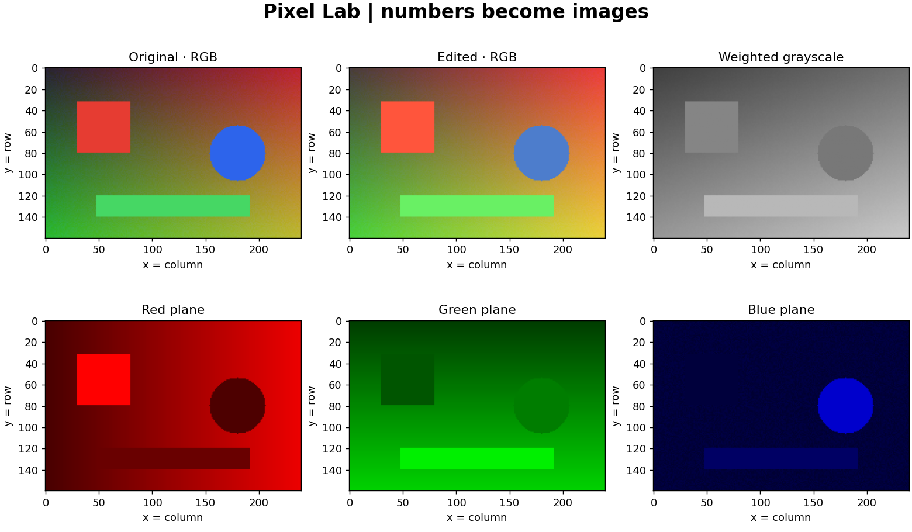

# 01 — Python for Computer Vision

**Level:** beginner · **Device:** CPU · **Data:** generated locally · **Release:** 1.0.0



## What You Will Learn

Read and write small Python programs; use functions, classes, lists and dictionaries; represent an image as a NumPy array; index pixels and regions; apply broadcasting; replace loops with vectorized code; plot images; and save reproducible outputs with portable file paths.

## Why It Matters

Every later detector, segmenter and transformer receives numerical data. If a red object becomes blue because channels were swapped, or a bright pixel becomes dark because arithmetic overflowed, a sophisticated model cannot repair the learning mistake for you. This chapter makes the data visible before models arrive.

## Prerequisites

Basic arithmetic and willingness to run Python cells. Use the [self-check](../00-roadmap/prerequisites.md) and [setup guide](../docs/setup.md). No neural networks, calculus, camera or GPU is needed.

## Core Concepts

| Concept | Intuition | Practical use |
| --- | --- | --- |
| Image array | A spreadsheet with color layers | Read and modify pixels |
| Indexing | Choosing a row, column and layer | Crop or recolor a region |
| Dtype | The allowed kind and range of stored numbers | Avoid overflow |
| Function | A named recipe with inputs and a result | Reuse a safe transformation |
| Class | State and behavior kept together | Represent a small editor or configuration |
| Broadcasting | Reuse one channel setting at every location | Apply red/green/blue gains |
| Vectorization | Ask an array library to operate on a whole grid | Reduce Python loop overhead |
| File handling | Find, validate, read and save named data | Make experiments repeatable |

## Mathematics

Only arithmetic, weighted sums and averages are needed. The [theory guide](theory/concepts.md) explains array shape, storage, clipping, channel multiplication, mean intensity and grayscale with numerical examples. Physical luminance, color management and calculus are later subjects; grayscale here is an encoded-channel approximation.

## Practical Examples

```bash
python -m cvzero doctor
python 01-python-for-computer-vision/src/implementations.py
python -m cvzero demo --output artifacts/ch01-demo --brightness 25 --gains 1.1 1.0 0.8
python -m cvzero inspect datasets/synthetic/scene.png
python -m cvzero benchmark --repeats 5 --output artifacts/ch01-benchmark.json
```

Use a new output folder for each run. After the demo, open its `report.html`. The included [sample report](../projects/beginner/pixel-lab/sample-output/report.html) is an executed example, with environment details in its JSON.

## Notebooks

Run these in order; each also works independently from a fresh kernel after installation.

| Notebook | Focus | Main visual |
| --- | --- | --- |
| [01 — Python and images](notebooks/01_python_and_images.ipynb) | Variables, lists, dictionaries, control flow, functions | Hand-labeled pixel grid |
| [02 — NumPy and pixels](notebooks/02_numpy_pixels.ipynb) | Shape, dtype, indexing, views, copies and broadcasting | Channel planes and crop comparison |
| [03 — Functions, classes and files](notebooks/03_functions_classes_files.ipynb) | Reusable operations, simple classes, `Path`, exceptions and PNG | A complete edit/read/write experiment |
| [04 — Practical experiments](notebooks/04_practical_experiments.ipynb) | Vectorization, OpenCV comparisons, timing and reproducibility | Brightness sweeps, histograms and local timings |

Use [Colab instructions](../docs/colab.md) to run without a local notebook installation.

## Exercises

Try [beginner](exercises/beginner.md), [intermediate](exercises/intermediate.md), then [advanced](exercises/advanced.md). The [challenge](exercises/challenge.md) asks you to build a small batch image audit with acceptance criteria and no supplied solution.

## Mini Project

[Pixel Lab — a reproducible image editing laboratory](mini-project/README.md). Combine loading, validation, crop, brightness, gains, grayscale, channel visualization, statistics and an HTML report. It has runnable code; it does not require training a model.

## Common Mistakes

| Mistake | Symptom | Correction |
| --- | --- | --- |
| `image[x, y]` | Wrong pixel or index error | Arrays use row `y`, then column `x` |
| Ignoring BGR | Red and blue are reversed | Convert explicitly at OpenCV boundaries |
| Arithmetic in `uint8` | Bright values wrap to dark ones | Convert before arithmetic, clip, then cast |
| Editing a view | Original unexpectedly changes | Use `.copy()` when independence is required |
| Forgetting `return` | Function result is `None` | Return the computed array |
| In-place edits by accident | Later comparisons are invalid | Keep a preserved original and return new arrays |
| Misleading scalar plot | Same data appears with different brightness | Fix `cmap='gray', vmin=0, vmax=255` |
| Saving as JPEG for exact equality | Pixel values change on reload | Use PNG for these tests |
| Running notebook cells out of order | Missing or stale variables | Restart kernel and run all |

## Interview Questions

### Beginner Questions

1. What does shape `(120, 160, 3)` mean?
2. What is the difference between a list and a NumPy array?
3. Why does indexing start at zero in these examples?

### Intermediate Questions

1. When does slicing create a view, and why does that matter?
2. How can a three-element gain vector apply to an entire RGB image?
3. Why do we convert before adding a negative brightness offset?

### Advanced Questions

1. Why can vectorized code still allocate substantial temporary memory?
2. Why can two grayscale implementations differ by one intensity level?
3. Why is an image's `nbytes` not a measurement of program peak memory?

### Coding Questions

1. Write a crop function with explicit bounds and an independent result.
2. Count pixels whose red channel exceeds a chosen threshold.
3. Return a dictionary describing image size, type and channel means.

### Conceptual Questions

1. Does increasing brightness recover information lost through clipping?
2. Why can a histogram hide spatial structure?
3. What does reproducible random input guarantee, and what does it not guarantee?

### System Design Questions

1. What input contract would you put between a loader and an image editor?
2. How would you preserve earlier outputs while running many experiments?
3. What must a benchmark record before another learner can interpret it?

## Research Directions

Investigate when loop overhead dominates and when memory traffic becomes more important. Compare different image sizes and document the protocol. Read the [NumPy research connection](../docs/references.md). These are algorithm-engineering questions, not a reason to claim dataset accuracy.

## CHECKPOINT

Explain an RGB array, implement a safe operation, modify it predictably, debug an overflow or view bug and apply Pixel Lab to a new image. Use [the checkpoint rubric](../00-roadmap/checkpoints.md).

## Next Chapter

[02 — Mathematics for Computer Vision](../02-mathematics-for-computer-vision/README.md) is the next complete chapter. It expands the arithmetic used here into vectors, matrices, derivatives, probability and optimization. See [the progress tracker](../docs/PROGRESS.md).

## References

[Python tutorial](https://docs.python.org/3/tutorial/), [NumPy quickstart](https://numpy.org/doc/stable/user/quickstart.html), [OpenCV image operations](https://docs.opencv.org/4.x/d3/df2/tutorial_py_basic_ops.html), and [full primary-source guide](../docs/references.md).
