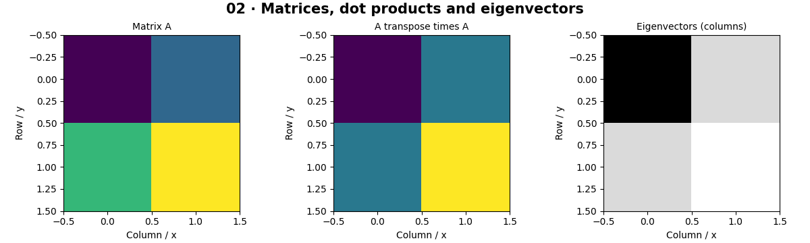

# Mathematics for Computer Vision — concepts and mechanisms

## What and why

Computer vision turns measurements into arrays and optimizes rules over those arrays. A scalar is one number; a vector is an ordered list; a matrix is a rectangular table. The same notation will later describe pixels, camera coordinates, weights and gradients.

## 1. Arrays, linear maps and eigenvectors

A dot product multiplies corresponding entries and adds them: it measures alignment. Matrix multiplication combines rows with columns and composes linear maps. An eigenvector keeps its direction under a map; its eigenvalue is the scale factor. Symmetric covariance matrices have orthogonal eigenvectors, which makes PCA a rotation toward directions of variation.

## 2. Derivatives, gradients and optimization

A derivative measures how a function changes when its input moves a little. A partial derivative changes one input while holding the others fixed. Collect the partial derivatives into a gradient. Gradient descent subtracts a small multiple of this gradient. Backpropagation is an efficient way of applying the chain rule, not a different derivative.

## 3. Probability, statistics and frequency

Probability describes uncertain outcomes; the mean describes a center and variance describes spread. A finite sample estimates these quantities with uncertainty. The Fourier transform rewrites a signal as weighted sinusoids. A large spectral coefficient means that a repeating pattern at that frequency is present; it does not specify an object category.

## Mathematical foundation

$$
w_{t+1}=w_t-\eta\,2(w_t-1)
$$

For loss L(w)=(w−1)², w is the current parameter, t the update number and η the positive learning rate. At w=3 and η=0.1, the gradient is 4, so the next value is 2.6.

The numerical example makes the units and reduction visible before the larger pipeline:

```python
import numpy as np
import cv2

w = 3.0
learning_rate = 0.1
gradient = 2 * (w - 1)
w_next = w - learning_rate * gradient
assert abs(w_next - 2.6) < 1e-12
print(w_next)
```

## What happens internally

The lab checks an eigendecomposition numerically, compares finite differences with an analytic derivative, and detects a sinusoid through an FFT. The FFT uses complex coefficients; magnitude discards phase.

Read the chapter entry point, then follow its shared source. The core reference is `numerics.softmax`. Separate data construction, algorithm, metric and plotting when changing the experiment.

## Visual reasoning



Predict a change before rerunning. Explain what each axis, color, mask or matrix cell represents. In learned examples, compare a loss curve with held-out predictions; in geometry examples, compare coordinate residuals with known synthetic truth. Visual plausibility is useful evidence, but does not replace a declared metric.

## Controlled experiment

Change the gradient-descent step from 0.1 to 0.3, then derive the stability interval for the quadratic before trying a larger step.

Write down the independent variable, what remains fixed, and the metric before changing code. Repeat stochastic experiments with multiple seeds and retain negative results. A timing comparison should include warm-up, repeat count and hardware; never compare unmatched preprocessing or data sizes.

## Applications and limits

Translate small equations into array operations before using models. The mini project applies the mechanism in a small runnable baseline. Elementwise multiplication A*B is not matrix multiplication A@B. A low loss after one example says nothing about generalization.

The local generated distribution deliberately removes some real-world complexity. External data, pretrained models and hardware paths are documented separately in [external workflows](../../docs/external-workflows.md). A toy objective or synthetic score must be labeled as such when used in a portfolio.

## Exercises and checkpoint

Explain this chapter to someone using one concrete example. Then implement a tiny case, change a parameter, create a failure and apply the method to new data. Use the [three exercise levels](../exercises/beginner.md) and [challenge](../exercises/challenge.md) to record evidence.

## Research connection

[Read the chapter research note](../../docs/research-reading.md#chapter-02). It distinguishes the original contribution, architecture intuition, limitations and alternatives from the scope of the runnable lab.

## References and next step

[Primary reference](https://numpy.org/doc/stable/reference/routines.linalg.html). Continue through the chapter notebooks and mini project, then follow the next-chapter link in the [chapter README](../README.md).

## Extended worked mathematics

The [mathematical reference](../../docs/math-reference.md) adds chain rule, covariance, Gaussian kernels, convolution size, Fourier coefficients and camera/epipolar geometry with numerical Python examples. Read the later geometry sections when those chapters become relevant.
