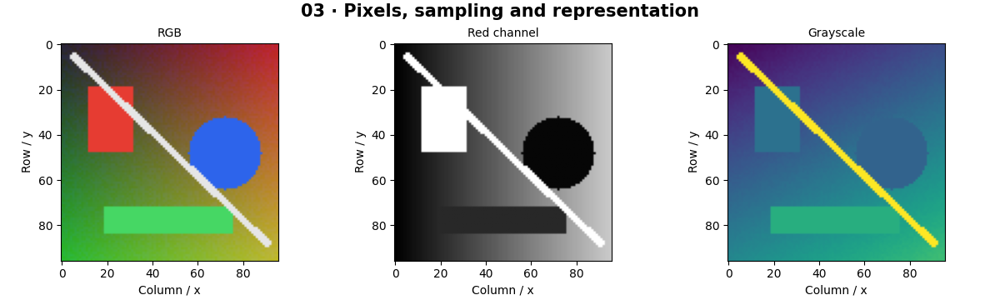

# Image Fundamentals — concepts and mechanisms

## What and why

Imagine an image as a spreadsheet. A grayscale cell holds one intensity; an RGB pixel holds three channel values. Sampling chooses where measurements are taken, and quantization chooses which intensity values can be represented. The array is the measurement, not the scene itself.

## 1. Pixels, coordinates and channels

Array indexing uses row then column, so image[y, x] is a pixel at horizontal position x and vertical position y. RGB has three channels; RGBA adds alpha, an opacity value. Grayscale is a weighted summary of color, not simply the first channel. OpenCV commonly stores BGR while plotting libraries expect RGB.

## 2. Bit depth and quantization error

An unsigned 8-bit channel represents integers from 0 to 255. Reducing intensity levels creates banding even if image width and height stay fixed. Convert to floating point before arithmetic, because integer overflow can wrap around. Float image arrays conventionally use 0 to 1 when displayed as color.

## 3. Resolution, alpha and tensor layout

Resolution describes the sampling grid. Reducing it loses spatial information; enlarging it cannot recover missing detail. Alpha compositing combines foreground and background using opacity. HWC and CHW contain the same values in different axis orders; reshape alone does not perform this permutation. Metadata such as EXIF orientation can change intended display.

## Mathematical foundation

$$
C=\alpha F+(1-\alpha)B
$$

C is the composited channel, F foreground intensity, B background intensity, and α opacity between zero and one. Half-opacity red over white gives RGB [1, 0.5, 0.5] in normalized units.

The numerical example makes the units and reduction visible before the larger pipeline:

```python
import numpy as np
import cv2

foreground = np.array([1.0, 0.0, 0.0])
background = np.ones(3)
alpha = 0.5
composite = alpha * foreground + (1 - alpha) * background
assert np.allclose(composite, [1.0, 0.5, 0.5])
print(composite)
```

## What happens internally

The experiments separate channels, quantize levels with rounding, resample the spatial grid and transpose axes. Image dimensions and memory size are measured from the actual array.

Read the chapter entry point, then follow its shared source. The core reference is `numerics.gray`. Separate data construction, algorithm, metric and plotting when changing the experiment.

## Visual reasoning



Predict a change before rerunning. Explain what each axis, color, mask or matrix cell represents. In learned examples, compare a loss curve with held-out predictions; in geometry examples, compare coordinate residuals with known synthetic truth. Visual plausibility is useful evidence, but does not replace a declared metric.

## Controlled experiment

Reduce the number of intensity levels while leaving resolution fixed. Then reduce resolution with all 256 levels. Describe how the two artifacts differ.

Write down the independent variable, what remains fixed, and the metric before changing code. Repeat stochastic experiments with multiple seeds and retain negative results. A timing comparison should include warm-up, repeat count and hardware; never compare unmatched preprocessing or data sizes.

## Applications and limits

Explain sampling, quantization and image memory. The mini project applies the mechanism in a small runnable baseline. Pixel coordinates are not Cartesian world coordinates: y normally increases downward. Alpha is not another visible color channel.

The local generated distribution deliberately removes some real-world complexity. External data, pretrained models and hardware paths are documented separately in [external workflows](../../docs/external-workflows.md). A toy objective or synthetic score must be labeled as such when used in a portfolio.

## Exercises and checkpoint

Explain this chapter to someone using one concrete example. Then implement a tiny case, change a parameter, create a failure and apply the method to new data. Use the [three exercise levels](../exercises/beginner.md) and [challenge](../exercises/challenge.md) to record evidence.

## Research connection

[Read the chapter research note](../../docs/research-reading.md#chapter-03). It distinguishes the original contribution, architecture intuition, limitations and alternatives from the scope of the runnable lab.

## References and next step

[Primary reference](https://pillow.readthedocs.io/en/stable/handbook/concepts.html). Continue through the chapter notebooks and mini project, then follow the next-chapter link in the [chapter README](../README.md).
