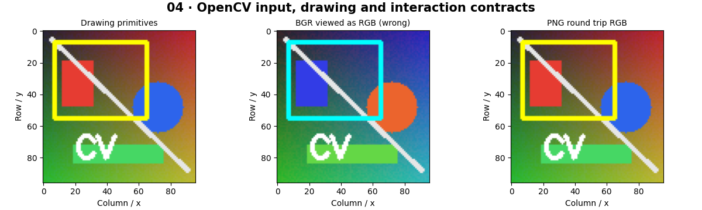

# OpenCV Fundamentals — concepts and mechanisms

## What and why

OpenCV supplies optimized building blocks for images and video. Its functions still have contracts: channel order, data type, coordinate convention and return values. Learning these contracts prevents a successful function call from silently producing the wrong image.

## 1. Read, write, draw and label

Read an image, check decoding succeeded, and convert BGR to RGB before plotting. Drawing modifies an array in place unless you copy it first. PNG is lossless for the lab arrays; JPEG can change values. The notebook performs an encode/decode round trip so image I/O can be tested without external assets.

## 2. Resizing and image display

Resizing interpolates a sampled grid. INTER_AREA is often useful when shrinking; nearest-neighbor preserves discrete labels in masks. Matplotlib can display images inside notebooks without a desktop window. Desktop imshow requires a GUI-enabled OpenCV build and an event loop that calls waitKey.

## 3. Events, camera loops and controls

A camera loop repeatedly reads a frame, checks success, processes it and releases the device in a finally block. Mouse callbacks receive events and coordinates; trackbars expose integer parameters. The notebook simulates a threshold control for headless execution. scripts/opencv_interactive.py supplies actual paint, trackbar and webcam modes on desktop systems.

## Mathematical foundation

$$
I_{RGB}(y,x)=[I_{BGR}(y,x,2),I_{BGR}(y,x,1),I_{BGR}(y,x,0)]
$$

I is an image indexed by row y, column x and channel index. Reversing the three BGR channels gives RGB. BGR [10,20,200] becomes RGB [200,20,10].

The numerical example makes the units and reduction visible before the larger pipeline:

```python
import numpy as np
import cv2

bgr = np.array([[[10, 20, 200]]], dtype=np.uint8)
rgb = cv2.cvtColor(bgr, cv2.COLOR_BGR2RGB)
assert rgb[0, 0].tolist() == [200, 20, 10]
print(rgb)
```

## What happens internally

OpenCV decoding produces an array, drawing edits its buffer, and encoding compresses that buffer to bytes. VideoCapture abstracts a file or device; read success is independent of the requested frame size.

Read the chapter entry point, then follow its shared source. The core reference is `numerics.gray`. Separate data construction, algorithm, metric and plotting when changing the experiment.

## Visual reasoning



Predict a change before rerunning. Explain what each axis, color, mask or matrix cell represents. In learned examples, compare a loss curve with held-out predictions; in geometry examples, compare coordinate residuals with known synthetic truth. Visual plausibility is useful evidence, but does not replace a declared metric.

## Controlled experiment

Save the same RGB image as PNG and JPEG, reload both, and measure the maximum absolute difference after casting to signed integers.

Write down the independent variable, what remains fixed, and the metric before changing code. Repeat stochastic experiments with multiple seeds and retain negative results. A timing comparison should include warm-up, repeat count and hardware; never compare unmatched preprocessing or data sizes.

## Applications and limits

Build image and webcam tools with useful failure messages. The mini project applies the mechanism in a small runnable baseline. cv2.imread returns None on many failures. A missing camera or display is an environmental condition, not evidence that the vision algorithm is wrong.

The local generated distribution deliberately removes some real-world complexity. External data, pretrained models and hardware paths are documented separately in [external workflows](../../docs/external-workflows.md). A toy objective or synthetic score must be labeled as such when used in a portfolio.

## Exercises and checkpoint

Explain this chapter to someone using one concrete example. Then implement a tiny case, change a parameter, create a failure and apply the method to new data. Use the [three exercise levels](../exercises/beginner.md) and [challenge](../exercises/challenge.md) to record evidence.

## Research connection

[Read the chapter research note](../../docs/research-reading.md#chapter-04). It distinguishes the original contribution, architecture intuition, limitations and alternatives from the scope of the runnable lab.

## References and next step

[Primary reference](https://docs.opencv.org/4.x/d6/d00/tutorial_py_root.html). Continue through the chapter notebooks and mini project, then follow the next-chapter link in the [chapter README](../README.md).
