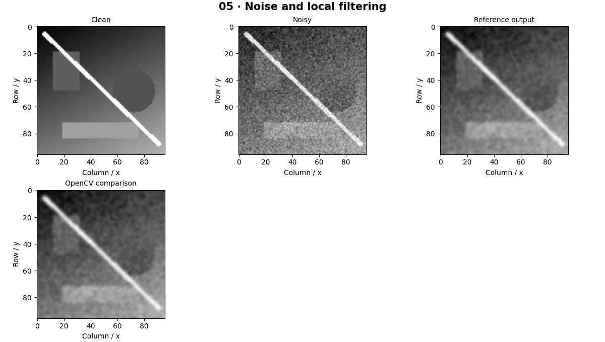

# Image Processing — concepts and mechanisms

## What and why

Filtering replaces a pixel using its neighborhood. Think of a small window sliding across a spreadsheet. The weights in that window form a kernel. Different weights preserve, blur or emphasize different spatial patterns, and boundary handling changes the answer near image edges.

## 1. Correlation and weighted neighborhoods

Correlation multiplies each neighborhood by a kernel and sums the products. Mathematical convolution flips the kernel first. OpenCV filter2D and deep-learning convolution layers implement correlation. Symmetric kernels hide the distinction. A mean filter assigns equal weight to every location; its weights sum to one so constant regions stay constant.

## 2. Gaussian noise and smoothing

Gaussian noise adds a random value to each measurement. A Gaussian filter weights nearby pixels more heavily than distant ones. Sigma controls the spread and kernel size truncates its support. Separable Gaussian filtering performs horizontal and vertical passes to reduce arithmetic. The lab compares explicit loops with OpenCV using matching replicate borders.

## 3. Impulse noise and nonlinear filters

Salt-and-pepper noise creates extreme pixels, so an average spreads the corruption. Median filtering selects the middle neighborhood value and often handles impulses better. Bilateral filtering also weights intensity similarity to preserve some edges. Speckle is multiplicative noise; its magnitude grows with signal intensity. No single filter solves every noise process.

## Mathematical foundation

$$
Y_{ij}=\sum_{u=-r}^{r}\sum_{v=-r}^{r}K_{uv}X_{i+u,j+v}
$$

X is the input, K the kernel, Y the result, and r the window radius. A 3×3 mean kernel has nine weights of 1/9. A neighborhood containing values 1 through 9 therefore produces 5.

The numerical example makes the units and reduction visible before the larger pipeline:

```python
import numpy as np
import cv2

patch = np.arange(1, 10, dtype=float).reshape(3, 3)
kernel = np.ones((3, 3)) / 9
value = np.sum(patch * kernel)
assert np.isclose(value, 5)
print(value)
```

## What happens internally

The reference implementation pads explicitly and loops over pixels. OpenCV uses optimized kernels and vectorized hardware. Match dtype, correlation convention and border mode before comparing results.

Read the chapter entry point, then follow its shared source. The core reference is `numerics.correlate`. Separate data construction, algorithm, metric and plotting when changing the experiment.

## Visual reasoning



Predict a change before rerunning. Explain what each axis, color, mask or matrix cell represents. In learned examples, compare a loss curve with held-out predictions; in geometry examples, compare coordinate residuals with known synthetic truth. Visual plausibility is useful evidence, but does not replace a declared metric.

## Controlled experiment

Use equal noise seeds to compare mean, Gaussian and median filtering. Report MSE against the clean synthetic image and also inspect whether thin edges disappear.

Write down the independent variable, what remains fixed, and the metric before changing code. Repeat stochastic experiments with multiple seeds and retain negative results. A timing comparison should include warm-up, repeat count and hardware; never compare unmatched preprocessing or data sizes.

## Applications and limits

Implement a sliding window and compare denoising methods. The mini project applies the mechanism in a small runnable baseline. Smoothing may lower noise while removing a real small object. Numerical equality comparisons are invalid when border modes differ.

The local generated distribution deliberately removes some real-world complexity. External data, pretrained models and hardware paths are documented separately in [external workflows](../../docs/external-workflows.md). A toy objective or synthetic score must be labeled as such when used in a portfolio.

## Exercises and checkpoint

Explain this chapter to someone using one concrete example. Then implement a tiny case, change a parameter, create a failure and apply the method to new data. Use the [three exercise levels](../exercises/beginner.md) and [challenge](../exercises/challenge.md) to record evidence.

## Research connection

[Read the chapter research note](../../docs/research-reading.md#chapter-05). It distinguishes the original contribution, architecture intuition, limitations and alternatives from the scope of the runnable lab.

## References and next step

[Primary reference](https://docs.opencv.org/4.x/d4/d13/tutorial_py_filtering.html). Continue through the chapter notebooks and mini project, then follow the next-chapter link in the [chapter README](../README.md).
