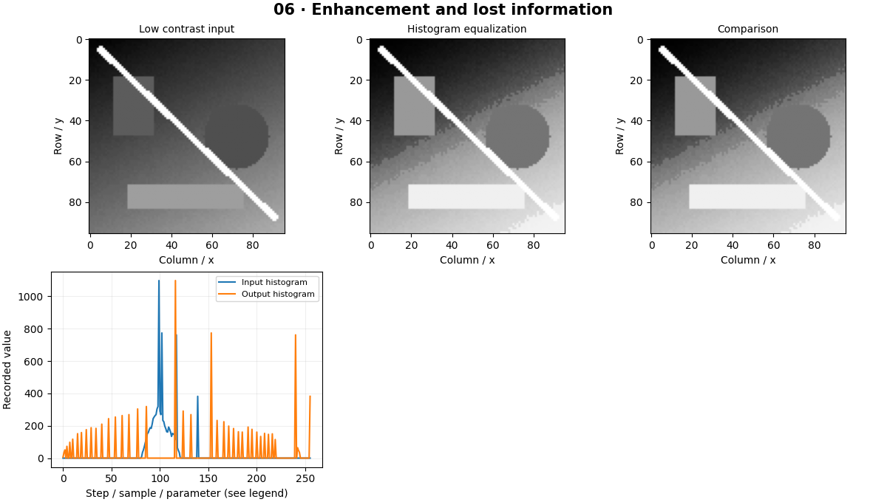

# Image Enhancement — concepts and mechanisms

## What and why

Enhancement changes appearance so a useful signal is easier to inspect or process. Brightness shifts intensity, contrast changes separation, and a histogram counts how often each intensity occurs. Enhancement should serve a task; a visually dramatic image is not automatically more informative.

## 1. Histograms and equalization

A histogram ignores spatial arrangement and counts intensity values. Equalization maps intensities through a cumulative distribution so a narrow range spreads more widely. The implementation subtracts the first nonzero cumulative count so a dark lower endpoint maps to zero. A constant image needs special handling because there is no intensity range to expand.

## 2. Local contrast with CLAHE

Global equalization uses one mapping for the whole image. CLAHE divides an image into tiles, clips excessive histogram counts and interpolates neighboring mappings. The clipping limit controls noise amplification. Apply local contrast carefully: a textureless low-light region may contain noise rather than hidden detail.

## 3. Gamma and unsharp masking

Gamma correction is a nonlinear pointwise map. With normalized input and the convention output=input**gamma, gamma below one brightens midtones. Unsharp masking adds a scaled difference between the original image and a blurred copy. Both clipping and color-space choices affect the result; sharpening can create halos around edges.

## Mathematical foundation

$$
y=x^\gamma\quad (0\le x\le1)
$$

x is normalized input intensity, y the corrected intensity and γ the chosen exponent. With x=0.25 and γ=0.5, y=0.5. This definition must be stated because some tools expose reciprocal gamma.

The numerical example makes the units and reduction visible before the larger pipeline:

```python
import numpy as np
import cv2

x = np.array([0.0, 0.25, 0.5, 1.0])
gamma = 0.5
y = x**gamma
assert np.isclose(y[1], 0.5)
print(y)
```

## What happens internally

The lab computes a NumPy CDF mapping, compares OpenCV equalization, then examines CLAHE and sharpening. The plotted histograms show counts, not probabilities unless normalized.

Read the chapter entry point, then follow its shared source. The core reference is `numerics.equalize`. Separate data construction, algorithm, metric and plotting when changing the experiment.

## Visual reasoning



Predict a change before rerunning. Explain what each axis, color, mask or matrix cell represents. In learned examples, compare a loss curve with held-out predictions; in geometry examples, compare coordinate residuals with known synthetic truth. Visual plausibility is useful evidence, but does not replace a declared metric.

## Controlled experiment

Increase CLAHE strength on a noisy flat region and quantify both local contrast and noise variance. Find a setting that improves the downstream threshold mask.

Write down the independent variable, what remains fixed, and the metric before changing code. Repeat stochastic experiments with multiple seeds and retain negative results. A timing comparison should include warm-up, repeat count and hardware; never compare unmatched preprocessing or data sizes.

## Applications and limits

Choose an enhancement method using image evidence. The mini project applies the mechanism in a small runnable baseline. Equalizing R, G and B independently can change hue. Clipping after sharpening discards values and can hide overshoot.

The local generated distribution deliberately removes some real-world complexity. External data, pretrained models and hardware paths are documented separately in [external workflows](../../docs/external-workflows.md). A toy objective or synthetic score must be labeled as such when used in a portfolio.

## Exercises and checkpoint

Explain this chapter to someone using one concrete example. Then implement a tiny case, change a parameter, create a failure and apply the method to new data. Use the [three exercise levels](../exercises/beginner.md) and [challenge](../exercises/challenge.md) to record evidence.

## Research connection

[Read the chapter research note](../../docs/research-reading.md#chapter-06). It distinguishes the original contribution, architecture intuition, limitations and alternatives from the scope of the runnable lab.

## References and next step

[Primary reference](https://docs.opencv.org/4.x/d5/daf/tutorial_py_histogram_equalization.html). Continue through the chapter notebooks and mini project, then follow the next-chapter link in the [chapter README](../README.md).
