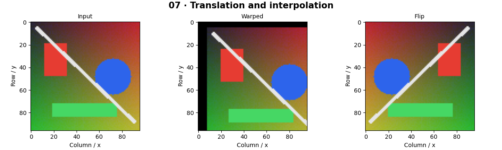

# Geometric Transformations — concepts and mechanisms

## What and why

Geometric transformations move coordinates rather than directly changing intensity. A camera sees perspective, while image editing may only need translation or rotation. Separating coordinate mapping from interpolation explains why correct geometry can still produce blurry pixels.

## 1. Translation, rotation and inverse mapping

Translation adds an offset; rotation mixes x and y around a chosen center. Homogeneous coordinates append a one, allowing translation and linear transformation in a single matrix. Image warping usually asks which source position produced each destination pixel, avoiding holes that forward scatter can leave.

## 2. Homographies from correspondences

An affine transform preserves parallel lines. A homography is a projective map represented by a 3×3 matrix up to scale; it can describe one plane viewed from another camera. Four point pairs in a nondegenerate arrangement provide eight independent equations. Normalized DLT improves conditioning before solving a homogeneous linear system by SVD.

## 3. Interpolation and document rectification

Nearest-neighbor chooses one sample; bilinear interpolation blends four samples. Interpolation does not recover lost detail. Document rectification estimates a homography from ordered page corners and resamples the page into a rectangle. Nonplanar pages, lens distortion and inaccurate corners violate the simple model.

## Mathematical foundation

$$
\tilde p\prime=H\tilde p,\qquad p\prime=(q_x/q_z,q_y/q_z)
$$

p is an input point, the tilde appends a homogeneous one, H is a 3×3 map and q is the resulting homogeneous vector. Translation by (3,−2) sends (4,5) to (7,3). Divide by the third coordinate after a perspective map.

The numerical example makes the units and reduction visible before the larger pipeline:

```python
import numpy as np
import cv2

point = np.array([4.0, 5.0, 1.0])
H = np.array([[1.0, 0.0, 3.0], [0.0, 1.0, -2.0], [0.0, 0.0, 1.0]])
q = H @ point
xy = q[:2] / q[2]
assert np.allclose(xy, [7, 3])
print(xy)
```

## What happens internally

The reference normalizes point clouds, builds the DLT design matrix, takes the last right singular vector and denormalizes H. OpenCV warpPerspective then performs sampling with that matrix.

Read the chapter entry point, then follow its shared source. The core reference is `geometry.fit_homography`. Separate data construction, algorithm, metric and plotting when changing the experiment.

## Visual reasoning



Predict a change before rerunning. Explain what each axis, color, mask or matrix cell represents. In learned examples, compare a loss curve with held-out predictions; in geometry examples, compare coordinate residuals with known synthetic truth. Visual plausibility is useful evidence, but does not replace a declared metric.

## Controlled experiment

Perturb one corner by two pixels and visualize the interior displacement. Compare nearest and bilinear interpolation on a checkerboard.

Write down the independent variable, what remains fixed, and the metric before changing code. Repeat stochastic experiments with multiple seeds and retain negative results. A timing comparison should include warm-up, repeat count and hardware; never compare unmatched preprocessing or data sizes.

## Applications and limits

Map coordinates correctly and control resampling artifacts. The mini project applies the mechanism in a small runnable baseline. A homography cannot generally align a scene with multiple depths under translation. Wrong corner order can fold the page across itself.

The local generated distribution deliberately removes some real-world complexity. External data, pretrained models and hardware paths are documented separately in [external workflows](../../docs/external-workflows.md). A toy objective or synthetic score must be labeled as such when used in a portfolio.

## Exercises and checkpoint

Explain this chapter to someone using one concrete example. Then implement a tiny case, change a parameter, create a failure and apply the method to new data. Use the [three exercise levels](../exercises/beginner.md) and [challenge](../exercises/challenge.md) to record evidence.

## Research connection

[Read the chapter research note](../../docs/research-reading.md#chapter-07). It distinguishes the original contribution, architecture intuition, limitations and alternatives from the scope of the runnable lab.

## References and next step

[Primary reference](https://docs.opencv.org/4.x/da/d6e/tutorial_py_geometric_transformations.html). Continue through the chapter notebooks and mini project, then follow the next-chapter link in the [chapter README](../README.md).
