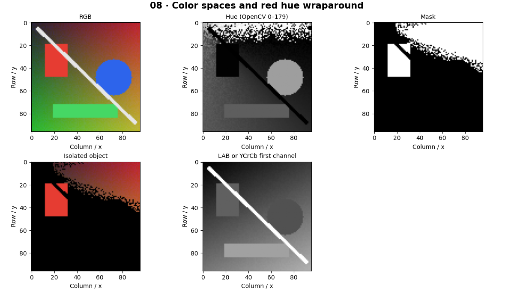

# Color Spaces — concepts and mechanisms

## What and why

A color space is a coordinate system for color. RGB is convenient for displays, HSV separates hue from saturation and value, and LAB separates lightness from opponent color axes. Choosing a space can make a simple threshold useful, but it does not remove lighting variation.

## 1. RGB, BGR and channel conventions

RGB and BGR store the same three color components in different orders. Grayscale deliberately discards chromatic information. A channel is a measurement axis, not an object category. Verify the dtype-specific range whenever converting spaces; OpenCV integer encodings are not identical to textbook floating-point units.

## 2. HSV color masks and hue wraparound

Hue cycles around a color wheel. In OpenCV 8-bit HSV, hue spans 0–179 while saturation and value span 0–255. Red straddles the hue boundary, so its mask combines two ranges. Hue becomes unstable near gray, which is why hue thresholding also needs a minimum saturation.

## 3. LAB, YCrCb and robust thresholds

LAB lightness and chromatic coordinates can reduce some sensitivity to brightness, and YCrCb separates luma from chroma. Neither guarantees invariance to illumination or camera processing. Skin-color masks are especially fragile across people, lighting and devices; they should not be treated as identity detectors or universal human detectors.

## Mathematical foundation

$$
M=(h<h_1\;\lor\;h>h_2)\land(s>s_0)\land(v>v_0)
$$

M is a Boolean red mask, h hue, s saturation and v value. h1 and h2 bound the two sides of red; s0 and v0 reject gray and darkness. For h=178, s=200, v=150 and bounds 10,170,80,50, the mask is true.

The numerical example makes the units and reduction visible before the larger pipeline:

```python
import numpy as np
import cv2

h, s, v = np.array([178, 30]), np.array([200, 200]), np.array([150, 150])
mask = ((h < 10) | (h > 170)) & (s > 80) & (v > 50)
assert mask.tolist() == [True, False]
print(mask)
```

## What happens internally

Convert RGB to HSV once, threshold channels, combine hue intervals and clean the binary mask using morphology. A centroid can then drive a simple color tracker.

Read the chapter entry point, then follow its shared source. The core reference is `numerics.components`. Separate data construction, algorithm, metric and plotting when changing the experiment.

## Visual reasoning



Predict a change before rerunning. Explain what each axis, color, mask or matrix cell represents. In learned examples, compare a loss curve with held-out predictions; in geometry examples, compare coordinate residuals with known synthetic truth. Visual plausibility is useful evidence, but does not replace a declared metric.

## Controlled experiment

Lower saturation while keeping hue fixed and observe the reliability of the red mask. Test two illuminations with the same object.

Write down the independent variable, what remains fixed, and the metric before changing code. Repeat stochastic experiments with multiple seeds and retain negative results. A timing comparison should include warm-up, repeat count and hardware; never compare unmatched preprocessing or data sizes.

## Applications and limits

Isolate a colored object while testing illumination changes. The mini project applies the mechanism in a small runnable baseline. Using hue degrees 0–360 directly on OpenCV uint8 HSV produces incorrect thresholds. Skin color is not a reliable substitute for a trained hand detector.

The local generated distribution deliberately removes some real-world complexity. External data, pretrained models and hardware paths are documented separately in [external workflows](../../docs/external-workflows.md). A toy objective or synthetic score must be labeled as such when used in a portfolio.

## Exercises and checkpoint

Explain this chapter to someone using one concrete example. Then implement a tiny case, change a parameter, create a failure and apply the method to new data. Use the [three exercise levels](../exercises/beginner.md) and [challenge](../exercises/challenge.md) to record evidence.

## Research connection

[Read the chapter research note](../../docs/research-reading.md#chapter-08). It distinguishes the original contribution, architecture intuition, limitations and alternatives from the scope of the runnable lab.

## References and next step

[Primary reference](https://docs.opencv.org/4.x/df/d9d/tutorial_py_colorspaces.html). Continue through the chapter notebooks and mini project, then follow the next-chapter link in the [chapter README](../README.md).
