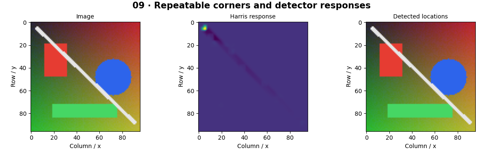

# Feature Detection — concepts and mechanisms

## What and why

A feature is a location with a pattern that can be found again. A uniform wall gives no precise location; a corner constrains movement in two directions. Feature detection chooses interesting points, while feature description records a neighborhood for later comparison.

## 1. Structure tensors and Harris corners

The structure tensor summarizes products of horizontal and vertical gradients in a local window. Two small eigenvalues indicate a flat region; one large value indicates an edge; two large values indicate a corner. Harris combines determinant and trace into a score without explicitly computing both eigenvalues.

## 2. Shi–Tomasi selection and suppression

Shi–Tomasi scores a point using the smaller structure-tensor eigenvalue. Good features also need spatial separation: a threshold alone may return many neighboring pixels around one physical corner. Non-maximum suppression and a minimum distance create a useful set rather than a dense blob of redundant detections.

## 3. FAST, scale and detector tradeoffs

FAST compares a ring of pixels around a candidate to its center and searches for a contiguous brighter or darker arc. It is efficient but not inherently scale invariant. SIFT adds scale-space extrema and orientation; ORB combines oriented FAST with a binary descriptor. Detection repeatability and descriptor distinctiveness are different properties.

## Mathematical foundation

$$
R=\det(M)-k\,\operatorname{trace}(M)^2
$$

M is the 2×2 sum of local gradient outer products, R the Harris response and k a sensitivity parameter. For eigenvalues 4 and 3, det=12 and trace=7; with k=0.04, R=10.04.

The numerical example makes the units and reduction visible before the larger pipeline:

```python
import numpy as np
import cv2

M = np.diag([4.0, 3.0])
k = 0.04
response = np.linalg.det(M) - k * np.trace(M) ** 2
assert np.isclose(response, 10.04)
print(response)
```

## What happens internally

The reference computes Sobel gradients, smooths their products and forms the response. The library comparison applies detector-specific selection, so point sets need not be identical.

Read the chapter entry point, then follow its shared source. The core reference is `numerics.harris`. Separate data construction, algorithm, metric and plotting when changing the experiment.

## Visual reasoning



Predict a change before rerunning. Explain what each axis, color, mask or matrix cell represents. In learned examples, compare a loss curve with held-out predictions; in geometry examples, compare coordinate residuals with known synthetic truth. Visual plausibility is useful evidence, but does not replace a declared metric.

## Controlled experiment

Rotate and blur a checkerboard. Count repeatable detections after transforming coordinates back, rather than comparing only raw detection counts.

Write down the independent variable, what remains fixed, and the metric before changing code. Repeat stochastic experiments with multiple seeds and retain negative results. A timing comparison should include warm-up, repeat count and hardware; never compare unmatched preprocessing or data sizes.

## Applications and limits

Find repeatable image locations and explain detector tradeoffs. The mini project applies the mechanism in a small runnable baseline. A high feature count is not proof of useful coverage. Border padding and threshold units influence the response.

The local generated distribution deliberately removes some real-world complexity. External data, pretrained models and hardware paths are documented separately in [external workflows](../../docs/external-workflows.md). A toy objective or synthetic score must be labeled as such when used in a portfolio.

## Exercises and checkpoint

Explain this chapter to someone using one concrete example. Then implement a tiny case, change a parameter, create a failure and apply the method to new data. Use the [three exercise levels](../exercises/beginner.md) and [challenge](../exercises/challenge.md) to record evidence.

## Research connection

[Read the chapter research note](../../docs/research-reading.md#chapter-09). It distinguishes the original contribution, architecture intuition, limitations and alternatives from the scope of the runnable lab.

## References and next step

[Primary reference](https://docs.opencv.org/4.x/dc/d0d/tutorial_py_features_harris.html). Continue through the chapter notebooks and mini project, then follow the next-chapter link in the [chapter README](../README.md).
