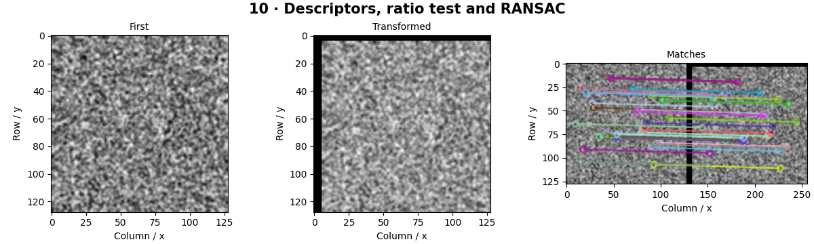

# Feature Description and Matching — concepts and mechanisms

## What and why

A descriptor turns a neighborhood into a vector or bit string. Matching asks which vectors likely describe the same physical point. A nearest neighbor is only a proposal: geometry is needed to reject accidental visual similarities.

## 1. Descriptors and distance metrics

SIFT descriptors are floating-point histograms, commonly compared with Euclidean distance. ORB descriptors are binary strings, compared with Hamming distance. BFMatcher checks descriptor pairs directly; FLANN uses approximate search structures suited to the descriptor type. A mismatch between descriptor type and distance changes the meaning of similarity.

## 2. Ratio tests and robust correspondence

The ratio test compares the nearest match distance with the second nearest. A ratio near one means the best candidate is ambiguous. Cross-checking asks whether the match is mutual; it is a different filter. Neither resolves repeated texture or guarantees a correct correspondence.

## 3. RANSAC homography and stitching

RANSAC repeatedly samples a minimal set, fits a model and counts points whose reprojection error is small. The best consensus is refined using inliers. For stitching a mostly planar scene or pure camera rotation, a homography can align overlapping images; blending, exposure and parallax still require attention.

## Mathematical foundation

$$
d_1/d_2<\tau
$$

d1 is the nearest descriptor distance, d2 the second nearest and τ the chosen ratio threshold. Distances 12 and 30 produce 0.4 and pass τ=0.75. Zero second-neighbor distance is ambiguous and should not be divided blindly.

The numerical example makes the units and reduction visible before the larger pipeline:

```python
import numpy as np
import cv2

best, second, ratio_threshold = 12.0, 30.0, 0.75
accepted = second > 0 and best / second < ratio_threshold
assert accepted
print(accepted)
```

## What happens internally

The lab detects ORB or SIFT features in a generated texture and its translated view, filters matches, estimates a RANSAC homography and compares translation with known truth.

Read the chapter entry point, then follow its shared source. The core reference is `geometry.fit_homography`. Separate data construction, algorithm, metric and plotting when changing the experiment.

## Visual reasoning



Predict a change before rerunning. Explain what each axis, color, mask or matrix cell represents. In learned examples, compare a loss curve with held-out predictions; in geometry examples, compare coordinate residuals with known synthetic truth. Visual plausibility is useful evidence, but does not replace a declared metric.

## Controlled experiment

Add repeated tiles and increase viewpoint change. Record keypoints, accepted matches, inliers and reprojection error separately.

Write down the independent variable, what remains fixed, and the metric before changing code. Repeat stochastic experiments with multiple seeds and retain negative results. A timing comparison should include warm-up, repeat count and hardware; never compare unmatched preprocessing or data sizes.

## Applications and limits

Reject false matches before estimating a geometric map. The mini project applies the mechanism in a small runnable baseline. Drawing many lines between two images can conceal false correspondences. A low residual on a tiny cluster of points may extrapolate badly.

The local generated distribution deliberately removes some real-world complexity. External data, pretrained models and hardware paths are documented separately in [external workflows](../../docs/external-workflows.md). A toy objective or synthetic score must be labeled as such when used in a portfolio.

## Exercises and checkpoint

Explain this chapter to someone using one concrete example. Then implement a tiny case, change a parameter, create a failure and apply the method to new data. Use the [three exercise levels](../exercises/beginner.md) and [challenge](../exercises/challenge.md) to record evidence.

## Research connection

[Read the chapter research note](../../docs/research-reading.md#chapter-10). It distinguishes the original contribution, architecture intuition, limitations and alternatives from the scope of the runnable lab.

## References and next step

[Primary reference](https://docs.opencv.org/4.x/dc/dc3/tutorial_py_matcher.html). Continue through the chapter notebooks and mini project, then follow the next-chapter link in the [chapter README](../README.md).
