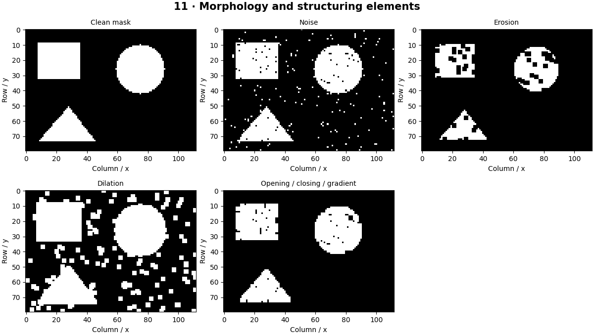

# Morphological Image Processing — concepts and mechanisms

## What and why

Morphology processes shape using a small structuring element. Imagine moving a stencil across a binary mask and asking whether any or all covered pixels are foreground. This provides controllable ways to remove specks, fill gaps and outline regions.

## 1. Erosion and dilation from scratch

Binary erosion keeps a pixel only when every active stencil position fits inside foreground. Dilation keeps it when any stencil position touches foreground. A disk, square and line encode different geometric assumptions. This lab uses a full square stencil and treats pixels outside the image as background.

## 2. Opening and closing

Opening is erosion followed by dilation; it removes small foreground structures. Closing reverses the order and can fill narrow background gaps. Applying an operation repeatedly changes the effective scale. These operations alter measurements, so cleaning a mask before area estimation needs a documented policy.

## 3. Gradients, top-hat and black-hat

The morphological gradient subtracts erosion from dilation to highlight boundaries. Top-hat subtracts an opening from the original to reveal small bright structures; black-hat subtracts the original from a closing to reveal small dark structures. Grayscale morphology uses neighborhood minima and maxima instead of Boolean all/any.

## Mathematical foundation

$$
(A\ominus B)(p)=\bigwedge_{b\in B}A(p+b)
$$

A is a Boolean image, B the active stencil offsets, p the current pixel, and ∧ means all entries must be true. For a 3×3 all-foreground patch, erosion returns true; one missing entry makes it false.

The numerical example makes the units and reduction visible before the larger pipeline:

```python
import numpy as np
import cv2

patch = np.ones((3, 3), dtype=bool)
assert patch.all()
patch[0, 0] = False
eroded_center = patch.all()
dilated_center = patch.any()
print(eroded_center, dilated_center)
```

## What happens internally

The reference pads with false, scans square windows and evaluates all or any. OpenCV performs optimized morphology; border settings must match to compare edges.

Read the chapter entry point, then follow its shared source. The core reference is `numerics.morphology`. Separate data construction, algorithm, metric and plotting when changing the experiment.

## Visual reasoning



Predict a change before rerunning. Explain what each axis, color, mask or matrix cell represents. In learned examples, compare a loss curve with held-out predictions; in geometry examples, compare coordinate residuals with known synthetic truth. Visual plausibility is useful evidence, but does not replace a declared metric.

## Controlled experiment

Try a horizontal line stencil on broken text and compare it with a square stencil. Measure whether neighboring letters incorrectly merge.

Write down the independent variable, what remains fixed, and the metric before changing code. Repeat stochastic experiments with multiple seeds and retain negative results. A timing comparison should include warm-up, repeat count and hardware; never compare unmatched preprocessing or data sizes.

## Applications and limits

Clean binary masks without destroying useful structure. The mini project applies the mechanism in a small runnable baseline. Opening can delete legitimate thin lines. The structuring element size should reflect object scale, not an arbitrary constant copied from another image.

The local generated distribution deliberately removes some real-world complexity. External data, pretrained models and hardware paths are documented separately in [external workflows](../../docs/external-workflows.md). A toy objective or synthetic score must be labeled as such when used in a portfolio.

## Exercises and checkpoint

Explain this chapter to someone using one concrete example. Then implement a tiny case, change a parameter, create a failure and apply the method to new data. Use the [three exercise levels](../exercises/beginner.md) and [challenge](../exercises/challenge.md) to record evidence.

## Research connection

[Read the chapter research note](../../docs/research-reading.md#chapter-11). It distinguishes the original contribution, architecture intuition, limitations and alternatives from the scope of the runnable lab.

## References and next step

[Primary reference](https://docs.opencv.org/4.x/d9/d61/tutorial_py_morphological_ops.html). Continue through the chapter notebooks and mini project, then follow the next-chapter link in the [chapter README](../README.md).
