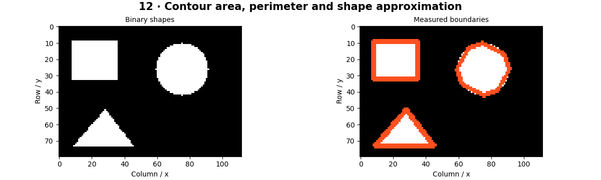

# Contours and Shapes — concepts and mechanisms

## What and why

A contour traces a region boundary. Once a segmentation mask is available, contours convert pixels into geometric measurements: area, perimeter, enclosing boxes, convex hulls and polygon approximations. The measurement is only as reliable as the mask and scale calibration.

## 1. Contours, components and measurements

Connected components label foreground regions; contours trace their boundaries. They answer related but different questions. A contour polygon area differs from counting foreground pixel centers, especially for small objects. Retrieval mode controls whether holes and nested boundaries are returned.

## 2. Bounding rectangles and shape approximations

An axis-aligned bounding box follows image axes; a rotated minimum-area rectangle follows object orientation. Polygon approximation removes points while limiting boundary deviation. Too large an epsilon turns curved shapes into crude polygons, while too small an epsilon preserves noise.

## 3. Convexity and calibrated dimensions

A convex hull encloses a contour without inward dents. Solidity compares region area with hull area; circularity compares area and perimeter. These are descriptors, not universal category rules. Converting pixels to millimeters requires known scale or camera geometry and an assumption about the measurement plane.

## Mathematical foundation

$$
C=4\pi A/P^2
$$

C is circularity, A region area and P perimeter in consistent units. A continuous circle of radius 3 has area 9π and perimeter 6π, yielding C=1. Digitized contours generally differ from the continuous ideal.

The numerical example makes the units and reduction visible before the larger pipeline:

```python
import numpy as np
import cv2

radius = 3.0
area = np.pi * radius**2
perimeter = 2 * np.pi * radius
circularity = 4 * np.pi * area / perimeter**2
assert np.isclose(circularity, 1)
print(circularity)
```

## What happens internally

OpenCV finds boundaries in the synthetic mask, measures each contour and overlays approximations and rotated boxes. Shape rules use measured values and expose ambiguous cases.

Read the chapter entry point, then follow its shared source. The core reference is `numerics.components`. Separate data construction, algorithm, metric and plotting when changing the experiment.

## Visual reasoning



Predict a change before rerunning. Explain what each axis, color, mask or matrix cell represents. In learned examples, compare a loss curve with held-out predictions; in geometry examples, compare coordinate residuals with known synthetic truth. Visual plausibility is useful evidence, but does not replace a declared metric.

## Controlled experiment

Rotate a rectangle and compare its axis-aligned box area with its minimum-area box. Add holes and inspect contour hierarchy.

Write down the independent variable, what remains fixed, and the metric before changing code. Repeat stochastic experiments with multiple seeds and retain negative results. A timing comparison should include warm-up, repeat count and hardware; never compare unmatched preprocessing or data sizes.

## Applications and limits

Measure image shapes and distinguish pixels from physical units. The mini project applies the mechanism in a small runnable baseline. Perspective changes apparent size. A fixed pixels-per-millimeter ratio cannot measure arbitrary depths.

The local generated distribution deliberately removes some real-world complexity. External data, pretrained models and hardware paths are documented separately in [external workflows](../../docs/external-workflows.md). A toy objective or synthetic score must be labeled as such when used in a portfolio.

## Exercises and checkpoint

Explain this chapter to someone using one concrete example. Then implement a tiny case, change a parameter, create a failure and apply the method to new data. Use the [three exercise levels](../exercises/beginner.md) and [challenge](../exercises/challenge.md) to record evidence.

## Research connection

[Read the chapter research note](../../docs/research-reading.md#chapter-12). It distinguishes the original contribution, architecture intuition, limitations and alternatives from the scope of the runnable lab.

## References and next step

[Primary reference](https://docs.opencv.org/4.x/d3/d05/tutorial_py_table_of_contents_contours.html). Continue through the chapter notebooks and mini project, then follow the next-chapter link in the [chapter README](../README.md).
