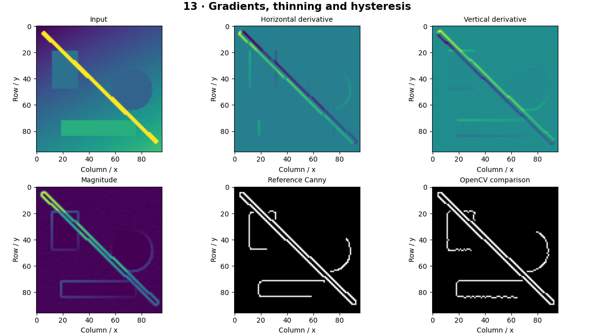

# Edge and Corner Detection — concepts and mechanisms

## What and why

Edges are rapid changes in image intensity. They often correspond to boundaries, but also arise from texture, shadows and noise. A derivative measures change; a good edge pipeline controls noise and decides which changes should form connected boundaries.

## 1. Gradients, Sobel and Scharr

A horizontal derivative responds to left-right intensity change, and a vertical derivative responds to up-down change. Sobel combines differencing with smoothing. Scharr uses different coefficients to improve rotational behavior for small kernels. Gradient magnitude combines both responses; orientation is obtained with atan2.

## 2. Laplacian and second derivatives

The Laplacian adds second derivatives and responds to changes in the gradient. It can highlight fine structures but amplifies noise strongly. A signed or floating representation is essential: clipping negative derivatives to zero destroys half the signal. Absolute value is a display choice, not the derivative itself.

## 3. Canny step by step

Canny smooths the image, estimates gradients, thins responses through non-maximum suppression, applies high and low thresholds, and keeps weak edges connected to strong ones through hysteresis. The reference uses four orientation bins and relative thresholds; OpenCV has different implementation details and absolute thresholds, so exact edge maps are not expected.

## Mathematical foundation

$$
G=\sqrt{G_x^2+G_y^2},\qquad\theta=\operatorname{atan2}(G_y,G_x)
$$

Gx and Gy are horizontal and vertical derivatives, G their magnitude and θ edge-normal orientation. Derivatives (3,4) have magnitude 5 and orientation about 53.13 degrees.

The numerical example makes the units and reduction visible before the larger pipeline:

```python
import numpy as np
import cv2

gx, gy = 3.0, 4.0
magnitude = np.hypot(gx, gy)
orientation = np.degrees(np.arctan2(gy, gx))
assert magnitude == 5
print(magnitude, orientation)
```

## What happens internally

Follow the NumPy implementation in order: Gaussian blur → Sobel → magnitude/orientation → directional suppression → two thresholds → queue-based hysteresis. Compare intermediate arrays, not only the final binary output.

Read the chapter entry point, then follow its shared source. The core reference is `numerics.canny_reference`. Separate data construction, algorithm, metric and plotting when changing the experiment.

## Visual reasoning



Predict a change before rerunning. Explain what each axis, color, mask or matrix cell represents. In learned examples, compare a loss curve with held-out predictions; in geometry examples, compare coordinate residuals with known synthetic truth. Visual plausibility is useful evidence, but does not replace a declared metric.

## Controlled experiment

Increase noise and independently change blur scale and hysteresis thresholds. Observe missing boundaries versus false texture edges.

Write down the independent variable, what remains fixed, and the metric before changing code. Repeat stochastic experiments with multiple seeds and retain negative results. A timing comparison should include warm-up, repeat count and hardware; never compare unmatched preprocessing or data sizes.

## Applications and limits

Construct a simplified Canny pipeline and evaluate noise effects. The mini project applies the mechanism in a small runnable baseline. Edges are not closed object masks. Applying contours to a broken Canny map can produce fragmented shapes.

The local generated distribution deliberately removes some real-world complexity. External data, pretrained models and hardware paths are documented separately in [external workflows](../../docs/external-workflows.md). A toy objective or synthetic score must be labeled as such when used in a portfolio.

## Exercises and checkpoint

Explain this chapter to someone using one concrete example. Then implement a tiny case, change a parameter, create a failure and apply the method to new data. Use the [three exercise levels](../exercises/beginner.md) and [challenge](../exercises/challenge.md) to record evidence.

## Research connection

[Read the chapter research note](../../docs/research-reading.md#chapter-13). It distinguishes the original contribution, architecture intuition, limitations and alternatives from the scope of the runnable lab.

## References and next step

[Primary reference](https://docs.opencv.org/4.x/da/d22/tutorial_py_canny.html). Continue through the chapter notebooks and mini project, then follow the next-chapter link in the [chapter README](../README.md).
