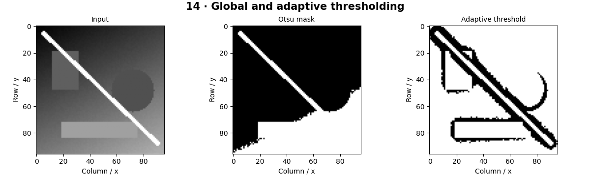

# Classical Segmentation — concepts and mechanisms

## What and why

Segmentation assigns a label to each pixel. Classical methods use explicit assumptions about intensity, color or connectivity. They are useful baselines because their failure conditions are easier to inspect than those of a large trained model.

## 1. Global, adaptive and Otsu thresholds

A threshold separates pixels above and below a cutoff. Otsu chooses a cutoff by maximizing between-class variance in the histogram. It works best when two intensity groups are meaningfully separable. Adaptive thresholding computes local cutoffs and can handle uneven illumination, but its neighborhood size introduces another scale assumption.

## 2. K-means color segmentation

K-means alternates assigning each feature vector to its nearest center and recomputing centers as means. For color segmentation, each pixel is a point in a color space. Cluster IDs have no semantic meaning and may permute between runs. Adding coordinates favors spatial compactness but changes the distance metric.

## 3. Connected components and region cleanup

Connected-component labeling groups adjacent foreground pixels after thresholding. Four-connectivity joins horizontal and vertical neighbors; eight-connectivity also joins diagonals. Component size filters remove specks but may remove real small objects. Compare the full pipeline against a known mask using IoU rather than visual impression alone.

## Mathematical foundation

$$
J=\sum_i\lVert x_i-\mu_{c_i}\rVert^2
$$

xi is a pixel feature vector, ci its cluster assignment and μ the selected cluster center. For values [1,2] assigned to center 1.5, the summed squared distance is 0.5. K-means decreases this objective but may reach a local solution.

The numerical example makes the units and reduction visible before the larger pipeline:

```python
import numpy as np
import cv2

values = np.array([1.0, 2.0])
center = values.mean()
objective = ((values - center) ** 2).sum()
assert np.isclose(objective, 0.5)
print(center, objective)
```

## What happens internally

The Otsu reference sweeps histogram partitions, k-means updates assignments and means, and the component reference uses a queue to flood each unvisited foreground region.

Read the chapter entry point, then follow its shared source. The core reference is `numerics.kmeans`. Separate data construction, algorithm, metric and plotting when changing the experiment.

## Visual reasoning



Predict a change before rerunning. Explain what each axis, color, mask or matrix cell represents. In learned examples, compare a loss curve with held-out predictions; in geometry examples, compare coordinate residuals with known synthetic truth. Visual plausibility is useful evidence, but does not replace a declared metric.

## Controlled experiment

Add a lighting gradient before thresholding. Compare Otsu and adaptive masks at fixed object geometry, then inspect component counts.

Write down the independent variable, what remains fixed, and the metric before changing code. Repeat stochastic experiments with multiple seeds and retain negative results. A timing comparison should include warm-up, repeat count and hardware; never compare unmatched preprocessing or data sizes.

## Applications and limits

Separate regions with explicit assumptions and evaluation. The mini project applies the mechanism in a small runnable baseline. Cluster zero is not automatically background. Accuracy on a mostly-background image can be high for an empty prediction.

The local generated distribution deliberately removes some real-world complexity. External data, pretrained models and hardware paths are documented separately in [external workflows](../../docs/external-workflows.md). A toy objective or synthetic score must be labeled as such when used in a portfolio.

## Exercises and checkpoint

Explain this chapter to someone using one concrete example. Then implement a tiny case, change a parameter, create a failure and apply the method to new data. Use the [three exercise levels](../exercises/beginner.md) and [challenge](../exercises/challenge.md) to record evidence.

## Research connection

[Read the chapter research note](../../docs/research-reading.md#chapter-14). It distinguishes the original contribution, architecture intuition, limitations and alternatives from the scope of the runnable lab.

## References and next step

[Primary reference](https://docs.opencv.org/4.x/d7/d4d/tutorial_py_thresholding.html). Continue through the chapter notebooks and mini project, then follow the next-chapter link in the [chapter README](../README.md).
