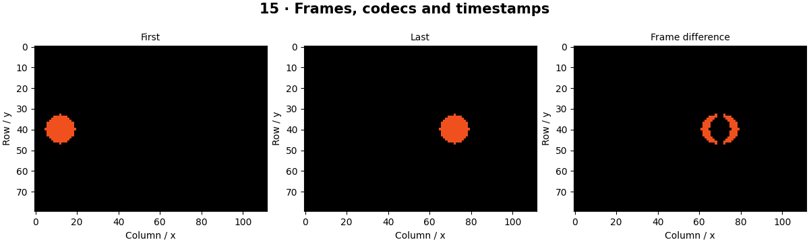

# Video Processing — concepts and mechanisms

## What and why

A video is a time-ordered sequence of images with timing and encoding information. Frame count, nominal FPS, processing throughput and end-to-end latency describe different things. A reliable loop must handle end-of-file, decode failures and unavailable cameras.

## 1. Frames, codecs and video I/O

Video containers hold encoded frames and timing metadata; a codec compresses the frames. VideoWriter needs a compatible codec, frame dimensions, color convention and nominal FPS. The lab writes a small generated motion sequence, reads it back and verifies the decoded frame count. Codec availability can differ across operating systems.

## 2. Processing loops and timestamps

Each successful read produces a frame that can be preprocessed, analyzed and displayed or saved. Use actual timestamps for motion and frame age. Nominal source FPS is not a measured inference rate. Always release captures and writers, even if processing raises an error.

## 3. Background models and streaming design

A background model estimates what normally occupies each pixel. Subtracting it highlights changes, but shadows, camera movement and moving foliage also produce changes. For live systems, a bounded queue can prevent old frames from accumulating when processing is slower than capture. Later tracking chapters add temporal identity.

## Mathematical foundation

$$
t_i=i/f
$$

ti is the nominal timestamp of frame index i and f the constant frame rate in frames per second. Frame 45 at 30 FPS is at 1.5 seconds. Variable-frame-rate video requires actual timestamps rather than this formula.

The numerical example makes the units and reduction visible before the larger pipeline:

```python
import numpy as np
import cv2

frame_index, fps = 45, 30.0
time_seconds = frame_index / fps
assert np.isclose(time_seconds, 1.5)
print(time_seconds)
```

## What happens internally

Generated moving frames isolate codec and loop behavior from camera hardware. Differences are computed in a signed type; thresholded differences are only motion candidates.

Read the chapter entry point, then follow its shared source. The core reference is `numerics.gray`. Separate data construction, algorithm, metric and plotting when changing the experiment.

## Visual reasoning



Predict a change before rerunning. Explain what each axis, color, mask or matrix cell represents. In learned examples, compare a loss curve with held-out predictions; in geometry examples, compare coordinate residuals with known synthetic truth. Visual plausibility is useful evidence, but does not replace a declared metric.

## Controlled experiment

Process every second frame and compare trajectory displacement per processed frame with displacement per second.

Write down the independent variable, what remains fixed, and the metric before changing code. Repeat stochastic experiments with multiple seeds and retain negative results. A timing comparison should include warm-up, repeat count and hardware; never compare unmatched preprocessing or data sizes.

## Applications and limits

Process finite files and release camera resources reliably. The mini project applies the mechanism in a small runnable baseline. VideoCapture.read returning false can mean end-of-stream or failure. Writing frames of the wrong shape may silently produce a broken video.

The local generated distribution deliberately removes some real-world complexity. External data, pretrained models and hardware paths are documented separately in [external workflows](../../docs/external-workflows.md). A toy objective or synthetic score must be labeled as such when used in a portfolio.

## Exercises and checkpoint

Explain this chapter to someone using one concrete example. Then implement a tiny case, change a parameter, create a failure and apply the method to new data. Use the [three exercise levels](../exercises/beginner.md) and [challenge](../exercises/challenge.md) to record evidence.

## Research connection

[Read the chapter research note](../../docs/research-reading.md#chapter-15). It distinguishes the original contribution, architecture intuition, limitations and alternatives from the scope of the runnable lab.

## References and next step

[Primary reference](https://docs.opencv.org/4.x/dd/d43/tutorial_py_video_display.html). Continue through the chapter notebooks and mini project, then follow the next-chapter link in the [chapter README](../README.md).
