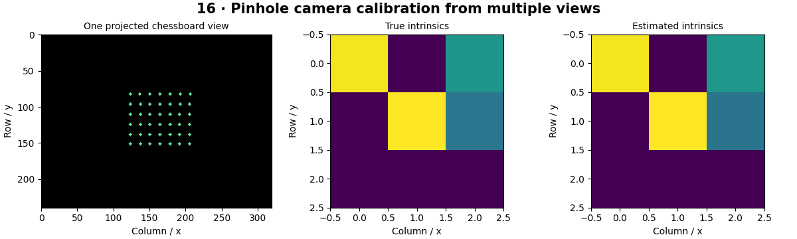

# Camera and Calibration — concepts and mechanisms

## What and why

Calibration estimates how a camera maps three-dimensional points to image pixels. Intrinsics describe the camera coordinate system and pixel scaling; extrinsics describe camera pose relative to a world frame. Lens distortion adds departures from the ideal pinhole model.

## 1. Pinhole cameras and intrinsics

The intrinsic matrix contains horizontal and vertical focal lengths in pixels and the principal point. Rotation and translation place a world point in camera coordinates. Perspective division makes distant objects appear smaller. Physical focal length in millimeters cannot be substituted for focal length in pixels without sensor scaling.

## 2. Chessboard calibration and reprojection

A calibration board supplies known points in a plane. Observe it at varied angles and positions, detect corners and minimize reprojection error across views. Reprojection error measures agreement with detected image points; it does not by itself guarantee accurate depth. The lab uses known synthetic board poses and compares recovered parameters with truth.

## 3. Distortion, undistortion and validation

Radial distortion bends lines increasingly away from the optical center, while tangential terms model decentering effects. Undistortion remaps pixels and can leave empty borders. A calibration depends on image resolution, focus and lens configuration. Reserve independent board views for evaluation and inspect spatial residual patterns.

## Mathematical foundation

$$
u=f_xX/Z+c_x,\qquad v=f_yY/Z+c_y
$$

X,Y,Z are camera-frame coordinates, fx,fy focal lengths in pixels, and cx,cy principal point. With X=0.2 m, Z=2 m, fx=400 px and cx=320 px, u=360 px.

The numerical example makes the units and reduction visible before the larger pipeline:

```python
import numpy as np
import cv2

X, Z, fx, cx = 0.2, 2.0, 400.0, 320.0
u = fx * X / Z + cx
assert np.isclose(u, 360)
print(u)
```

## What happens internally

The synthetic lab projects a grid through known intrinsics and poses, adds pixel noise and calls calibrateCamera. The reported parameter error is meaningful because synthetic truth is available.

Read the chapter entry point, then follow its shared source. The core reference is `geometry.project`. Separate data construction, algorithm, metric and plotting when changing the experiment.

## Visual reasoning



Predict a change before rerunning. Explain what each axis, color, mask or matrix cell represents. In learned examples, compare a loss curve with held-out predictions; in geometry examples, compare coordinate residuals with known synthetic truth. Visual plausibility is useful evidence, but does not replace a declared metric.

## Controlled experiment

Use many nearly identical front-facing board views versus varied views. Compare parameter stability, not just training reprojection error.

Write down the independent variable, what remains fixed, and the metric before changing code. Repeat stochastic experiments with multiple seeds and retain negative results. A timing comparison should include warm-up, repeat count and hardware; never compare unmatched preprocessing or data sizes.

## Applications and limits

Calibrate a camera and validate on held-out board views. The mini project applies the mechanism in a small runnable baseline. Chessboard dimensions count inner corners, not squares. Mixing units changes estimated translations and baseline scale.

The local generated distribution deliberately removes some real-world complexity. External data, pretrained models and hardware paths are documented separately in [external workflows](../../docs/external-workflows.md). A toy objective or synthetic score must be labeled as such when used in a portfolio.

## Exercises and checkpoint

Explain this chapter to someone using one concrete example. Then implement a tiny case, change a parameter, create a failure and apply the method to new data. Use the [three exercise levels](../exercises/beginner.md) and [challenge](../exercises/challenge.md) to record evidence.

## Research connection

[Read the chapter research note](../../docs/research-reading.md#chapter-16). It distinguishes the original contribution, architecture intuition, limitations and alternatives from the scope of the runnable lab.

## References and next step

[Primary reference](https://docs.opencv.org/4.x/dc/dbb/tutorial_py_calibration.html). Continue through the chapter notebooks and mini project, then follow the next-chapter link in the [chapter README](../README.md).
