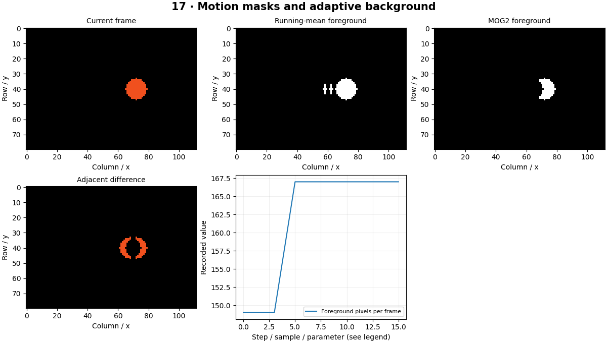

# Motion Detection — concepts and mechanisms

## What and why

Motion detection asks where the scene changes over time. It does not identify object categories or preserve identity. The simplest useful systems compare frames or maintain a slowly changing background and then clean a foreground mask.

## 1. Frame differencing

Frame differencing subtracts consecutive images and thresholds the absolute change. It emphasizes movement boundaries and can miss the interior of a slowly moving object. A stopped object disappears from the difference even though it still occupies the scene.

## 2. Running backgrounds and adaptation

An exponential running average updates each background pixel with a weighted portion of the current frame. A large update rate adapts quickly but absorbs stopped objects; a small rate keeps old conditions longer. Updating only likely background regions can reduce contamination, but classification errors can then freeze the model.

## 3. MOG2, shadows and failure analysis

MOG2 models a pixel with a mixture of distributions to handle some recurring background variations. Shadows may receive a distinct mask value. A moving camera changes almost every pixel, so stabilization or camera-motion estimation is needed before interpreting foreground as object motion.

## Mathematical foundation

$$
B_t=(1-\alpha)B_{t-1}+\alpha I_t
$$

Bt is the updated background, It the current frame and α the update rate. For previous background 100, current intensity 140 and α=0.1, the new estimate is 104.

The numerical example makes the units and reduction visible before the larger pipeline:

```python
import numpy as np
import cv2

previous, current, alpha = 100.0, 140.0, 0.1
background = (1 - alpha) * previous + alpha * current
assert np.isclose(background, 104)
print(background)
```

## What happens internally

The generated sequence supplies an initial background and moving foreground. The lab compares absolute differences, a running mean and OpenCV MOG2 masks under a fixed seed.

Read the chapter entry point, then follow its shared source. The core reference is `tracking.KalmanTracker`. Separate data construction, algorithm, metric and plotting when changing the experiment.

## Visual reasoning



Predict a change before rerunning. Explain what each axis, color, mask or matrix cell represents. In learned examples, compare a loss curve with held-out predictions; in geometry examples, compare coordinate residuals with known synthetic truth. Visual plausibility is useful evidence, but does not replace a declared metric.

## Controlled experiment

Stop the object midway and vary adaptation rate. Measure how long it remains foreground and how long a ghost remains after it leaves.

Write down the independent variable, what remains fixed, and the metric before changing code. Repeat stochastic experiments with multiple seeds and retain negative results. A timing comparison should include warm-up, repeat count and hardware; never compare unmatched preprocessing or data sizes.

## Applications and limits

Detect scene change without confusing it with object identity. The mini project applies the mechanism in a small runnable baseline. Global lighting changes resemble motion. A binary foreground mask does not distinguish one object from two touching objects.

The local generated distribution deliberately removes some real-world complexity. External data, pretrained models and hardware paths are documented separately in [external workflows](../../docs/external-workflows.md). A toy objective or synthetic score must be labeled as such when used in a portfolio.

## Exercises and checkpoint

Explain this chapter to someone using one concrete example. Then implement a tiny case, change a parameter, create a failure and apply the method to new data. Use the [three exercise levels](../exercises/beginner.md) and [challenge](../exercises/challenge.md) to record evidence.

## Research connection

[Read the chapter research note](../../docs/research-reading.md#chapter-17). It distinguishes the original contribution, architecture intuition, limitations and alternatives from the scope of the runnable lab.

## References and next step

[Primary reference](https://docs.opencv.org/4.x/d1/dc5/tutorial_background_subtraction.html). Continue through the chapter notebooks and mini project, then follow the next-chapter link in the [chapter README](../README.md).
