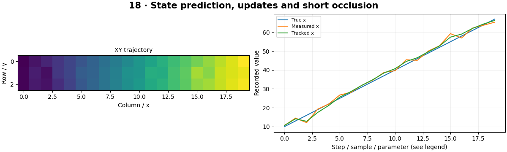

# Object Tracking — concepts and mechanisms

## What and why

Tracking estimates an object state over time. Detection supplies observations; a motion model predicts where the object might be next. Keeping uncertainty explicit allows a tracker to bridge short missing detections without pretending its prediction is a measurement.

## 1. State, observations and prediction

A simple state stores x, y, horizontal velocity and vertical velocity. A constant-velocity transition advances position by velocity times elapsed time. Process noise represents unmodeled acceleration. A detection observes position with measurement noise and usually does not directly observe velocity.

## 2. Kalman correction and uncertainty

Kalman correction combines prediction and measurement using their uncertainties. The gain is larger when the prediction is uncertain and smaller when the measurement is noisy. Covariance tracks uncertainty, including relationships between position and velocity. The implementation uses a numerically stable covariance update.

## 3. Occlusion, gating and track lifetime

Gating rejects observations too far from a predicted state. During a missing detection, a track predicts forward and its uncertainty grows. A maximum missed-frame policy eventually deletes it. Template-based trackers such as correlation filters and detector-assisted tracking use different observations; neither guarantees identity through long occlusion.

## Mathematical foundation

$$
x_{t+1}=x_t+v_x\Delta t
$$

x is horizontal position, vx horizontal velocity and Δt elapsed time. At x=10 px, velocity 3 px/s and Δt=0.5 s, predicted x is 11.5 px. This model assumes constant velocity over that interval.

The numerical example makes the units and reduction visible before the larger pipeline:

```python
import numpy as np
import cv2

position, velocity, dt = 10.0, 3.0, 0.5
prediction = position + velocity * dt
assert np.isclose(prediction, 11.5)
print(prediction)
```

## What happens internally

The tracker predicts state/covariance, associates gated observations, corrects matched tracks and expires stale tracks. The lab compares noisy centers and filtered positions against known trajectories.

Read the chapter entry point, then follow its shared source. The core reference is `tracking.KalmanTracker`. Separate data construction, algorithm, metric and plotting when changing the experiment.

## Visual reasoning



Predict a change before rerunning. Explain what each axis, color, mask or matrix cell represents. In learned examples, compare a loss curve with held-out predictions; in geometry examples, compare coordinate residuals with known synthetic truth. Visual plausibility is useful evidence, but does not replace a declared metric.

## Controlled experiment

Increase measurement noise and insert a short occlusion. Plot position error and inspect uncertainty rather than judging smoothness alone.

Write down the independent variable, what remains fixed, and the metric before changing code. Repeat stochastic experiments with multiple seeds and retain negative results. A timing comparison should include warm-up, repeat count and hardware; never compare unmatched preprocessing or data sizes.

## Applications and limits

Follow a visible object and explain when its identity is uncertain. The mini project applies the mechanism in a small runnable baseline. A smooth trajectory can still be wrong. Pixel velocity changes when FPS changes unless elapsed time is included.

The local generated distribution deliberately removes some real-world complexity. External data, pretrained models and hardware paths are documented separately in [external workflows](../../docs/external-workflows.md). A toy objective or synthetic score must be labeled as such when used in a portfolio.

## Exercises and checkpoint

Explain this chapter to someone using one concrete example. Then implement a tiny case, change a parameter, create a failure and apply the method to new data. Use the [three exercise levels](../exercises/beginner.md) and [challenge](../exercises/challenge.md) to record evidence.

## Research connection

[Read the chapter research note](../../docs/research-reading.md#chapter-18). It distinguishes the original contribution, architecture intuition, limitations and alternatives from the scope of the runnable lab.

## References and next step

[Primary reference](https://docs.opencv.org/4.x/dd/d6a/classcv_1_1KalmanFilter.html). Continue through the chapter notebooks and mini project, then follow the next-chapter link in the [chapter README](../README.md).
