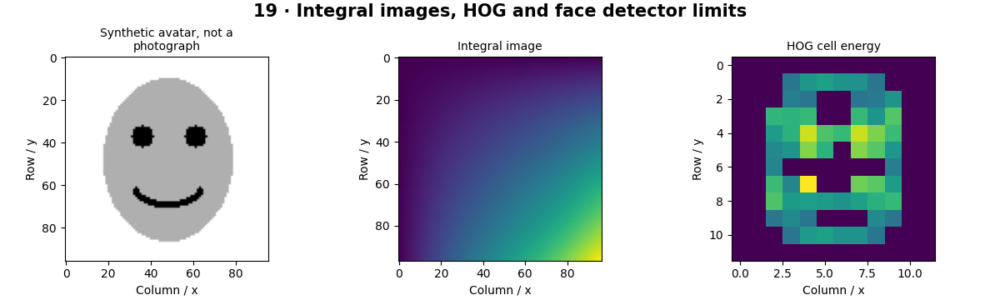

# Face Detection — concepts and mechanisms

## What and why

Face detection locates face-like regions. It does not identify a person, estimate trustworthiness or infer sensitive traits. Classical and learned detectors use different representations, but all require careful evaluation across pose, lighting, scale and the intended population.

## 1. Integral images and Haar features

An integral image stores the cumulative sum above and to the left of each position. Rectangle sums then require four array accesses, which makes Haar rectangle features inexpensive. A cascade rejects easy negative windows early and spends more computation on promising regions. Its learned thresholds come from training examples, not the integral-image formula itself.

## 2. HOG and sliding-window detectors

HOG divides a neighborhood into cells and summarizes gradient orientations. The full descriptor also uses overlapping block normalization to reduce contrast sensitivity. A linear classifier can score windows at multiple scales. The included NumPy HOG is a simplified cell-normalized teaching version; it is not a reproduction of a trained face detector.

## 3. Modern detectors and evaluation

Modern convolutional face detectors jointly predict boxes, scores and sometimes landmarks. The lab loads OpenCV’s bundled Haar cascade and runs it on a cartoon solely to exercise the API. No human-face recall is claimed. Real evaluation requires consented, documented imagery and separate analysis of missed and false detections.

## Mathematical foundation

$$
S(x,y)=\sum_{u\le x,v\le y}I(u,v)
$$

S is an integral image and I the original intensity. A padded integral image makes rectangle sums uniform. For the 2×2 values [[1,2],[3,4]], the full rectangle sum is 10.

The numerical example makes the units and reduction visible before the larger pipeline:

```python
import numpy as np
import cv2

image = np.array([[1, 2], [3, 4]])
integral = np.pad(image.cumsum(0).cumsum(1), ((1, 0), (1, 0)))
total = integral[2, 2] - integral[0, 2] - integral[2, 0] + integral[0, 0]
assert total == 10
print(total)
```

## What happens internally

The lab visualizes an integral image, orientation histograms and actual cascade boxes. Empty detections are a valid outcome on the synthetic cartoon.

Read the chapter entry point, then follow its shared source. The core reference is `numerics.hog`. Separate data construction, algorithm, metric and plotting when changing the experiment.

## Visual reasoning



Predict a change before rerunning. Explain what each axis, color, mask or matrix cell represents. In learned examples, compare a loss curve with held-out predictions; in geometry examples, compare coordinate residuals with known synthetic truth. Visual plausibility is useful evidence, but does not replace a declared metric.

## Controlled experiment

Test how resizing and contrast affect a detector on a small consented evaluation set; include empty scenes and partial occlusions.

Write down the independent variable, what remains fixed, and the metric before changing code. Repeat stochastic experiments with multiple seeds and retain negative results. A timing comparison should include warm-up, repeat count and hardware; never compare unmatched preprocessing or data sizes.

## Applications and limits

Evaluate face boxes on consented examples without identity claims. The mini project applies the mechanism in a small runnable baseline. A detected box is not proof that a person is present. Cascade scores should not be treated as calibrated probabilities.

The local generated distribution deliberately removes some real-world complexity. External data, pretrained models and hardware paths are documented separately in [external workflows](../../docs/external-workflows.md). A toy objective or synthetic score must be labeled as such when used in a portfolio.

## Exercises and checkpoint

Explain this chapter to someone using one concrete example. Then implement a tiny case, change a parameter, create a failure and apply the method to new data. Use the [three exercise levels](../exercises/beginner.md) and [challenge](../exercises/challenge.md) to record evidence.

## Research connection

[Read the chapter research note](../../docs/research-reading.md#chapter-19). It distinguishes the original contribution, architecture intuition, limitations and alternatives from the scope of the runnable lab.

## References and next step

[Primary reference](https://docs.opencv.org/4.x/db/d28/tutorial_cascade_classifier.html). Continue through the chapter notebooks and mini project, then follow the next-chapter link in the [chapter README](../README.md).
