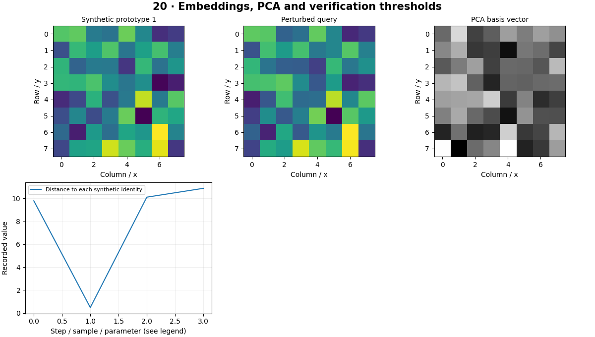

# Face Recognition — concepts and mechanisms

## What and why

Recognition compares representations to decide whether two observations may share an identity. Verification is a one-to-one comparison; identification searches a gallery. The educational lab uses synthetic vectors and anonymous labels so the decision mechanics can be learned without collecting biometric data.

## 1. Embeddings, PCA and distance

An embedding is a vector intended to preserve useful similarity. PCA projects data onto directions of high variance; it does not automatically learn identity. Face-recognition systems usually train a representation with identity-related supervision and carefully align crops. The synthetic lab separates the geometry of embeddings from those data and training requirements.

## 2. Verification thresholds and open sets

Verification compares a pair against a threshold; identification selects among gallery candidates and must also support unknown identities. Euclidean distance depends on vector magnitude unless vectors are normalized. Cosine similarity compares direction. Choose a threshold on validation data for a target false-match rate, then freeze it before testing.

## 3. Evaluation, consent and failure cases

Evaluate false matches, false nonmatches and uncertainty across relevant acquisition conditions. A gallery’s size changes the chance of accidental nearest neighbors. Use informed consent, access control and retention limits for any real biometric extension. Do not infer protected attributes or suitability from an embedding.

## Mathematical foundation

$$
s(a,b)=\frac{a^Tb}{\lVert a\rVert\lVert b\rVert}
$$

a and b are nonzero embedding vectors and s is cosine similarity. For a=[1,0] and b=[1,1], similarity is 1/√2, about 0.707. A threshold is a deployment choice, not a universal constant.

The numerical example makes the units and reduction visible before the larger pipeline:

```python
import numpy as np
import cv2

a, b = np.array([1.0, 0.0]), np.array([1.0, 1.0])
score = a @ b / (np.linalg.norm(a) * np.linalg.norm(b))
assert np.isclose(score, 1 / np.sqrt(2))
print(score)
```

## What happens internally

Generated cluster prototypes create anonymous identities. PCA and nearest-prototype comparison demonstrate distance and rejection; they do not constitute a pretrained human-face recognition system.

Read the chapter entry point, then follow its shared source. The core reference is `numerics.softmax`. Separate data construction, algorithm, metric and plotting when changing the experiment.

## Visual reasoning



Predict a change before rerunning. Explain what each axis, color, mask or matrix cell represents. In learned examples, compare a loss curve with held-out predictions; in geometry examples, compare coordinate residuals with known synthetic truth. Visual plausibility is useful evidence, but does not replace a declared metric.

## Controlled experiment

Add unknown synthetic identities and sweep the threshold. Plot false acceptance and false rejection rather than only closed-set accuracy.

Write down the independent variable, what remains fixed, and the metric before changing code. Repeat stochastic experiments with multiple seeds and retain negative results. A timing comparison should include warm-up, repeat count and hardware; never compare unmatched preprocessing or data sizes.

## Applications and limits

Study small consented verification experiments with error analysis. The mini project applies the mechanism in a small runnable baseline. Selecting the threshold on the test set leaks evaluation information. Good synthetic cluster separation is not evidence of biometric performance.

The local generated distribution deliberately removes some real-world complexity. External data, pretrained models and hardware paths are documented separately in [external workflows](../../docs/external-workflows.md). A toy objective or synthetic score must be labeled as such when used in a portfolio.

## Exercises and checkpoint

Explain this chapter to someone using one concrete example. Then implement a tiny case, change a parameter, create a failure and apply the method to new data. Use the [three exercise levels](../exercises/beginner.md) and [challenge](../exercises/challenge.md) to record evidence.

## Research connection

[Read the chapter research note](../../docs/research-reading.md#chapter-20). It distinguishes the original contribution, architecture intuition, limitations and alternatives from the scope of the runnable lab.

## References and next step

[Primary reference](https://scikit-learn.org/stable/modules/generated/sklearn.decomposition.PCA.html). Continue through the chapter notebooks and mini project, then follow the next-chapter link in the [chapter README](../README.md).
