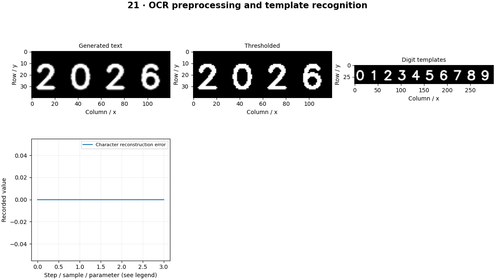

# OCR — concepts and mechanisms

## What and why

Optical character recognition converts an image of text into symbols. A useful pipeline distinguishes text detection, geometric cleanup, recognition and layout reconstruction. Blurring, skew, language and font choices can each break a different stage.

## 1. Thresholding, deskewing and text regions

Preprocessing should improve separation of strokes from background without deleting punctuation or joining letters. Estimate skew from text-line orientation or reliable foreground geometry, rotate with controlled interpolation and preserve a copy of the original. Thresholding is appropriate for some documents but can harm colored or textured text.

## 2. Template recognition and sequence errors

Template matching compares a crop against stored glyph images. It illustrates recognition directly, but needs aligned characters and limited fonts. The lab renders digits, compares normalized templates and reports character errors. Real words require segmentation or sequence models that can handle variable-width characters and context.

## 3. Tesseract and learned OCR pipelines

Tesseract provides a complete OCR engine with page-segmentation and language options. Modern learned systems often separate text detection from line recognition, sometimes using CTC to align variable-length outputs. scripts/external_models.py includes an opt-in Tesseract workflow. Layout, tables and reading order remain separate engineering tasks.

## Mathematical foundation

$$
CER=(S+D+I)/N
$$

S is substitutions, D deletions, I insertions and N the number of reference characters. One substitution in a five-character word gives CER=0.2. General CER needs an edit-distance alignment; equal-length position errors are only a restricted case.

The numerical example makes the units and reduction visible before the larger pipeline:

```python
import numpy as np
import cv2

substitutions, deletions, insertions, reference_length = 1, 0, 0, 5
cer = (substitutions + deletions + insertions) / reference_length
assert np.isclose(cer, 0.2)
print(cer)
```

## What happens internally

The local lab uses known fixed-spaced glyphs to isolate template recognition. Its positional character error is explicitly narrower than unrestricted edit-distance CER.

Read the chapter entry point, then follow its shared source. The core reference is `numerics.otsu`. Separate data construction, algorithm, metric and plotting when changing the experiment.

## Visual reasoning



Predict a change before rerunning. Explain what each axis, color, mask or matrix cell represents. In learned examples, compare a loss curve with held-out predictions; in geometry examples, compare coordinate residuals with known synthetic truth. Visual plausibility is useful evidence, but does not replace a declared metric.

## Controlled experiment

Change blur, rotation and character spacing independently. Identify whether errors arise before or during recognition.

Write down the independent variable, what remains fixed, and the metric before changing code. Repeat stochastic experiments with multiple seeds and retain negative results. A timing comparison should include warm-up, repeat count and hardware; never compare unmatched preprocessing or data sizes.

## Applications and limits

Extract text while preserving reading order and error evidence. The mini project applies the mechanism in a small runnable baseline. A higher-resolution resize cannot restore unreadable strokes. OCR confidence is not a guarantee that a number was read correctly.

The local generated distribution deliberately removes some real-world complexity. External data, pretrained models and hardware paths are documented separately in [external workflows](../../docs/external-workflows.md). A toy objective or synthetic score must be labeled as such when used in a portfolio.

## Exercises and checkpoint

Explain this chapter to someone using one concrete example. Then implement a tiny case, change a parameter, create a failure and apply the method to new data. Use the [three exercise levels](../exercises/beginner.md) and [challenge](../exercises/challenge.md) to record evidence.

## Research connection

[Read the chapter research note](../../docs/research-reading.md#chapter-21). It distinguishes the original contribution, architecture intuition, limitations and alternatives from the scope of the runnable lab.

## References and next step

[Primary reference](https://tesseract-ocr.github.io/tessdoc/ImproveQuality.html). Continue through the chapter notebooks and mini project, then follow the next-chapter link in the [chapter README](../README.md).
