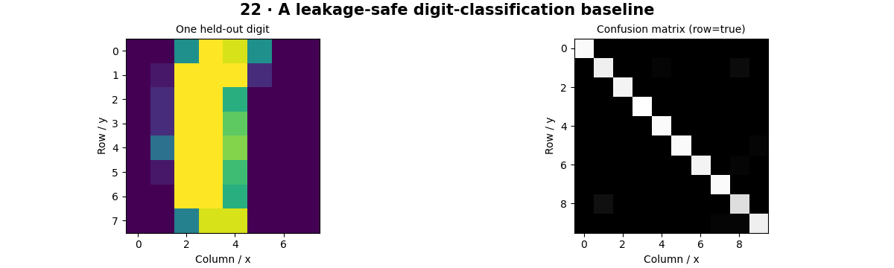

# Machine Learning for Vision — concepts and mechanisms

## What and why

Machine learning fits a rule from examples rather than specifying every visual condition manually. Features are measured inputs, labels are targets, and a held-out evaluation estimates behavior on new examples. Dataset design is part of the model, not administrative work after training.

## 1. Datasets, splits and leakage

Separate training, validation and test data before fitting any preprocessing. Training fits parameters, validation selects settings and the test set estimates final performance. Related images from one person, video or production item should stay in one split. Random image splitting can leak nearly identical observations across splits.

## 2. Linear classification and optimization

A linear classifier scores a weighted combination of features. Logistic regression maps those scores to probabilities and minimizes cross entropy with regularization. A scikit-learn Pipeline fits scaling on training data and applies that fitted transformation to test data. The lab uses packaged handwritten-digit data without a network download.

## 3. Metrics, confusion and thresholds

A confusion matrix counts predicted versus true classes. Precision asks how many predicted positives were correct; recall asks how many true positives were found. F1 balances the two, while ROC-AUC measures ranking across thresholds and needs both classes. Class imbalance and decision costs determine which metric is useful.

## Mathematical foundation

$$
Precision=TP/(TP+FP),\quad Recall=TP/(TP+FN)
$$

TP, FP and FN count true positives, false positives and missed positives. With TP=8, FP=2 and FN=4, precision=0.8 and recall=2/3. Zero denominators need an explicit reporting policy.

The numerical example makes the units and reduction visible before the larger pipeline:

```python
import numpy as np
import cv2

tp, fp, fn = 8, 2, 4
precision = tp / (tp + fp)
recall = tp / (tp + fn)
f1 = 2 * precision * recall / (precision + recall)
print(precision, recall, f1)
```

## What happens internally

A stratified split preserves approximate class proportions; a training-only scaler and LogisticRegression form the pipeline. The confusion matrix is measured on untouched test examples.

Read the chapter entry point, then follow its shared source. The core reference is `numerics.softmax`. Separate data construction, algorithm, metric and plotting when changing the experiment.

## Visual reasoning



Predict a change before rerunning. Explain what each axis, color, mask or matrix cell represents. In learned examples, compare a loss curve with held-out predictions; in geometry examples, compare coordinate residuals with known synthetic truth. Visual plausibility is useful evidence, but does not replace a declared metric.

## Controlled experiment

Compare raw-pixel and HOG features while keeping the split fixed. Tune settings on validation data before inspecting final test results.

Write down the independent variable, what remains fixed, and the metric before changing code. Repeat stochastic experiments with multiple seeds and retain negative results. A timing comparison should include warm-up, repeat count and hardware; never compare unmatched preprocessing or data sizes.

## Applications and limits

Evaluate a baseline with a genuinely held-out split. The mini project applies the mechanism in a small runnable baseline. Fitting a scaler or PCA before splitting leaks test distribution information. Accuracy can hide poor minority-class recall.

The local generated distribution deliberately removes some real-world complexity. External data, pretrained models and hardware paths are documented separately in [external workflows](../../docs/external-workflows.md). A toy objective or synthetic score must be labeled as such when used in a portfolio.

## Exercises and checkpoint

Explain this chapter to someone using one concrete example. Then implement a tiny case, change a parameter, create a failure and apply the method to new data. Use the [three exercise levels](../exercises/beginner.md) and [challenge](../exercises/challenge.md) to record evidence.

## Research connection

[Read the chapter research note](../../docs/research-reading.md#chapter-22). It distinguishes the original contribution, architecture intuition, limitations and alternatives from the scope of the runnable lab.

## References and next step

[Primary reference](https://scikit-learn.org/stable/common_pitfalls.html). Continue through the chapter notebooks and mini project, then follow the next-chapter link in the [chapter README](../README.md).
