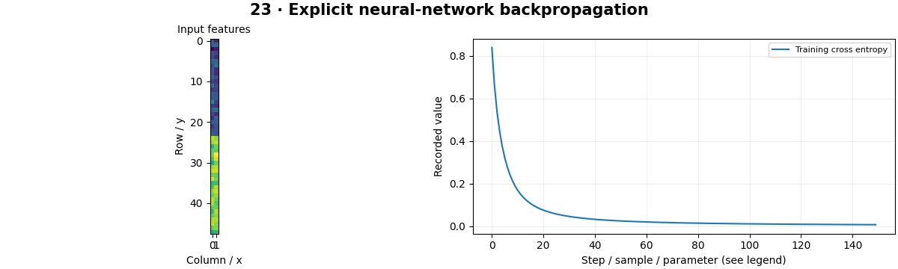

# CNN Fundamentals — concepts and mechanisms

## What and why

A neural network composes simple differentiable operations. A CNN shares small learned filters across image locations, exploiting local structure. Begin with an explicit small network and derivatives, then connect those operations to a framework training loop.

## 1. Perceptrons, loss and backpropagation

A perceptron forms a weighted sum plus bias; a nonlinear activation lets multiple layers express more than one linear map. Forward propagation produces scores, a loss compares them with labels, and backpropagation applies the chain rule to obtain parameter gradients. The NumPy MLP includes explicit derivatives for tanh and softmax cross entropy.

## 2. Convolution, padding and receptive fields

A CNN filter slides over channels and spatial locations with shared weights. Stride controls movement and padding controls borders. Pooling aggregates neighborhoods and expands the effective receptive field. Mathematical convolution reverses a kernel; framework conv2d uses correlation. Learned kernels are updated by loss gradients, unlike fixed Gaussian or Sobel filters.

## 3. A tiny trainable CNN

The tiny CNN combines convolution, ReLU, pooling and a classifier. A training loop clears gradients, computes loss, calls backward and updates weights. Evaluation disables training-specific behavior and gradient recording. Small synthetic shapes make every step runnable on CPU but do not establish real-world classification quality.

## Mathematical foundation

$$
\frac{\partial L}{\partial z_j}=p_j-y_j
$$

z is a class logit, p=softmax(z), y a one-hot label and L single-example cross entropy. For p=[0.2,0.8] and label class 1, the logit gradient is [0.2,−0.2]. Average this gradient over a mean-reduced batch.

The numerical example makes the units and reduction visible before the larger pipeline:

```python
import numpy as np
import cv2

probabilities = np.array([0.2, 0.8])
target = np.array([0.0, 1.0])
logit_gradient = probabilities - target
assert np.isclose(logit_gradient.sum(), 0)
print(logit_gradient)
```

## What happens internally

Inspect the NumPy weight and bias gradients, then compare a fixed kernel through NumPy correlation and PyTorch conv2d. The final lesson trains a CNN with independent generated test samples.

Read the chapter entry point, then follow its shared source. The core reference is `numerics.mlp_train`. Separate data construction, algorithm, metric and plotting when changing the experiment.

## Visual reasoning



Predict a change before rerunning. Explain what each axis, color, mask or matrix cell represents. In learned examples, compare a loss curve with held-out predictions; in geometry examples, compare coordinate residuals with known synthetic truth. Visual plausibility is useful evidence, but does not replace a declared metric.

## Controlled experiment

Remove the activation from a multilayer network and reason about which functions remain possible. Change stride and compute output size before running.

Write down the independent variable, what remains fixed, and the metric before changing code. Repeat stochastic experiments with multiple seeds and retain negative results. A timing comparison should include warm-up, repeat count and hardware; never compare unmatched preprocessing or data sizes.

## Applications and limits

Derive a tiny network update and compare fixed and learned filters. The mini project applies the mechanism in a small runnable baseline. Calling backward accumulates gradients unless they are cleared. A decreasing training loss does not prove generalization.

The local generated distribution deliberately removes some real-world complexity. External data, pretrained models and hardware paths are documented separately in [external workflows](../../docs/external-workflows.md). A toy objective or synthetic score must be labeled as such when used in a portfolio.

## Exercises and checkpoint

Explain this chapter to someone using one concrete example. Then implement a tiny case, change a parameter, create a failure and apply the method to new data. Use the [three exercise levels](../exercises/beginner.md) and [challenge](../exercises/challenge.md) to record evidence.

## Research connection

[Read the chapter research note](../../docs/research-reading.md#chapter-23). It distinguishes the original contribution, architecture intuition, limitations and alternatives from the scope of the runnable lab.

## References and next step

[Primary reference](https://docs.pytorch.org/tutorials/beginner/basics/autogradqs_tutorial.html). Continue through the chapter notebooks and mini project, then follow the next-chapter link in the [chapter README](../README.md).

## Complete NumPy CNN

The practical notebook also trains a full small CNN without autograd. [Manual forward/backward source](../../src/cvzero/course/scratch_cnn.py) includes valid correlation, ReLU, global mean pooling and a class head. Independent finite-difference tests check gradients for kernels, biases and head weights.
