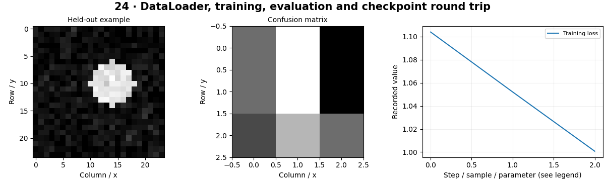

# PyTorch for Computer Vision — concepts and mechanisms

## What and why

PyTorch manages tensors, differentiable operations and model parameters. Its convenience does not remove responsibilities for split integrity, device handling, training state and reproducible checkpoints. A clear loop makes these responsibilities visible.

## 1. Tensors, Dataset and DataLoader

A tensor has shape, dtype and device. A Dataset exposes examples; a DataLoader forms batches and optionally shuffles them. Transforms must preserve label meaning. Images commonly use NCHW in models. Use training augmentation only on training data, and deterministic preprocessing for validation and inference.

## 2. Training, validation and devices

Training and evaluation are different modes. model.train enables training behavior; model.eval changes layers such as dropout and batch normalization. Neither by itself disables autograd. Use inference_mode or no_grad for evaluation. Move model and data to the same available device; CPU is a valid default when CUDA is unavailable.

## 3. Checkpoints, AMP and experiment records

Save a state_dict and record architecture, preprocessing, labels and hyperparameters. A resumable training checkpoint also needs optimizer, scheduler, epoch and RNG state. Mixed precision can improve GPU throughput, but use the supported torch.amp API and measure numeric behavior. The CPU lab verifies an exact weight-save/load logit round trip.

## Mathematical foundation

$$
\theta_{t+1}=\theta_t-\eta\nabla_\theta L
$$

θ represents all trainable parameters, η the learning rate and ∇θL the gradient. A weight 0.5 with gradient 0.2 and step 0.1 updates to 0.48. Adam changes this basic rule using moving gradient statistics.

The numerical example makes the units and reduction visible before the larger pipeline:

```python
import numpy as np
import cv2

weight, gradient, learning_rate = 0.5, 0.2, 0.1
updated = weight - learning_rate * gradient
assert np.isclose(updated, 0.48)
print(updated)
```

## What happens internally

The reusable trainer uses a seeded DataLoader, Adam and explicit train/eval transitions. The notebook reloads weights on CPU and compares logits, catching architecture or state mismatches.

Read the chapter entry point, then follow its shared source. The core reference is `models.train_supervised`. Separate data construction, algorithm, metric and plotting when changing the experiment.

## Visual reasoning



Predict a change before rerunning. Explain what each axis, color, mask or matrix cell represents. In learned examples, compare a loss curve with held-out predictions; in geometry examples, compare coordinate residuals with known synthetic truth. Visual plausibility is useful evidence, but does not replace a declared metric.

## Controlled experiment

Resume a training run with and without optimizer state and compare the first update after resuming. Explain why identical weights alone may not reproduce training.

Write down the independent variable, what remains fixed, and the metric before changing code. Repeat stochastic experiments with multiple seeds and retain negative results. A timing comparison should include warm-up, repeat count and hardware; never compare unmatched preprocessing or data sizes.

## Applications and limits

Write a reproducible training and validation loop. The mini project applies the mechanism in a small runnable baseline. Using a shuffled validation sampler does not inherently bias metrics, but applying random training augmentation can make evaluation unstable.

The local generated distribution deliberately removes some real-world complexity. External data, pretrained models and hardware paths are documented separately in [external workflows](../../docs/external-workflows.md). A toy objective or synthetic score must be labeled as such when used in a portfolio.

## Exercises and checkpoint

Explain this chapter to someone using one concrete example. Then implement a tiny case, change a parameter, create a failure and apply the method to new data. Use the [three exercise levels](../exercises/beginner.md) and [challenge](../exercises/challenge.md) to record evidence.

## Research connection

[Read the chapter research note](../../docs/research-reading.md#chapter-24). It distinguishes the original contribution, architecture intuition, limitations and alternatives from the scope of the runnable lab.

## References and next step

[Primary reference](https://docs.pytorch.org/tutorials/beginner/basics/quickstart_tutorial.html). Continue through the chapter notebooks and mini project, then follow the next-chapter link in the [chapter README](../README.md).
