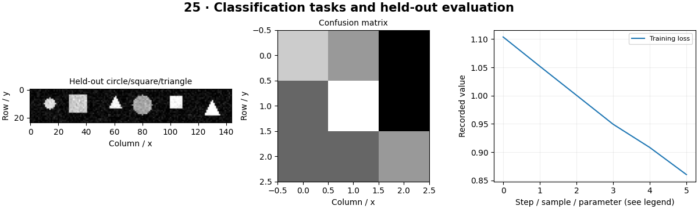

# Image Classification — concepts and mechanisms

## What and why

Classification predicts labels for an entire image. Binary, multiclass and multilabel problems have different target and output meanings. Choosing the loss follows from those meanings, not from whichever model is fashionable.

## 1. Multiclass CNN classification

Multiclass classification chooses one of several mutually exclusive labels. Cross entropy accepts raw logits and integer class indices in the common PyTorch form. The synthetic CNN learns circle, square and triangle classes. A held-out confusion matrix reveals which classes are confused, while training curves reveal optimization behavior.

## 2. Binary decisions and calibration

A binary decision applies a threshold to a score. A threshold of 0.5 is a convention, not a cost-optimal rule for every task. Calibration measures whether predicted confidence agrees with empirical frequency. The lab derives a circle-versus-other score from the multiclass model; a dedicated binary model would use its own objective.

## 3. Multilabel tasks and model families

Multilabel data can have several true labels per image, requiring independent output probabilities and a multilabel loss such as BCEWithLogitsLoss. ResNet uses residual connections, EfficientNet balances model dimensions, and MobileNet emphasizes efficient operations. The optional workflow supports these pretrained families; the local lesson isolates target encoding and loss mechanics.

## Mathematical foundation

$$
p_k=e^{z_k}/\sum_j e^{z_j}
$$

zk is the logit for class k and pk its softmax probability. Subtracting the largest logit before exponentiation avoids overflow without changing the result. Two equal logits produce probabilities [0.5,0.5].

The numerical example makes the units and reduction visible before the larger pipeline:

```python
import numpy as np
import cv2

logits = np.array([1000.0, 1000.0])
shifted = logits - logits.max()
probability = np.exp(shifted) / np.exp(shifted).sum()
assert np.allclose(probability, [0.5, 0.5])
print(probability)
```

## What happens internally

A tiny convolutional backbone and linear head produce logits; the lab trains on generated shapes, measures held-out predictions and contrasts exclusive and independent target encodings.

Read the chapter entry point, then follow its shared source. The core reference is `models.TinyCNN`. Separate data construction, algorithm, metric and plotting when changing the experiment.

## Visual reasoning



Predict a change before rerunning. Explain what each axis, color, mask or matrix cell represents. In learned examples, compare a loss curve with held-out predictions; in geometry examples, compare coordinate residuals with known synthetic truth. Visual plausibility is useful evidence, but does not replace a declared metric.

## Controlled experiment

Create a background-only class and inspect whether confidence on unknown objects falls. Compare macro and micro metrics under class imbalance.

Write down the independent variable, what remains fixed, and the metric before changing code. Repeat stochastic experiments with multiple seeds and retain negative results. A timing comparison should include warm-up, repeat count and hardware; never compare unmatched preprocessing or data sizes.

## Applications and limits

Train a classifier and report per-class failures. The mini project applies the mechanism in a small runnable baseline. Softmax forces scores to sum to one even for an out-of-distribution image. A confident prediction is not proof that the image belongs to a known class.

The local generated distribution deliberately removes some real-world complexity. External data, pretrained models and hardware paths are documented separately in [external workflows](../../docs/external-workflows.md). A toy objective or synthetic score must be labeled as such when used in a portfolio.

## Exercises and checkpoint

Explain this chapter to someone using one concrete example. Then implement a tiny case, change a parameter, create a failure and apply the method to new data. Use the [three exercise levels](../exercises/beginner.md) and [challenge](../exercises/challenge.md) to record evidence.

## Research connection

[Read the chapter research note](../../docs/research-reading.md#chapter-25). It distinguishes the original contribution, architecture intuition, limitations and alternatives from the scope of the runnable lab.

## References and next step

[Primary reference](https://docs.pytorch.org/vision/stable/models.html). Continue through the chapter notebooks and mini project, then follow the next-chapter link in the [chapter README](../README.md).
