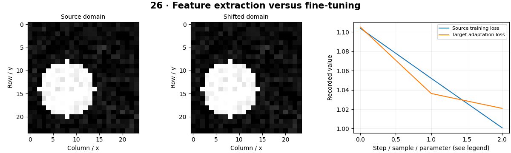

# Transfer Learning — concepts and mechanisms

## What and why

Transfer learning starts from useful learned features and adapts them to a new task. This can reduce data and training requirements, but success depends on how source and target data relate. Frozen features and fine-tuning answer different experimental questions.

## 1. Source pretraining and feature reuse

Early image features often capture edges and textures, while later features become more task-specific. Pretraining on a source task provides an initialization or fixed representation. The CPU lab trains its own source model on synthetic shapes, so the origin of every weight is visible.

## 2. Frozen backbones and new heads

Feature extraction freezes backbone parameters and trains a replacement classifier. Freezing requires controlling requires_grad and sometimes layer mode: batch-normalization running statistics can change even when parameter gradients are disabled. The experiment measures actual backbone parameter changes instead of assuming the freeze succeeded.

## 3. Fine-tuning under domain shift

Fine-tuning updates some or all pretrained layers, usually with careful learning rates and validation. Large updates can destroy useful features; a very different target domain may require more adaptation. The lab creates a brightness shift and compares frozen versus trainable features on independent target samples.

## Mathematical foundation

$$
h=f_{\theta}(x),\qquad z=W h+b
$$

x is an image, fθ the backbone, h its feature vector and W,b the new head. Frozen transfer changes W and b while holding θ fixed. With h=[2,1], W=[0.5,−1] and b=0.2, the score is 0.2.

The numerical example makes the units and reduction visible before the larger pipeline:

```python
import numpy as np
import cv2

features = np.array([2.0, 1.0])
weights = np.array([0.5, -1.0])
score = weights @ features + 0.2
assert np.isclose(score, 0.2)
print(score)
```

## What happens internally

The lab snapshots feature parameters, trains the target head or full network and computes the maximum feature change. The reported source model is locally trained, not ImageNet pretrained.

Read the chapter entry point, then follow its shared source. The core reference is `models.train_supervised`. Separate data construction, algorithm, metric and plotting when changing the experiment.

## Visual reasoning



Predict a change before rerunning. Explain what each axis, color, mask or matrix cell represents. In learned examples, compare a loss curve with held-out predictions; in geometry examples, compare coordinate residuals with known synthetic truth. Visual plausibility is useful evidence, but does not replace a declared metric.

## Controlled experiment

Vary target brightness and compare frozen features with fine-tuning at two learning rates using an unchanged test set.

Write down the independent variable, what remains fixed, and the metric before changing code. Repeat stochastic experiments with multiple seeds and retain negative results. A timing comparison should include warm-up, repeat count and hardware; never compare unmatched preprocessing or data sizes.

## Applications and limits

Compare frozen features against controlled fine-tuning. The mini project applies the mechanism in a small runnable baseline. Replacing the head without matching the label map can silently swap class meanings. Pretraining data may overlap an evaluation set.

The local generated distribution deliberately removes some real-world complexity. External data, pretrained models and hardware paths are documented separately in [external workflows](../../docs/external-workflows.md). A toy objective or synthetic score must be labeled as such when used in a portfolio.

## Exercises and checkpoint

Explain this chapter to someone using one concrete example. Then implement a tiny case, change a parameter, create a failure and apply the method to new data. Use the [three exercise levels](../exercises/beginner.md) and [challenge](../exercises/challenge.md) to record evidence.

## Research connection

[Read the chapter research note](../../docs/research-reading.md#chapter-26). It distinguishes the original contribution, architecture intuition, limitations and alternatives from the scope of the runnable lab.

## References and next step

[Primary reference](https://docs.pytorch.org/tutorials/beginner/transfer_learning_tutorial.html). Continue through the chapter notebooks and mini project, then follow the next-chapter link in the [chapter README](../README.md).
