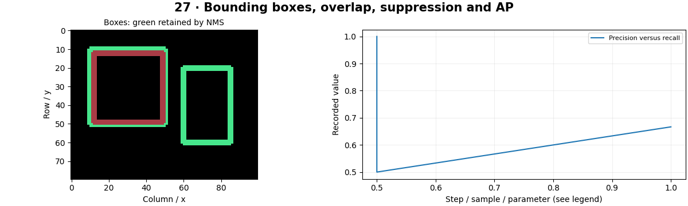

# Object Detection — concepts and mechanisms

## What and why

Object detection predicts both location and class. A detector can produce several overlapping proposals, so evaluation must match predictions to ground-truth objects and count duplicates correctly. Localization and classification errors are different failure modes.

## 1. Boxes, coordinate formats and IoU

A box can be expressed by two corners or by center, width and height. This repository uses continuous xyxy coordinates with width=x2−x1. Intersection over Union measures overlap relative to combined area. Empty or non-overlapping boxes need well-defined zero overlap.

## 2. NMS and duplicate predictions

Greedy NMS keeps the highest-scoring box and removes lower-scoring boxes with excessive overlap, then repeats. Apply class-aware suppression when overlapping objects of different classes can coexist. NMS can remove a real nearby object; modern set-prediction methods may use different duplicate-control mechanisms.

## 3. Precision–recall and detector evolution

R-CNN classified region proposals, Fast R-CNN shared feature computation, and Faster R-CNN learned proposals. SSD and YOLO developed single-stage prediction paths. AP integrates a precision–recall curve after one-to-one matching; mAP averages AP under specified classes and IoU thresholds. The lab demonstrates AP with preassigned matches, not a full COCO evaluator.

## Mathematical foundation

$$
IoU(A,B)=|A\cap B|/(|A|+|B|-|A\cap B|)
$$

A and B are regions and vertical bars denote area. Two 2×2 boxes overlapping in a 1×1 region have intersection 1, union 7 and IoU=1/7.

The numerical example makes the units and reduction visible before the larger pipeline:

```python
import numpy as np
import cv2

area_a, area_b, intersection = 4.0, 4.0, 1.0
iou = intersection / (area_a + area_b - intersection)
assert np.isclose(iou, 1 / 7)
print(iou)
```

## What happens internally

The NumPy implementation computes vectorized intersection/union and greedy suppression. Precision/recall are calculated from sorted scores and explicit true/false match flags.

Read the chapter entry point, then follow its shared source. The core reference is `numerics.nms`. Separate data construction, algorithm, metric and plotting when changing the experiment.

## Visual reasoning



Predict a change before rerunning. Explain what each axis, color, mask or matrix cell represents. In learned examples, compare a loss curve with held-out predictions; in geometry examples, compare coordinate residuals with known synthetic truth. Visual plausibility is useful evidence, but does not replace a declared metric.

## Controlled experiment

Raise the NMS IoU threshold and explain the effect on crowded scenes versus duplicate boxes. Keep confidence and IoU thresholds distinct.

Write down the independent variable, what remains fixed, and the metric before changing code. Repeat stochastic experiments with multiple seeds and retain negative results. A timing comparison should include warm-up, repeat count and hardware; never compare unmatched preprocessing or data sizes.

## Applications and limits

Implement IoU and NMS before calling a detector API. The mini project applies the mechanism in a small runnable baseline. AP50 and COCO-style AP across IoU thresholds are not interchangeable. Coordinate off-by-one conventions matter for small objects.

The local generated distribution deliberately removes some real-world complexity. External data, pretrained models and hardware paths are documented separately in [external workflows](../../docs/external-workflows.md). A toy objective or synthetic score must be labeled as such when used in a portfolio.

## Exercises and checkpoint

Explain this chapter to someone using one concrete example. Then implement a tiny case, change a parameter, create a failure and apply the method to new data. Use the [three exercise levels](../exercises/beginner.md) and [challenge](../exercises/challenge.md) to record evidence.

## Research connection

[Read the chapter research note](../../docs/research-reading.md#chapter-27). It distinguishes the original contribution, architecture intuition, limitations and alternatives from the scope of the runnable lab.

## References and next step

[Primary reference](https://cocodataset.org/#detection-eval). Continue through the chapter notebooks and mini project, then follow the next-chapter link in the [chapter README](../README.md).
