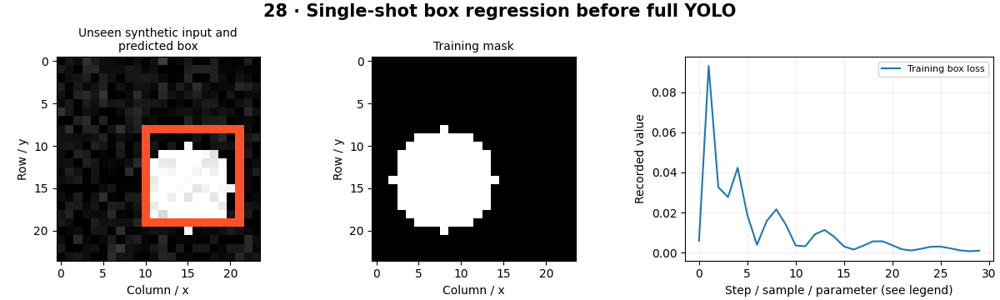

# YOLO — concepts and mechanisms

## What and why

YOLO-family detectors predict objects efficiently from shared image features. The exact head, assignment, loss and suppression behavior varies by version. Learn the box and training mechanics first, then use an explicit model configuration for the full library workflow.

## 1. Single-stage localization mechanics

A dense detector learns location and category predictions from spatial features at one or more scales. Early YOLO used a grid-based formulation; newer families change important details. The CPU lab trains a single-object box regressor to expose normalized target encoding and localization loss. It is intentionally not a reproduction of a named YOLO architecture.

## 2. Dataset preparation and annotation checks

YOLO-format labels commonly store class index and normalized center x, center y, width and height. Annotation errors directly corrupt training. The dataset script generates independent train/validation/test splits, checks coordinate ranges, verifies matching files and rejects duplicate image bytes across splits. Real data also needs source-level grouping.

## 3. Training, evaluation, inference and export

The optional Ultralytics workflow trains a user-selected model, evaluates the test split, saves annotated inference and exports ONNX. Choose model files explicitly and record the installed version. Validation guides hyperparameters; the held-out test is used after decisions are frozen. Review dataset and dependency licenses before redistribution or deployment.

## Mathematical foundation

$$
c_x=(x_1+x_2)/(2W),\quad w=(x_2-x_1)/W
$$

x1,x2 are horizontal corners and W image width; cx and w are normalized center and width. For corners 20 and 60 in a 100-pixel image, cx=0.4 and w=0.4.

The numerical example makes the units and reduction visible before the larger pipeline:

```python
import numpy as np
import cv2

x1, x2, width = 20.0, 60.0, 100.0
center_x = (x1 + x2) / (2 * width)
box_width = (x2 - x1) / width
assert np.allclose([center_x, box_width], [0.4, 0.4])
print(center_x, box_width)
```

## What happens internally

The local regressor predicts normalized cxcywh with a sigmoid and trains against boxes derived from generated masks. Full detector stages are implemented in the optional external workflow and are not executed by default.

Read the chapter entry point, then follow its shared source. The core reference is `numerics.iou`. Separate data construction, algorithm, metric and plotting when changing the experiment.

## Visual reasoning



Predict a change before rerunning. Explain what each axis, color, mask or matrix cell represents. In learned examples, compare a loss curve with held-out predictions; in geometry examples, compare coordinate residuals with known synthetic truth. Visual plausibility is useful evidence, but does not replace a declared metric.

## Controlled experiment

Inspect every generated label as an overlay, then intentionally introduce an invalid width and confirm that validation rejects it.

Write down the independent variable, what remains fixed, and the metric before changing code. Repeat stochastic experiments with multiple seeds and retain negative results. A timing comparison should include warm-up, repeat count and hardware; never compare unmatched preprocessing or data sizes.

## Applications and limits

Run an auditable custom detector workflow. The mini project applies the mechanism in a small runnable baseline. Training and test images from adjacent video frames can leak scene content. A synthetic regressor loss must not be advertised as YOLO mAP.

The local generated distribution deliberately removes some real-world complexity. External data, pretrained models and hardware paths are documented separately in [external workflows](../../docs/external-workflows.md). A toy objective or synthetic score must be labeled as such when used in a portfolio.

## Exercises and checkpoint

Explain this chapter to someone using one concrete example. Then implement a tiny case, change a parameter, create a failure and apply the method to new data. Use the [three exercise levels](../exercises/beginner.md) and [challenge](../exercises/challenge.md) to record evidence.

## Research connection

[Read the chapter research note](../../docs/research-reading.md#chapter-28). It distinguishes the original contribution, architecture intuition, limitations and alternatives from the scope of the runnable lab.

## References and next step

[Primary reference](https://docs.ultralytics.com/modes/train/). Continue through the chapter notebooks and mini project, then follow the next-chapter link in the [chapter README](../README.md).
