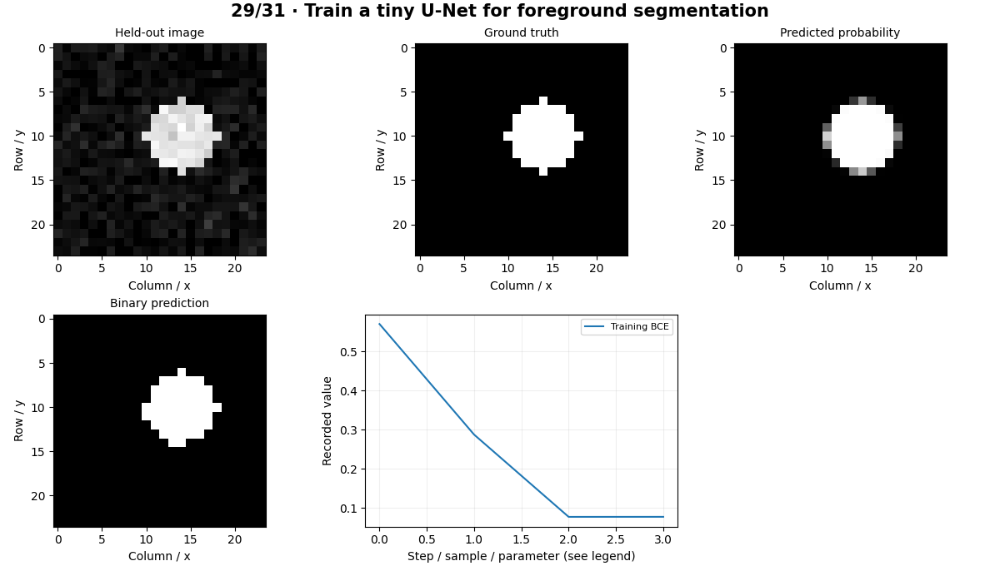

# Object Segmentation — concepts and mechanisms

## What and why

Object segmentation describes which pixels belong to a foreground region. A binary mask gives finer geometry than a box, enabling measurements of coverage and shape. Before separating categories or individual instances, learn mask representation and overlap metrics.

## 1. Binary masks and overlap metrics

A binary target assigns each pixel foreground or background. IoU measures intersection divided by union; Dice doubles the intersection and divides by the sum of mask sizes. Empty masks require a stated convention. Pixel accuracy can be misleading when nearly every pixel is background.

## 2. Encoder–decoder segmentation

An encoder reduces spatial resolution while learning features; a decoder restores a dense prediction. Skip connections preserve fine spatial information. The tiny U-Net uses a shallow encoder, interpolation and a skip concatenation, then produces one foreground logit per pixel. BCEWithLogitsLoss combines a stable sigmoid with binary cross entropy.

## 3. Thresholds and boundary errors

A probability threshold converts logits into a mask. Select it on validation data, since changing it on test images biases evaluation. Boundary errors may be costly even when overall IoU is high. Small defects, thin structures and annotation ambiguity need separate analysis.

## Mathematical foundation

$$
Dice=2|P\cap G|/(|P|+|G|)
$$

P is the predicted foreground and G ground truth. If each contains 10 pixels and 8 overlap, Dice=0.8. The associated IoU is 8/12, not 0.8.

The numerical example makes the units and reduction visible before the larger pipeline:

```python
import numpy as np
import cv2

predicted, truth, intersection = 10.0, 10.0, 8.0
dice = 2 * intersection / (predicted + truth)
assert np.isclose(dice, 0.8)
print(dice)
```

## What happens internally

The lab trains on generated images and exact synthetic masks, then measures held-out IoU and Dice. These numbers describe only the stated generated distribution.

Read the chapter entry point, then follow its shared source. The core reference is `models.TinyUNet`. Separate data construction, algorithm, metric and plotting when changing the experiment.

## Visual reasoning



Predict a change before rerunning. Explain what each axis, color, mask or matrix cell represents. In learned examples, compare a loss curve with held-out predictions; in geometry examples, compare coordinate residuals with known synthetic truth. Visual plausibility is useful evidence, but does not replace a declared metric.

## Controlled experiment

Change the foreground threshold and plot precision/recall for foreground pixels. Inspect small objects separately.

Write down the independent variable, what remains fixed, and the metric before changing code. Repeat stochastic experiments with multiple seeds and retain negative results. A timing comparison should include warm-up, repeat count and hardware; never compare unmatched preprocessing or data sizes.

## Applications and limits

Match segmentation formulations to an industrial question. The mini project applies the mechanism in a small runnable baseline. Resize categorical masks with nearest-neighbor interpolation. Bilinear interpolation creates invalid intermediate class IDs.

The local generated distribution deliberately removes some real-world complexity. External data, pretrained models and hardware paths are documented separately in [external workflows](../../docs/external-workflows.md). A toy objective or synthetic score must be labeled as such when used in a portfolio.

## Exercises and checkpoint

Explain this chapter to someone using one concrete example. Then implement a tiny case, change a parameter, create a failure and apply the method to new data. Use the [three exercise levels](../exercises/beginner.md) and [challenge](../exercises/challenge.md) to record evidence.

## Research connection

[Read the chapter research note](../../docs/research-reading.md#chapter-29). It distinguishes the original contribution, architecture intuition, limitations and alternatives from the scope of the runnable lab.

## References and next step

[Primary reference](https://arxiv.org/abs/1505.04597). Continue through the chapter notebooks and mini project, then follow the next-chapter link in the [chapter README](../README.md).
