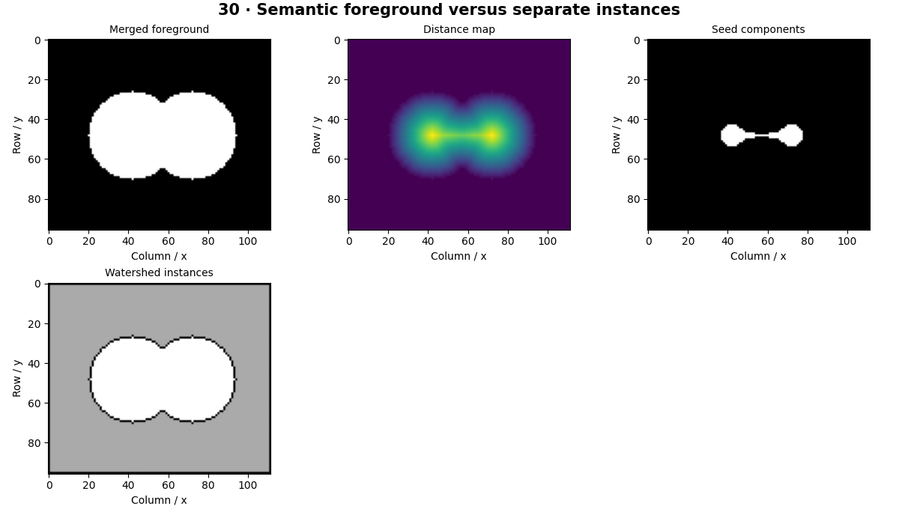

# Instance Segmentation — concepts and mechanisms

## What and why

Instance segmentation gives each object its own mask, even when objects share a class. Semantic segmentation alone labels all same-class pixels alike. Separating touching objects therefore requires additional structure, such as markers, proposals or object queries.

## 1. Instance IDs versus class labels

An instance map stores a distinct ID for every object and usually reserves zero for background. IDs are local identifiers, not semantic categories. Two touching circles should have two instances even though both are foreground. Evaluation must match predicted and true instances before scoring overlap.

## 2. Distance transforms and watershed

A distance transform measures distance from foreground pixels to the nearest background. Local peaks can seed individual objects. Watershed grows labeled regions along a topographic surface and places boundaries where regions meet. Poor markers lead to over-segmentation or merged objects, which makes marker design central to this classical method.

## 3. Mask R-CNN and learned instance masks

Mask R-CNN adds an instance-mask branch to a two-stage detector and uses RoIAlign to reduce quantization misalignment. The default CPU lesson uses watershed on generated touching shapes; the optional torchvision workflow runs a pretrained Mask R-CNN. Dense crowds and occlusion remain hard because visible boundaries may be incomplete.

## Mathematical foundation

$$
D(p)=\min_{q\in background}\lVert p-q\rVert_2
$$

D(p) is a foreground pixel’s distance to background. For point p=[2,2] and background point q=[2,0], the distance is 2 pixels. Large local distances often occur near object interiors.

The numerical example makes the units and reduction visible before the larger pipeline:

```python
import numpy as np
import cv2

p = np.array([2.0, 2.0])
q = np.array([2.0, 0.0])
distance = np.linalg.norm(p - q)
assert distance == 2
print(distance)
```

## What happens internally

The lab computes a foreground mask, distance map, marker labels and watershed boundaries. Counted instances are measured from the resulting IDs, not assumed from the input design.

Read the chapter entry point, then follow its shared source. The core reference is `numerics.components`. Separate data construction, algorithm, metric and plotting when changing the experiment.

## Visual reasoning



Predict a change before rerunning. Explain what each axis, color, mask or matrix cell represents. In learned examples, compare a loss curve with held-out predictions; in geometry examples, compare coordinate residuals with known synthetic truth. Visual plausibility is useful evidence, but does not replace a declared metric.

## Controlled experiment

Move the two circles closer and vary the marker threshold. Identify the point at which seeds merge.

Write down the independent variable, what remains fixed, and the metric before changing code. Repeat stochastic experiments with multiple seeds and retain negative results. A timing comparison should include warm-up, repeat count and hardware; never compare unmatched preprocessing or data sizes.

## Applications and limits

Keep object identity when masks overlap. The mini project applies the mechanism in a small runnable baseline. A separate ID for every connected component fails when objects touch. Instance IDs are not stable track IDs across frames.

The local generated distribution deliberately removes some real-world complexity. External data, pretrained models and hardware paths are documented separately in [external workflows](../../docs/external-workflows.md). A toy objective or synthetic score must be labeled as such when used in a portfolio.

## Exercises and checkpoint

Explain this chapter to someone using one concrete example. Then implement a tiny case, change a parameter, create a failure and apply the method to new data. Use the [three exercise levels](../exercises/beginner.md) and [challenge](../exercises/challenge.md) to record evidence.

## Research connection

[Read the chapter research note](../../docs/research-reading.md#chapter-30). It distinguishes the original contribution, architecture intuition, limitations and alternatives from the scope of the runnable lab.

## References and next step

[Primary reference](https://arxiv.org/abs/1703.06870). Continue through the chapter notebooks and mini project, then follow the next-chapter link in the [chapter README](../README.md).
