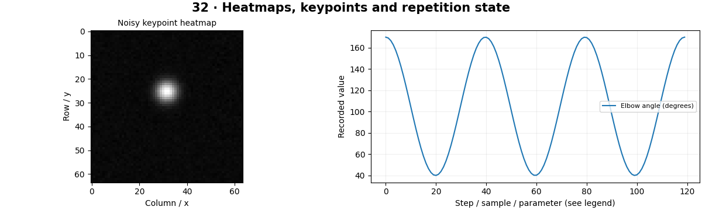

# Pose Estimation — concepts and mechanisms

## What and why

Pose estimation locates keypoints such as joints. A skeleton connects selected keypoints into a geometric structure. The output can support motion visualization or repetition counting, but visibility, projection and landmark uncertainty limit interpretation.

## 1. Keypoint heatmaps and coordinates

A heatmap gives a spatial score for one keypoint. Argmax picks its peak; soft-argmax computes an expected coordinate under normalized scores. Temperature controls concentration. Multiple peaks can make the expectation fall between plausible locations, so confidence and multimodality matter.

## 2. Joint angles and skeleton geometry

A joint angle uses two vectors meeting at the joint and the angle between them. Two-dimensional image angles depend on camera viewpoint and are not always anatomical three-dimensional angles. Normalize coordinates consistently and reject zero-length limbs rather than returning an arbitrary angle.

## 3. Temporal states and exercise counting

A repetition counter uses a state machine and separate high/low thresholds to avoid counting noise near one threshold. It also needs rules for missing keypoints and incomplete cycles. The lab uses synthetic angles; the optional MediaPipe workflow obtains body landmarks from a user-provided model and image.

## Mathematical foundation

$$
\theta=\arccos\left(\frac{u\cdot v}{\lVert u\rVert\lVert v\rVert}\right)
$$

u and v are limb vectors from the joint and θ their angle. Perpendicular vectors [1,0] and [0,1] give 90 degrees. Clamp the cosine to [−1,1] to handle floating-point roundoff.

The numerical example makes the units and reduction visible before the larger pipeline:

```python
import numpy as np
import cv2

u, v = np.array([1.0, 0.0]), np.array([0.0, 1.0])
cosine = u @ v / (np.linalg.norm(u) * np.linalg.norm(v))
angle = np.degrees(np.arccos(np.clip(cosine, -1, 1)))
assert np.isclose(angle, 90)
print(angle)
```

## What happens internally

Heatmap decoding, angle computation and hysteresis are separate functions so each can be inspected and tested independently of a pose detector.

Read the chapter entry point, then follow its shared source. The core reference is `tracking.joint_angle`. Separate data construction, algorithm, metric and plotting when changing the experiment.

## Visual reasoning



Predict a change before rerunning. Explain what each axis, color, mask or matrix cell represents. In learned examples, compare a loss curve with held-out predictions; in geometry examples, compare coordinate residuals with known synthetic truth. Visual plausibility is useful evidence, but does not replace a declared metric.

## Controlled experiment

Add angular noise around the thresholds and compare a single threshold with hysteresis. Include an incomplete repetition.

Write down the independent variable, what remains fixed, and the metric before changing code. Repeat stochastic experiments with multiple seeds and retain negative results. A timing comparison should include warm-up, repeat count and hardware; never compare unmatched preprocessing or data sizes.

## Applications and limits

Visualize joints with uncertainty and safe exercise feedback. The mini project applies the mechanism in a small runnable baseline. A keypoint detector does not diagnose posture or health. Occluded joints can be guessed incorrectly.

The local generated distribution deliberately removes some real-world complexity. External data, pretrained models and hardware paths are documented separately in [external workflows](../../docs/external-workflows.md). A toy objective or synthetic score must be labeled as such when used in a portfolio.

## Exercises and checkpoint

Explain this chapter to someone using one concrete example. Then implement a tiny case, change a parameter, create a failure and apply the method to new data. Use the [three exercise levels](../exercises/beginner.md) and [challenge](../exercises/challenge.md) to record evidence.

## Research connection

[Read the chapter research note](../../docs/research-reading.md#chapter-32). It distinguishes the original contribution, architecture intuition, limitations and alternatives from the scope of the runnable lab.

## References and next step

[Primary reference](https://ai.google.dev/edge/mediapipe/solutions/vision/pose_landmarker/python). Continue through the chapter notebooks and mini project, then follow the next-chapter link in the [chapter README](../README.md).
