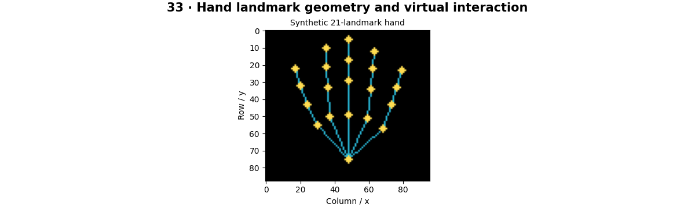

# Hand Tracking — concepts and mechanisms

## What and why

Hand tracking combines landmark detection, temporal consistency and a gesture interpretation layer. Landmarks provide coordinates; a gesture controller still needs normalization, state and debouncing. Image-space motion should not automatically become an operating-system action.

## 1. Hand landmarks and normalized geometry

A common hand model uses 21 landmarks, including wrist and finger joints. Coordinates may be normalized to image dimensions and depth may use a model-specific scale. Finger numbering is an API contract, not something to infer from drawing order. Handedness can be affected by mirrored camera views.

## 2. Pinch and finger gesture features

A pinch feature can divide thumb–index tip distance by a reference hand length. This reduces sensitivity to image scale, although perspective and foreshortening remain. A static threshold gives a preliminary gesture classifier; temporal smoothing and hysteresis reduce flicker.

## 3. Stable interaction and virtual pointers

A virtual pointer maps a selected landmark into a bounded interaction region, smooths motion and confirms clicks with a state machine. The lab visualizes pointer coordinates without moving the system mouse. The optional detector adapter returns landmarks; a real controller must add explicit user enable/disable controls and a reliable escape action.

## Mathematical foundation

$$
r=\lVert p_{thumb}-p_{index}\rVert/\lVert p_{wrist}-p_{middle}\rVert
$$

r is a scale-normalized pinch ratio. If fingertip distance is 10 pixels and reference hand length 80 pixels, r=0.125. A zero reference length makes the feature invalid.

The numerical example makes the units and reduction visible before the larger pipeline:

```python
import numpy as np
import cv2

tip_distance, reference_length = 10.0, 80.0
pinch_ratio = tip_distance / reference_length
assert np.isclose(pinch_ratio, 0.125)
print(pinch_ratio)
```

## What happens internally

Synthetic landmarks make indexing, distance normalization and pointer mapping inspectable. No live hand accuracy or OS-control behavior is claimed by the default lab.

Read the chapter entry point, then follow its shared source. The core reference is `tracking.joint_angle`. Separate data construction, algorithm, metric and plotting when changing the experiment.

## Visual reasoning



Predict a change before rerunning. Explain what each axis, color, mask or matrix cell represents. In learned examples, compare a loss curve with held-out predictions; in geometry examples, compare coordinate residuals with known synthetic truth. Visual plausibility is useful evidence, but does not replace a declared metric.

## Controlled experiment

Scale all landmark coordinates by two and verify that a normalized pinch ratio stays constant. Add noise and inspect click stability.

Write down the independent variable, what remains fixed, and the metric before changing code. Repeat stochastic experiments with multiple seeds and retain negative results. A timing comparison should include warm-up, repeat count and hardware; never compare unmatched preprocessing or data sizes.

## Applications and limits

Convert landmarks into reversible desktop interactions. The mini project applies the mechanism in a small runnable baseline. Raw pixel thresholds change with distance from the camera. Mirroring the display without adjusting coordinates reverses interaction.

The local generated distribution deliberately removes some real-world complexity. External data, pretrained models and hardware paths are documented separately in [external workflows](../../docs/external-workflows.md). A toy objective or synthetic score must be labeled as such when used in a portfolio.

## Exercises and checkpoint

Explain this chapter to someone using one concrete example. Then implement a tiny case, change a parameter, create a failure and apply the method to new data. Use the [three exercise levels](../exercises/beginner.md) and [challenge](../exercises/challenge.md) to record evidence.

## Research connection

[Read the chapter research note](../../docs/research-reading.md#chapter-33). It distinguishes the original contribution, architecture intuition, limitations and alternatives from the scope of the runnable lab.

## References and next step

[Primary reference](https://ai.google.dev/edge/mediapipe/solutions/vision/hand_landmarker/python). Continue through the chapter notebooks and mini project, then follow the next-chapter link in the [chapter README](../README.md).
