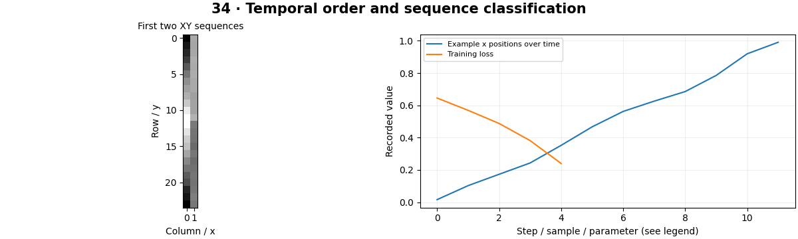

# Action Recognition — concepts and mechanisms

## What and why

Action recognition uses temporal information to classify a sequence. A single frame may show a pose but cannot reliably reveal motion direction or order. The choice of temporal representation determines what evidence a model can use.

## 1. Sequences and temporal sampling

A clip samples frames over a time interval. Frame rate, stride and clip length control which motions remain visible. Splits should group related clips by source video or actor to avoid leakage. The synthetic lab uses coordinate trajectories so temporal order is the only useful direction cue.

## 2. CNN–RNN and recurrent state

A CNN–RNN pipeline extracts per-frame features and updates a recurrent state over time. A GRU uses gates to control information retention. The local model trains a small GRU to distinguish leftward and rightward trajectories; this demonstrates sequence learning without claiming general human-action recognition.

## 3. 3D CNNs and temporal transformers

A 3D convolution spans time and space, while a temporal transformer compares tokens across frames. Both require choices about temporal resolution and compute. A real-time system must consider how much future context it needs: a model that observes an entire clip is not an instantaneous online recognizer.

## Mathematical foundation

$$
v_t=(x_t-x_{t-1})/\Delta t
$$

xt is position at time t, Δt the time interval and vt the finite-difference velocity. Moving from 4 to 7 pixels in 0.1 seconds gives 30 pixels per second. Frame differences without Δt mix speed with frame rate.

The numerical example makes the units and reduction visible before the larger pipeline:

```python
import numpy as np
import cv2

previous, current, dt = 4.0, 7.0, 0.1
velocity = (current - previous) / dt
assert np.isclose(velocity, 30)
print(velocity)
```

## What happens internally

Generated trajectories become batches of T×2 features; a GRU summarizes them and a head predicts direction. Held-out sequences use an independent random seed.

Read the chapter entry point, then follow its shared source. The core reference is `models.TinyCNN`. Separate data construction, algorithm, metric and plotting when changing the experiment.

## Visual reasoning



Predict a change before rerunning. Explain what each axis, color, mask or matrix cell represents. In learned examples, compare a loss curve with held-out predictions; in geometry examples, compare coordinate residuals with known synthetic truth. Visual plausibility is useful evidence, but does not replace a declared metric.

## Controlled experiment

Reverse each test sequence and check whether the predicted direction changes. Shuffle frame order and measure the damage.

Write down the independent variable, what remains fixed, and the metric before changing code. Repeat stochastic experiments with multiple seeds and retain negative results. A timing comparison should include warm-up, repeat count and hardware; never compare unmatched preprocessing or data sizes.

## Applications and limits

Classify visible actions without inferring private mental states. The mini project applies the mechanism in a small runnable baseline. A model may recognize the background or actor instead of the action. Random clip splitting can make evaluation misleadingly easy.

The local generated distribution deliberately removes some real-world complexity. External data, pretrained models and hardware paths are documented separately in [external workflows](../../docs/external-workflows.md). A toy objective or synthetic score must be labeled as such when used in a portfolio.

## Exercises and checkpoint

Explain this chapter to someone using one concrete example. Then implement a tiny case, change a parameter, create a failure and apply the method to new data. Use the [three exercise levels](../exercises/beginner.md) and [challenge](../exercises/challenge.md) to record evidence.

## Research connection

[Read the chapter research note](../../docs/research-reading.md#chapter-34). It distinguishes the original contribution, architecture intuition, limitations and alternatives from the scope of the runnable lab.

## References and next step

[Primary reference](https://docs.pytorch.org/docs/stable/generated/torch.nn.GRU.html). Continue through the chapter notebooks and mini project, then follow the next-chapter link in the [chapter README](../README.md).
