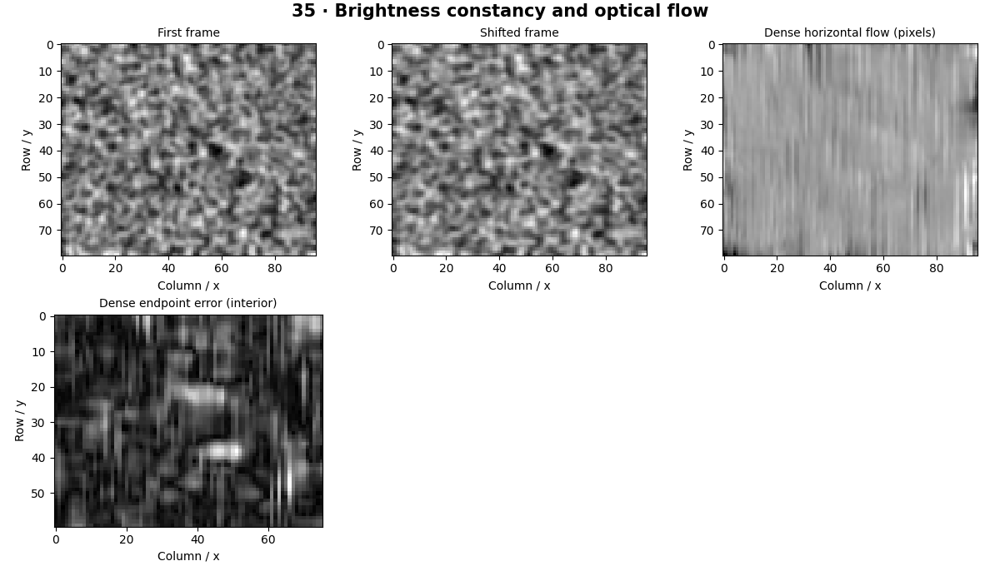

# Optical Flow — concepts and mechanisms

## What and why

Optical flow estimates apparent pixel motion between frames. It is a dense or sparse correspondence field, not a semantic object tracker. Brightness constancy and local motion assumptions make the problem tractable but can fail under illumination change, occlusion or large motion.

## 1. Brightness constancy and the aperture problem

Brightness constancy assumes a moving scene point keeps approximately the same image intensity. Linearizing this assumption gives one equation for two motion components, so a single pixel is underdetermined. Along a straight edge, only motion perpendicular to the edge is locally observable: this is the aperture problem.

## 2. Lucas–Kanade least squares

Lucas–Kanade assumes nearby pixels share a motion vector and solves an overdetermined least-squares system using their gradients. A well-conditioned structure tensor needs gradient variation in two directions. The NumPy reference estimates one small global translation; OpenCV’s pyramidal implementation tracks selected points.

## 3. Pyramids and dense flow

A pyramid handles larger motion by solving at coarse resolution and refining. Farneback estimates dense flow through local polynomial approximations. The lab compares known synthetic translation with sparse and dense estimates, excluding border regions where the warp changes the observation model.

## Mathematical foundation

$$
I_xu+I_yv+I_t=0
$$

Ix,Iy are spatial intensity derivatives, It the temporal derivative and u,v the small displacement components. If Ix=2, Iy=0 and It=−4, horizontal displacement u=2 satisfies the equation, while v remains unconstrained.

The numerical example makes the units and reduction visible before the larger pipeline:

```python
import numpy as np
import cv2

ix, iy, it = 2.0, 0.0, -4.0
u, v = 2.0, 0.0
residual = ix * u + iy * v + it
assert np.isclose(residual, 0)
print(residual)
```

## What happens internally

The reference builds gradient equations and solves least squares. Library comparisons use pyramidal Lucas–Kanade and Farneback; their assumptions and support differ.

Read the chapter entry point, then follow its shared source. The core reference is `numerics.lucas_kanade_global`. Separate data construction, algorithm, metric and plotting when changing the experiment.

## Visual reasoning



Predict a change before rerunning. Explain what each axis, color, mask or matrix cell represents. In learned examples, compare a loss curve with held-out predictions; in geometry examples, compare coordinate residuals with known synthetic truth. Visual plausibility is useful evidence, but does not replace a declared metric.

## Controlled experiment

Increase translation until the small-motion estimate fails, then compare with pyramidal tracking. Add a uniform brightness offset as a separate failure test.

Write down the independent variable, what remains fixed, and the metric before changing code. Repeat stochastic experiments with multiple seeds and retain negative results. A timing comparison should include warm-up, repeat count and hardware; never compare unmatched preprocessing or data sizes.

## Applications and limits

Estimate apparent motion and test its assumptions. The mini project applies the mechanism in a small runnable baseline. A colorful flow image can look plausible even when magnitudes are wrong. Use endpoint error against known displacement.

The local generated distribution deliberately removes some real-world complexity. External data, pretrained models and hardware paths are documented separately in [external workflows](../../docs/external-workflows.md). A toy objective or synthetic score must be labeled as such when used in a portfolio.

## Exercises and checkpoint

Explain this chapter to someone using one concrete example. Then implement a tiny case, change a parameter, create a failure and apply the method to new data. Use the [three exercise levels](../exercises/beginner.md) and [challenge](../exercises/challenge.md) to record evidence.

## Research connection

[Read the chapter research note](../../docs/research-reading.md#chapter-35). It distinguishes the original contribution, architecture intuition, limitations and alternatives from the scope of the runnable lab.

## References and next step

[Primary reference](https://docs.opencv.org/4.x/d4/dee/tutorial_optical_flow.html). Continue through the chapter notebooks and mini project, then follow the next-chapter link in the [chapter README](../README.md).
