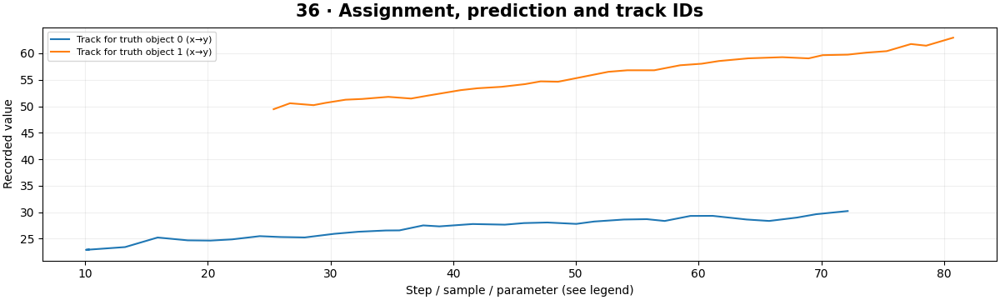

# Multi-Object Tracking — concepts and mechanisms

## What and why

Multi-object tracking maintains several identities across detections. It combines prediction, association, creation and deletion policies. Detection quality, occlusion and object similarity all affect identity continuity.

## 1. Track state and detection association

Each active object has a predicted state and uncertainty. New detections must be assigned to old tracks, left unmatched or used to start new tracks. Independent nearest-neighbor choices can assign two detections to the same track, so association needs a global one-to-one constraint.

## 2. Hungarian assignment and gating

The Hungarian algorithm finds a minimum-cost assignment in a cost matrix. Costs can use center distance, box overlap or appearance distance. Gating excludes implausible pairs before accepting assignments. Unmatched tracks predict through short gaps and expire after a declared lifetime.

## 3. SORT, DeepSORT and evaluation

SORT couples a Kalman box state with assignment; DeepSORT adds learned appearance information to reduce identity errors. The included tracker teaches center-state Kalman/Hungarian mechanics and is not a full reproduction of either. Evaluate identity switches, IDF1 or HOTA using a suitable benchmark, not only detector mAP.

## Mathematical foundation

$$
\min_A\sum_{ij}A_{ij}C_{ij}
$$

Cij is the cost of assigning track i to detection j, and Aij is 1 when that assignment is selected. Each track and detection may appear at most once. Costs [[1,9],[8,2]] favor the diagonal with total cost 3.

The numerical example makes the units and reduction visible before the larger pipeline:

```python
import numpy as np
import cv2
from scipy.optimize import linear_sum_assignment

cost = np.array([[1.0, 9.0], [8.0, 2.0]])
rows, columns = linear_sum_assignment(cost)
total = cost[rows, columns].sum()
assert total == 3
print(rows, columns, total)
```

## What happens internally

The shared tracker performs prediction, gated Hungarian association and Joseph-form covariance correction. The synthetic lab introduces missed observations and reports a limited nearest-truth identity diagnostic.

Read the chapter entry point, then follow its shared source. The core reference is `tracking.KalmanTracker`. Separate data construction, algorithm, metric and plotting when changing the experiment.

## Visual reasoning



Predict a change before rerunning. Explain what each axis, color, mask or matrix cell represents. In learned examples, compare a loss curve with held-out predictions; in geometry examples, compare coordinate residuals with known synthetic truth. Visual plausibility is useful evidence, but does not replace a declared metric.

## Controlled experiment

Make two trajectories cross, remove observations briefly and compare the ID sequence before and after occlusion.

Write down the independent variable, what remains fixed, and the metric before changing code. Repeat stochastic experiments with multiple seeds and retain negative results. A timing comparison should include warm-up, repeat count and hardware; never compare unmatched preprocessing or data sizes.

## Applications and limits

Evaluate association separately from detection quality. The mini project applies the mechanism in a small runnable baseline. Track IDs are temporary anonymous identifiers, not person identities. A detector score is not a track survival probability.

The local generated distribution deliberately removes some real-world complexity. External data, pretrained models and hardware paths are documented separately in [external workflows](../../docs/external-workflows.md). A toy objective or synthetic score must be labeled as such when used in a portfolio.

## Exercises and checkpoint

Explain this chapter to someone using one concrete example. Then implement a tiny case, change a parameter, create a failure and apply the method to new data. Use the [three exercise levels](../exercises/beginner.md) and [challenge](../exercises/challenge.md) to record evidence.

## Research connection

[Read the chapter research note](../../docs/research-reading.md#chapter-36). It distinguishes the original contribution, architecture intuition, limitations and alternatives from the scope of the runnable lab.

## References and next step

[Primary reference](https://arxiv.org/abs/1602.00763). Continue through the chapter notebooks and mini project, then follow the next-chapter link in the [chapter README](../README.md).
