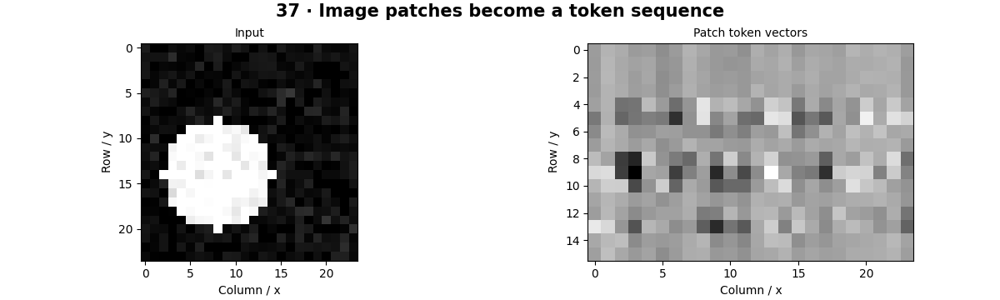

# Vision Transformers — concepts and mechanisms

## What and why

A Vision Transformer turns an image into a sequence of patch tokens and lets tokens exchange information through attention. This changes the inductive assumptions used by a CNN. Read the attention primer in Chapter 38 before implementing the transformer block here; the directory numbering follows the requested catalog.

## 1. Patch embeddings and positions

Divide an image into non-overlapping patches, flatten each patch and project it into an embedding vector. A convolution with kernel and stride equal to the patch size performs the same shared projection. Position embeddings distinguish where tokens came from; otherwise attention alone does not encode the image grid order.

## 2. Transformer encoder mechanics

An encoder block combines self-attention, a token-wise feed-forward network, normalization and residual connections. Queries compare each token with keys, and the resulting weights mix values. Multiple heads learn different projections. The local model uses one small encoder and mean pooling rather than reproducing a large published checkpoint.

## 3. Train a simplified ViT

Train the tiny model on generated shapes, compare patch size and inspect held-out predictions. Small data can favor stronger locality assumptions. A pretrained ViT can be run through the optional torchvision classifier workflow, but downloading weights and evaluating on a real dataset are separate explicit steps.

## Mathematical foundation

$$
N=(H/P)(W/P)
$$

H and W are image height and width, P square patch size and N the number of patch tokens when dimensions divide exactly. A 24×24 image with 6×6 patches produces 16 tokens.

The numerical example makes the units and reduction visible before the larger pipeline:

```python
import numpy as np
import cv2

height, width, patch = 24, 24, 6
assert height % patch == width % patch == 0
tokens = (height // patch) * (width // patch)
assert tokens == 16
print(tokens)
```

## What happens internally

TinyViT uses a patch projection, learned position embeddings, an encoder block, normalization, token averaging and a classifier. The source exposes each step instead of calling a pretrained model in the default notebook.

Read the chapter entry point, then follow its shared source. The core reference is `models.TinyViT`. Separate data construction, algorithm, metric and plotting when changing the experiment.

## Visual reasoning



Predict a change before rerunning. Explain what each axis, color, mask or matrix cell represents. In learned examples, compare a loss curve with held-out predictions; in geometry examples, compare coordinate residuals with known synthetic truth. Visual plausibility is useful evidence, but does not replace a declared metric.

## Controlled experiment

Double the number of tokens and estimate attention-matrix growth before measuring memory. Compare the tiny CNN and ViT on the same synthetic split.

Write down the independent variable, what remains fixed, and the metric before changing code. Repeat stochastic experiments with multiple seeds and retain negative results. A timing comparison should include warm-up, repeat count and hardware; never compare unmatched preprocessing or data sizes.

## Applications and limits

Implement small attention first, then a simplified ViT. The mini project applies the mechanism in a small runnable baseline. Reshape cannot replace a correct patch permutation. Pretrained position embeddings may need resizing when image resolution changes.

The local generated distribution deliberately removes some real-world complexity. External data, pretrained models and hardware paths are documented separately in [external workflows](../../docs/external-workflows.md). A toy objective or synthetic score must be labeled as such when used in a portfolio.

## Exercises and checkpoint

Explain this chapter to someone using one concrete example. Then implement a tiny case, change a parameter, create a failure and apply the method to new data. Use the [three exercise levels](../exercises/beginner.md) and [challenge](../exercises/challenge.md) to record evidence.

## Research connection

[Read the chapter research note](../../docs/research-reading.md#chapter-37). It distinguishes the original contribution, architecture intuition, limitations and alternatives from the scope of the runnable lab.

## References and next step

[Primary reference](https://arxiv.org/abs/2010.11929). Continue through the chapter notebooks and mini project, then follow the next-chapter link in the [chapter README](../README.md).
