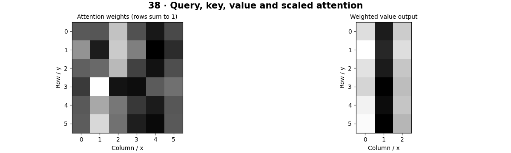

# Attention Mechanisms — concepts and mechanisms

## What and why

Attention is a data-dependent weighted average. Imagine asking a question of every item, scoring how relevant each item is, and combining the information from the most relevant items. Queries, keys and values are learned projections that make this comparison trainable.

## 1. Queries, keys and values

A query represents what a token seeks, a key represents how a token can be matched, and a value carries the information to combine. In self-attention all three come from the same sequence; in cross-attention queries and key/value tokens come from different sources. These are mathematical roles, not literal language questions.

## 2. Scaled dot-product attention

Multiply queries by transposed keys to form a score matrix, divide by the square root of key dimension, apply a row-wise softmax and multiply by values. Scaling controls score magnitude as dimension grows. The NumPy implementation uses stable softmax and is compared numerically with PyTorch.

## 3. Masks, heads and efficient attention

A mask blocks disallowed token pairs before normalization. A causal mask prevents access to future tokens, whereas image classification usually allows all patches to interact. Multiple heads use distinct projections. Full attention stores token-pair relationships, which grows quadratically with token count; optimized kernels reduce memory traffic but do not make every formulation linear.

## Mathematical foundation

$$
Attention(Q,K,V)=softmax(QK^T/\sqrt{d_k})V
$$

Q and K are query/key matrices, V contains values and dk is key width. Softmax acts over keys for each query. Equal scores over two values [2,6] yield their mean 4.

The numerical example makes the units and reduction visible before the larger pipeline:

```python
import numpy as np
import cv2

scores = np.array([0.0, 0.0])
weights = np.exp(scores) / np.exp(scores).sum()
values = np.array([2.0, 6.0])
output = weights @ values
assert np.isclose(output, 4)
print(weights, output)
```

## What happens internally

The reference returns both weighted values and the attention matrix, allowing row sums and masked entries to be inspected. Framework comparison uses matching inputs and mask conventions.

Read the chapter entry point, then follow its shared source. The core reference is `numerics.attention`. Separate data construction, algorithm, metric and plotting when changing the experiment.

## Visual reasoning



Predict a change before rerunning. Explain what each axis, color, mask or matrix cell represents. In learned examples, compare a loss curve with held-out predictions; in geometry examples, compare coordinate residuals with known synthetic truth. Visual plausibility is useful evidence, but does not replace a declared metric.

## Controlled experiment

Scale query/key magnitudes and inspect whether attention becomes peaked. Apply a triangular mask and verify forbidden weights are zero.

Write down the independent variable, what remains fixed, and the metric before changing code. Repeat stochastic experiments with multiple seeds and retain negative results. A timing comparison should include warm-up, repeat count and hardware; never compare unmatched preprocessing or data sizes.

## Applications and limits

Investigate the attention mechanism introduced in Chapter 37. The mini project applies the mechanism in a small runnable baseline. A softmax over the wrong axis can still produce plausible array shapes. Attention weights are not automatically causal explanations of predictions.

The local generated distribution deliberately removes some real-world complexity. External data, pretrained models and hardware paths are documented separately in [external workflows](../../docs/external-workflows.md). A toy objective or synthetic score must be labeled as such when used in a portfolio.

## Exercises and checkpoint

Explain this chapter to someone using one concrete example. Then implement a tiny case, change a parameter, create a failure and apply the method to new data. Use the [three exercise levels](../exercises/beginner.md) and [challenge](../exercises/challenge.md) to record evidence.

## Research connection

[Read the chapter research note](../../docs/research-reading.md#chapter-38). It distinguishes the original contribution, architecture intuition, limitations and alternatives from the scope of the runnable lab.

## References and next step

[Primary reference](https://arxiv.org/abs/1706.03762). Continue through the chapter notebooks and mini project, then follow the next-chapter link in the [chapter README](../README.md).
