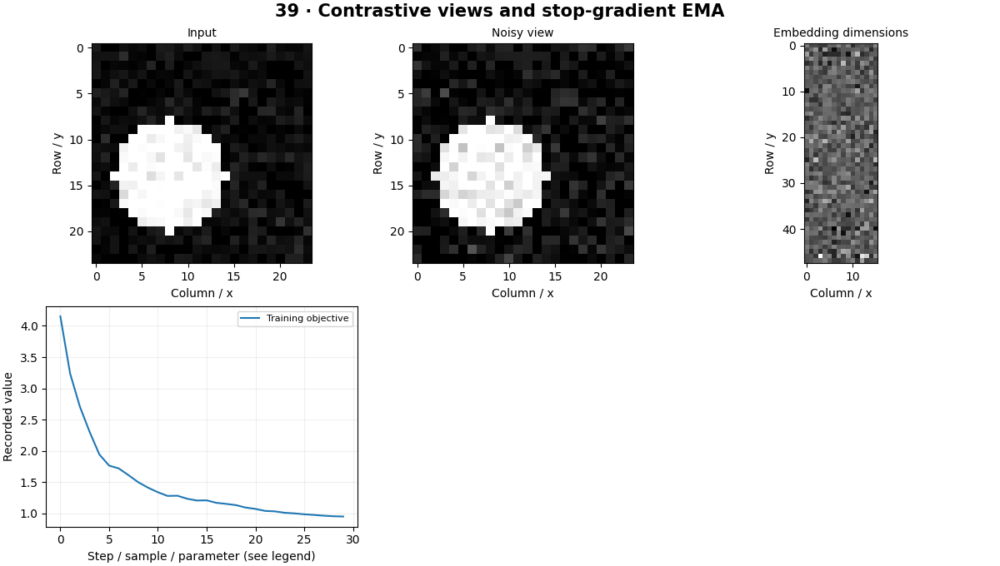

# Self-Supervised Learning — concepts and mechanisms

## What and why

Self-supervised learning constructs a training signal from data itself. The goal is a useful representation, not merely a low pretext-task loss. Augmentations and objectives decide what information is preserved and what is deliberately ignored.

## 1. Contrastive views and SimCLR

Contrastive learning pulls representations of two augmented views of the same image together and distinguishes other examples. Normalization and temperature control similarity scores. The local SimCLR-style experiment forms paired views and computes a normalized temperature-scaled contrastive objective. Augmentations must preserve information needed for downstream tasks.

## 2. EMA targets and BYOL ideas

BYOL uses an online network, predictor, target network and stop-gradient, with the target updated through an exponential moving average. These details interact in preventing trivial collapse. The local EMA consistency lab isolates target updates and intentionally omits parts of full BYOL; its loss is not evidence that a faithful BYOL reproduction has been achieved.

## 3. Masked image modeling and evaluation

Masked image modeling hides part of an input and learns to reconstruct missing content. Pixel reconstruction can encourage local appearance knowledge but is not identical to semantic understanding. Evaluate representations with a frozen linear probe or controlled fine-tuning on a separate labeled split, rather than judging only reconstruction loss.

## Mathematical foundation

$$
\theta_{target}\leftarrow m\theta_{target}+(1-m)\theta_{online}
$$

m is the EMA momentum, θtarget the slow-moving parameters and θonline the current trained parameters. With values 1 and 3 and m=0.9, the target becomes 1.2.

The numerical example makes the units and reduction visible before the larger pipeline:

```python
import numpy as np
import cv2

target, online, momentum = 1.0, 3.0, 0.9
updated_target = momentum * target + (1 - momentum) * online
assert np.isclose(updated_target, 1.2)
print(updated_target)
```

## What happens internally

Three experiments isolate contrastive pair construction, EMA target consistency and masked reconstruction. They use small synthetic data and report local objectives, not large-scale representation benchmarks.

Read the chapter entry point, then follow its shared source. The core reference is `models.Autoencoder`. Separate data construction, algorithm, metric and plotting when changing the experiment.

## Visual reasoning



Predict a change before rerunning. Explain what each axis, color, mask or matrix cell represents. In learned examples, compare a loss curve with held-out predictions; in geometry examples, compare coordinate residuals with known synthetic truth. Visual plausibility is useful evidence, but does not replace a declared metric.

## Controlled experiment

Remove an augmentation and measure downstream probe performance, not only training loss. Check embedding variance for collapse.

Write down the independent variable, what remains fixed, and the metric before changing code. Repeat stochastic experiments with multiple seeds and retain negative results. A timing comparison should include warm-up, repeat count and hardware; never compare unmatched preprocessing or data sizes.

## Applications and limits

Compare representations with fixed evaluation protocols. The mini project applies the mechanism in a small runnable baseline. Two crops can remove the object and cease to be meaningful positive pairs. EMA consistency without the full method can collapse.

The local generated distribution deliberately removes some real-world complexity. External data, pretrained models and hardware paths are documented separately in [external workflows](../../docs/external-workflows.md). A toy objective or synthetic score must be labeled as such when used in a portfolio.

## Exercises and checkpoint

Explain this chapter to someone using one concrete example. Then implement a tiny case, change a parameter, create a failure and apply the method to new data. Use the [three exercise levels](../exercises/beginner.md) and [challenge](../exercises/challenge.md) to record evidence.

## Research connection

[Read the chapter research note](../../docs/research-reading.md#chapter-39). It distinguishes the original contribution, architecture intuition, limitations and alternatives from the scope of the runnable lab.

## References and next step

[Primary reference](https://arxiv.org/abs/2002.05709). Continue through the chapter notebooks and mini project, then follow the next-chapter link in the [chapter README](../README.md).
