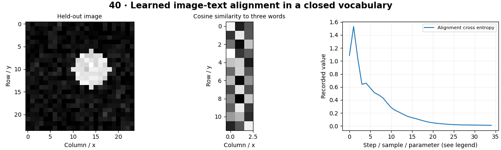

# Vision-Language Models — concepts and mechanisms

## What and why

Vision-language models relate images to text. A dual encoder can compare image and text embeddings for retrieval; a generative model can produce captions or answers. These are different capabilities and require different outputs and evaluation.

## 1. Image–text embedding alignment

An image encoder and text encoder map their inputs into a shared space. Training can increase similarity for paired observations and reduce it for other pairs. The CPU lab learns three synthetic word embeddings and a small image encoder; it demonstrates alignment but has no open-vocabulary language understanding.

## 2. Retrieval and zero-shot candidate scoring

CLIP-style inference compares an image with candidate text prompts. Softmax scores are relative to the chosen candidates, so adding or rewording labels can change them. Prompt sensitivity and dataset shift require evaluation. The external adapter supports a real pretrained CLIP model through explicit weight-download permission in the command.

## 3. Captioning, VQA and grounding limits

Captioning generates a description, while visual question answering conditions on both an image and a question. Generation can add details unsupported by the image. The optional BLIP adapters demonstrate these tasks, but factual grounding, sensitive data handling and downstream verification remain the application’s responsibility.

## Mathematical foundation

$$
s_{ij}=\hat v_i^T\hat t_j/\tau
$$

Normalized image embedding v̂i and text embedding t̂j have dot-product similarity, scaled by positive temperature τ. Aligned unit vectors have similarity 1 before scaling. These scores are not calibrated truth probabilities.

The numerical example makes the units and reduction visible before the larger pipeline:

```python
import numpy as np
import cv2

image_embedding = np.array([1.0, 0.0])
text_embeddings = np.array([[1.0, 0.0], [0.0, 1.0]])
scores = text_embeddings @ image_embedding
assert np.allclose(scores, [1.0, 0.0])
print(scores)
```

## What happens internally

The local dual encoder learns a closed vocabulary on generated image-label pairs. Pretrained retrieval, captioning and VQA are implemented separately and are never silently substituted for this small experiment.

Read the chapter entry point, then follow its shared source. The core reference is `numerics.attention`. Separate data construction, algorithm, metric and plotting when changing the experiment.

## Visual reasoning



Predict a change before rerunning. Explain what each axis, color, mask or matrix cell represents. In learned examples, compare a loss curve with held-out predictions; in geometry examples, compare coordinate residuals with known synthetic truth. Visual plausibility is useful evidence, but does not replace a declared metric.

## Controlled experiment

Add a visually similar distractor prompt to a candidate set and inspect score changes. Evaluate retrieval rank rather than assuming a fixed probability meaning.

Write down the independent variable, what remains fixed, and the metric before changing code. Repeat stochastic experiments with multiple seeds and retain negative results. A timing comparison should include warm-up, repeat count and hardware; never compare unmatched preprocessing or data sizes.

## Applications and limits

Measure retrieval and prompt sensitivity with documented model licenses. The mini project applies the mechanism in a small runnable baseline. A plausible caption may hallucinate objects. An embedding similarity cannot establish a person’s identity, intent or protected traits.

The local generated distribution deliberately removes some real-world complexity. External data, pretrained models and hardware paths are documented separately in [external workflows](../../docs/external-workflows.md). A toy objective or synthetic score must be labeled as such when used in a portfolio.

## Exercises and checkpoint

Explain this chapter to someone using one concrete example. Then implement a tiny case, change a parameter, create a failure and apply the method to new data. Use the [three exercise levels](../exercises/beginner.md) and [challenge](../exercises/challenge.md) to record evidence.

## Research connection

[Read the chapter research note](../../docs/research-reading.md#chapter-40). It distinguishes the original contribution, architecture intuition, limitations and alternatives from the scope of the runnable lab.

## References and next step

[Primary reference](https://arxiv.org/abs/2103.00020). Continue through the chapter notebooks and mini project, then follow the next-chapter link in the [chapter README](../README.md).
