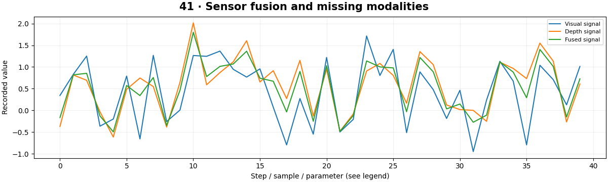

# Multimodal Computer Vision — concepts and mechanisms

## What and why

Multimodal vision combines information from different sources, such as RGB, depth, text or audio. The central problems include alignment, missing inputs and conflicting evidence. More sensors can improve a system only when their uncertainties and timing are handled correctly.

## 1. Early, late and cross-modal fusion

Early fusion combines inputs or features before the final predictor; late fusion combines separate predictions. Cross-attention can allow one modality to query another. These choices trade flexibility, missing-input handling and compute. RGB and depth must refer to compatible coordinates before pixel-level fusion makes sense.

## 2. Uncertainty-weighted sensor fusion

When two independent Gaussian measurements estimate the same quantity, weighting by inverse variance gives a minimum-variance combination. The scalar lab uses known synthetic noise to demonstrate this rule. Real uncertainty must be estimated and checked; correlated errors violate the independence assumption.

## 3. Missing modalities and synchronization

A missing modality should trigger an explicit fallback, not a fabricated zero measurement. Timestamp misalignment can turn useful depth or audio into contradictory evidence. Evaluate performance with dropped, delayed and corrupted modalities so the system does not rely silently on ideal sensor availability.

## Mathematical foundation

$$
\hat x=(x_1/\sigma_1^2+x_2/\sigma_2^2)/(1/\sigma_1^2+1/\sigma_2^2)
$$

x1,x2 estimate one quantity and σ1²,σ2² are independent measurement variances. Measurements 2 and 4 with variances 1 and 4 combine to 2.4, closer to the more precise first sensor.

The numerical example makes the units and reduction visible before the larger pipeline:

```python
import numpy as np
import cv2

x1, x2, variance1, variance2 = 2.0, 4.0, 1.0, 4.0
fused = (x1 / variance1 + x2 / variance2) / (1 / variance1 + 1 / variance2)
assert np.isclose(fused, 2.4)
print(fused)
```

## What happens internally

The lab generates visual and depth-like scalar measurements, applies precision weighting and falls back to the available sensor when depth is missing. It isolates fusion rather than a full learned multimodal architecture.

Read the chapter entry point, then follow its shared source. The core reference is `numerics.softmax`. Separate data construction, algorithm, metric and plotting when changing the experiment.

## Visual reasoning



Predict a change before rerunning. Explain what each axis, color, mask or matrix cell represents. In learned examples, compare a loss curve with held-out predictions; in geometry examples, compare coordinate residuals with known synthetic truth. Visual plausibility is useful evidence, but does not replace a declared metric.

## Controlled experiment

Make sensor errors correlated and compare the theoretical confidence with observed error. Then introduce missing depth.

Write down the independent variable, what remains fixed, and the metric before changing code. Repeat stochastic experiments with multiple seeds and retain negative results. A timing comparison should include warm-up, repeat count and hardware; never compare unmatched preprocessing or data sizes.

## Applications and limits

Combine visual and nonvisual observations without hiding missing data. The mini project applies the mechanism in a small runnable baseline. Concatenating arrays is not sufficient if modalities describe different times or coordinates. A high-confidence sensor can still be systematically biased.

The local generated distribution deliberately removes some real-world complexity. External data, pretrained models and hardware paths are documented separately in [external workflows](../../docs/external-workflows.md). A toy objective or synthetic score must be labeled as such when used in a portfolio.

## Exercises and checkpoint

Explain this chapter to someone using one concrete example. Then implement a tiny case, change a parameter, create a failure and apply the method to new data. Use the [three exercise levels](../exercises/beginner.md) and [challenge](../exercises/challenge.md) to record evidence.

## Research connection

[Read the chapter research note](../../docs/research-reading.md#chapter-41). It distinguishes the original contribution, architecture intuition, limitations and alternatives from the scope of the runnable lab.

## References and next step

[Primary reference](https://docs.opencv.org/4.x/d9/d0c/group__calib3d.html). Continue through the chapter notebooks and mini project, then follow the next-chapter link in the [chapter README](../README.md).
