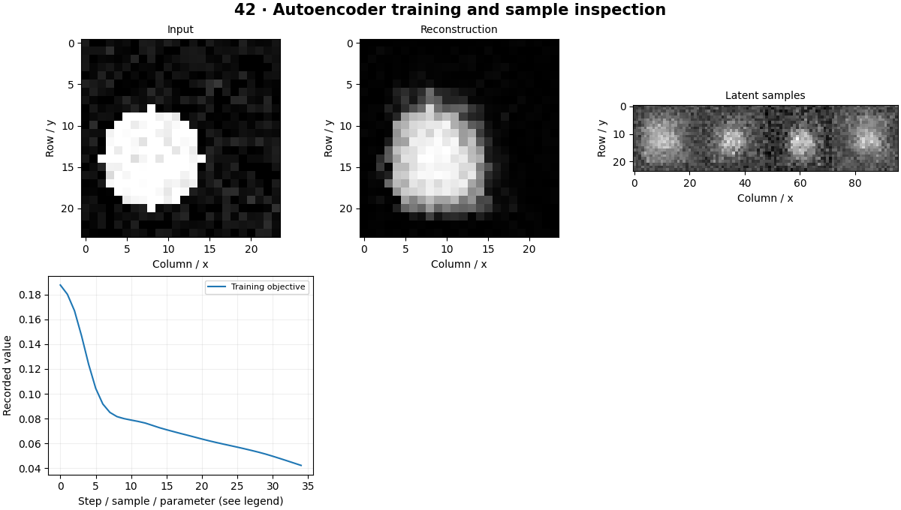

# Generative Computer Vision — concepts and mechanisms

## What and why

Generative vision learns to reconstruct or synthesize images. An autoencoder compresses observations, a VAE imposes a probabilistic latent structure, and a GAN learns through competition. Understanding their objectives helps explain blur, collapse and unstable training.

## 1. Autoencoders and reconstruction

An encoder maps an image into a smaller latent representation and a decoder reconstructs it. A reconstruction objective rewards recovering input pixels but does not automatically organize the latent space for random sampling. A model can memorize examples, so held-out reconstruction and interpolation need separate inspection.

## 2. Variational autoencoders

A VAE predicts a latent mean and variance and samples using a differentiable reparameterization. Its objective balances reconstruction with a KL penalty toward a prior. Increasing the regularization can improve latent structure while reducing sharpness. The tiny lab uses an MLP VAE on generated shapes.

## 3. GAN objectives and failure analysis

A GAN trains a generator to create images and a discriminator to distinguish real from generated images. Their changing objectives make optimization a game rather than ordinary supervised fitting. Mode collapse can produce a few plausible images while ignoring diversity. Short CPU training runs illustrate mechanics and may produce poor samples.

## Mathematical foundation

$$
z=\mu+\sigma\odot\epsilon,\qquad\epsilon\sim\mathcal N(0,I)
$$

μ and σ are encoder outputs, ε standard-normal noise, ⊙ elementwise multiplication and z the sampled latent vector. With μ=2, σ=0.5 and ε=−1, z=1.5. Gradients can pass through μ and σ.

The numerical example makes the units and reduction visible before the larger pipeline:

```python
import numpy as np
import cv2

mean, standard_deviation, noise = 2.0, 0.5, -1.0
latent = mean + standard_deviation * noise
assert np.isclose(latent, 1.5)
print(latent)
```

## What happens internally

The three local modes train an autoencoder, VAE or small GAN and display their actual outputs. Loss curves are optimization observations, not substitutes for diversity or realism evaluation.

Read the chapter entry point, then follow its shared source. The core reference is `models.Autoencoder`. Separate data construction, algorithm, metric and plotting when changing the experiment.

## Visual reasoning



Predict a change before rerunning. Explain what each axis, color, mask or matrix cell represents. In learned examples, compare a loss curve with held-out predictions; in geometry examples, compare coordinate residuals with known synthetic truth. Visual plausibility is useful evidence, but does not replace a declared metric.

## Controlled experiment

Interpolate between two latent codes, vary the VAE KL weight and inspect whether the GAN repeats a few outputs.

Write down the independent variable, what remains fixed, and the metric before changing code. Repeat stochastic experiments with multiple seeds and retain negative results. A timing comparison should include warm-up, repeat count and hardware; never compare unmatched preprocessing or data sizes.

## Applications and limits

Separate reconstruction quality from distribution coverage. The mini project applies the mechanism in a small runnable baseline. Low reconstruction MSE can favor blurry averages. Cherry-picked generated samples do not establish model quality.

The local generated distribution deliberately removes some real-world complexity. External data, pretrained models and hardware paths are documented separately in [external workflows](../../docs/external-workflows.md). A toy objective or synthetic score must be labeled as such when used in a portfolio.

## Exercises and checkpoint

Explain this chapter to someone using one concrete example. Then implement a tiny case, change a parameter, create a failure and apply the method to new data. Use the [three exercise levels](../exercises/beginner.md) and [challenge](../exercises/challenge.md) to record evidence.

## Research connection

[Read the chapter research note](../../docs/research-reading.md#chapter-42). It distinguishes the original contribution, architecture intuition, limitations and alternatives from the scope of the runnable lab.

## References and next step

[Primary reference](https://arxiv.org/abs/1312.6114). Continue through the chapter notebooks and mini project, then follow the next-chapter link in the [chapter README](../README.md).
