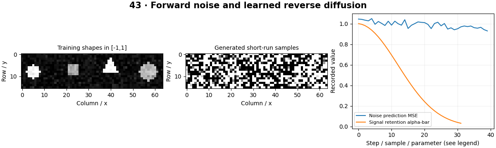

# Diffusion Models for Vision — concepts and mechanisms

## What and why

Diffusion models learn to reverse a gradual noising process. The forward process is prescribed, while a network learns a reverse-step ingredient such as noise prediction. Sampling repeats many learned denoising steps, making the noise schedule and parameterization essential.

## 1. Forward noising schedules

At each forward step, a small amount of Gaussian noise replaces signal. Products of retained signal fractions allow sampling a noisy image at any time directly. Early times preserve much of the image; late times approach noise. A short schedule may not fully erase the training image, which affects sampling assumptions.

## 2. Noise prediction and training

A noise-prediction network sees the noisy image and time index and predicts the injected noise. Mean squared error supplies a simple training objective. Time conditioning tells the network which noise level it is solving. The local model is a small MLP trained on 16×16 generated shapes.

## 3. Reverse sampling and conditioning

Reverse sampling starts from noise and repeatedly estimates a cleaner state while adding schedule-dependent randomness. Guidance and image-to-image methods introduce additional conditioning and strength controls. The lab implements a small DDPM-style sampler; it is not a pretrained text-to-image system, and its short runs are expected to be low quality.

## Mathematical foundation

$$
x_t=\sqrt{\bar\alpha_t}x_0+\sqrt{1-\bar\alpha_t}\epsilon
$$

x0 is clean data, ε standard-normal noise, ᾱt cumulative signal retention and xt the noisy sample. With ᾱ=0.64, x0=1 and ε=0, xt=0.8. The two square-root factors control signal and noise variance.

The numerical example makes the units and reduction visible before the larger pipeline:

```python
import numpy as np
import cv2

alpha_bar, clean, noise = 0.64, 1.0, 0.0
noisy = np.sqrt(alpha_bar) * clean + np.sqrt(1 - alpha_bar) * noise
assert np.isclose(noisy, 0.8)
print(noisy)
```

## What happens internally

The source samples random time indices, creates noisy inputs with known noise targets, optimizes an MSE objective and executes a reverse loop. Training and sampling use the same stored schedule.

Read the chapter entry point, then follow its shared source. The core reference is `models.diffusion_train_sample`. Separate data construction, algorithm, metric and plotting when changing the experiment.

## Visual reasoning



Predict a change before rerunning. Explain what each axis, color, mask or matrix cell represents. In learned examples, compare a loss curve with held-out predictions; in geometry examples, compare coordinate residuals with known synthetic truth. Visual plausibility is useful evidence, but does not replace a declared metric.

## Controlled experiment

Plot signal retention across steps and compare samples after different training budgets. Check that the final forward state is close to the assumed starting distribution.

Write down the independent variable, what remains fixed, and the metric before changing code. Repeat stochastic experiments with multiple seeds and retain negative results. A timing comparison should include warm-up, repeat count and hardware; never compare unmatched preprocessing or data sizes.

## Applications and limits

Explain noise prediction before using a pretrained generator. The mini project applies the mechanism in a small runnable baseline. Confusing predicted noise with a predicted clean image changes the reverse equation. A falling noise loss is not a guarantee of visually good samples.

The local generated distribution deliberately removes some real-world complexity. External data, pretrained models and hardware paths are documented separately in [external workflows](../../docs/external-workflows.md). A toy objective or synthetic score must be labeled as such when used in a portfolio.

## Exercises and checkpoint

Explain this chapter to someone using one concrete example. Then implement a tiny case, change a parameter, create a failure and apply the method to new data. Use the [three exercise levels](../exercises/beginner.md) and [challenge](../exercises/challenge.md) to record evidence.

## Research connection

[Read the chapter research note](../../docs/research-reading.md#chapter-43). It distinguishes the original contribution, architecture intuition, limitations and alternatives from the scope of the runnable lab.

## References and next step

[Primary reference](https://arxiv.org/abs/2006.11239). Continue through the chapter notebooks and mini project, then follow the next-chapter link in the [chapter README](../README.md).
