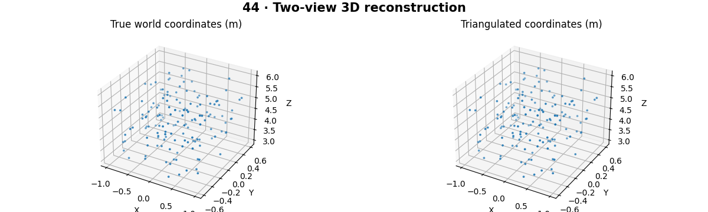

# 3D Computer Vision — concepts and mechanisms

## What and why

Three-dimensional vision connects world geometry to image measurements. A single image loses depth through projection; multiple views and assumptions can constrain it. Coordinate frames, units and calibration are as important as the reconstruction algorithm.

## 1. World, camera and image coordinates

A rigid pose uses a rotation matrix and translation to map coordinates between frames. Rotation preserves lengths and has determinant +1. The camera projects camera-frame XYZ through intrinsics and perspective division. Be explicit whether a transform maps world to camera or camera to world; their translations are not interchangeable.

## 2. Epipolar geometry and triangulation

Corresponding points lie on related epipolar lines. A fundamental matrix describes the pixel-coordinate constraint; an essential matrix describes calibrated rays. Triangulation finds a 3D point consistent with two camera projections. The lab assumes known calibration and correspondences so that this geometric step can be studied independently.

## 3. Reprojection and reconstruction error

Reprojection error compares predicted and observed pixels, whereas 3D error compares reconstructed and true world coordinates. Small ray intersection angles make depth uncertain even with modest pixel residuals. Real reconstruction also needs feature matching, pose estimation, outlier rejection and often bundle adjustment.

## Mathematical foundation

$$
\tilde p\sim K[R\mid t]\tilde X
$$

X̃ is a homogeneous world point, R,t map world to camera, K contains intrinsics and p̃ is homogeneous image position. The symbol ∼ means equal up to a nonzero scale. Dividing by depth yields pixel coordinates.

The numerical example makes the units and reduction visible before the larger pipeline:

```python
import numpy as np
import cv2

world = np.array([1.0, 2.0, 4.0, 1.0])
projection = np.column_stack([np.eye(3), np.zeros(3)])
q = projection @ world
pixel = q[:2] / q[2]
assert np.allclose(pixel, [0.25, 0.5])
print(pixel)
```

## What happens internally

The reference builds four linear equations per correspondence and solves a homogeneous least-squares problem by SVD. OpenCV triangulation is compared under identical camera matrices.

Read the chapter entry point, then follow its shared source. The core reference is `geometry.triangulate`. Separate data construction, algorithm, metric and plotting when changing the experiment.

## Visual reasoning



Predict a change before rerunning. Explain what each axis, color, mask or matrix cell represents. In learned examples, compare a loss curve with held-out predictions; in geometry examples, compare coordinate residuals with known synthetic truth. Visual plausibility is useful evidence, but does not replace a declared metric.

## Controlled experiment

Reduce the baseline while holding pixel noise fixed and measure how 3D error changes. Include points at several depths.

Write down the independent variable, what remains fixed, and the metric before changing code. Repeat stochastic experiments with multiple seeds and retain negative results. A timing comparison should include warm-up, repeat count and hardware; never compare unmatched preprocessing or data sizes.

## Applications and limits

Recover geometry while tracking coordinate frames and scale ambiguity. The mini project applies the mechanism in a small runnable baseline. Low reprojection error alone does not fix scale or guarantee accurate depth. Mixing left-handed and right-handed frames can mirror a reconstruction.

The local generated distribution deliberately removes some real-world complexity. External data, pretrained models and hardware paths are documented separately in [external workflows](../../docs/external-workflows.md). A toy objective or synthetic score must be labeled as such when used in a portfolio.

## Exercises and checkpoint

Explain this chapter to someone using one concrete example. Then implement a tiny case, change a parameter, create a failure and apply the method to new data. Use the [three exercise levels](../exercises/beginner.md) and [challenge](../exercises/challenge.md) to record evidence.

## Research connection

[Read the chapter research note](../../docs/research-reading.md#chapter-44). It distinguishes the original contribution, architecture intuition, limitations and alternatives from the scope of the runnable lab.

## References and next step

[Primary reference](https://docs.opencv.org/4.x/d9/d0c/group__calib3d.html). Continue through the chapter notebooks and mini project, then follow the next-chapter link in the [chapter README](../README.md).
