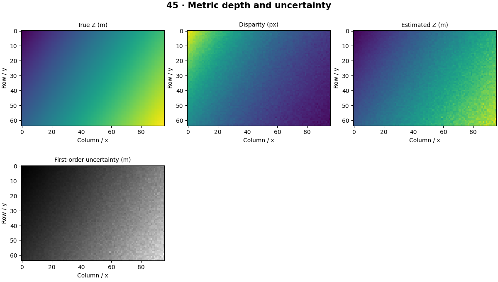

# Depth Estimation — concepts and mechanisms

## What and why

Depth is distance along a stated camera axis or ray; the convention must be declared. Stereo geometry can recover metric depth from calibration, while monocular learned depth often has scale ambiguity or domain-dependent calibration.

## 1. Disparity and metric depth

In a rectified stereo pair, disparity is the horizontal pixel difference between matching points. Larger disparity usually means smaller depth. Focal length in pixels and baseline in physical units determine metric scale. Zero or negative disparity should be marked invalid, not converted into an invented finite distance.

## 2. Depth uncertainty and invalid pixels

Depth varies inversely with disparity, so the same pixel disparity error causes greater depth error for distant objects. First-order uncertainty propagates through the derivative of the depth formula. Evaluate only valid regions and report their coverage; excluding difficult pixels without reporting coverage can inflate apparent quality.

## 3. Monocular priors and evaluation

Monocular models infer depth using learned visual priors, which can fail on unfamiliar materials, scales and camera settings. Relative depth order is different from metric depth. Aligning predicted scale on test ground truth changes the evaluation task and must be reported explicitly.

## Mathematical foundation

$$
Z=fB/d
$$

Z is depth, f focal length in pixels, B baseline in meters and d disparity in pixels. With f=200 px, B=0.12 m and d=8 px, Z=3 m. Units cancel only when f and d share pixel units.

The numerical example makes the units and reduction visible before the larger pipeline:

```python
import numpy as np
import cv2

focal_px, baseline_m, disparity_px = 200.0, 0.12, 8.0
depth_m = focal_px * baseline_m / disparity_px
assert np.isclose(depth_m, 3)
print(depth_m)
```

## What happens internally

The lab generates a known depth surface, converts it to disparity, adds measured pixel noise and recovers depth with invalid-value masking. It also visualizes first-order uncertainty.

Read the chapter entry point, then follow its shared source. The core reference is `geometry.disparity_to_depth`. Separate data construction, algorithm, metric and plotting when changing the experiment.

## Visual reasoning



Predict a change before rerunning. Explain what each axis, color, mask or matrix cell represents. In learned examples, compare a loss curve with held-out predictions; in geometry examples, compare coordinate residuals with known synthetic truth. Visual plausibility is useful evidence, but does not replace a declared metric.

## Controlled experiment

Add the same disparity noise at 2 m and 6 m. Compare depth MAE and explain the nonlinear difference.

Write down the independent variable, what remains fixed, and the metric before changing code. Repeat stochastic experiments with multiple seeds and retain negative results. A timing comparison should include warm-up, repeat count and hardware; never compare unmatched preprocessing or data sizes.

## Applications and limits

Evaluate depth without pretending image estimates are measurements. The mini project applies the mechanism in a small runnable baseline. A visually smooth depth map can be consistently wrong in scale. Depth Z and Euclidean range are different away from the optical axis.

The local generated distribution deliberately removes some real-world complexity. External data, pretrained models and hardware paths are documented separately in [external workflows](../../docs/external-workflows.md). A toy objective or synthetic score must be labeled as such when used in a portfolio.

## Exercises and checkpoint

Explain this chapter to someone using one concrete example. Then implement a tiny case, change a parameter, create a failure and apply the method to new data. Use the [three exercise levels](../exercises/beginner.md) and [challenge](../exercises/challenge.md) to record evidence.

## Research connection

[Read the chapter research note](../../docs/research-reading.md#chapter-45). It distinguishes the original contribution, architecture intuition, limitations and alternatives from the scope of the runnable lab.

## References and next step

[Primary reference](https://docs.opencv.org/4.x/dd/d53/tutorial_py_depthmap.html). Continue through the chapter notebooks and mini project, then follow the next-chapter link in the [chapter README](../README.md).
