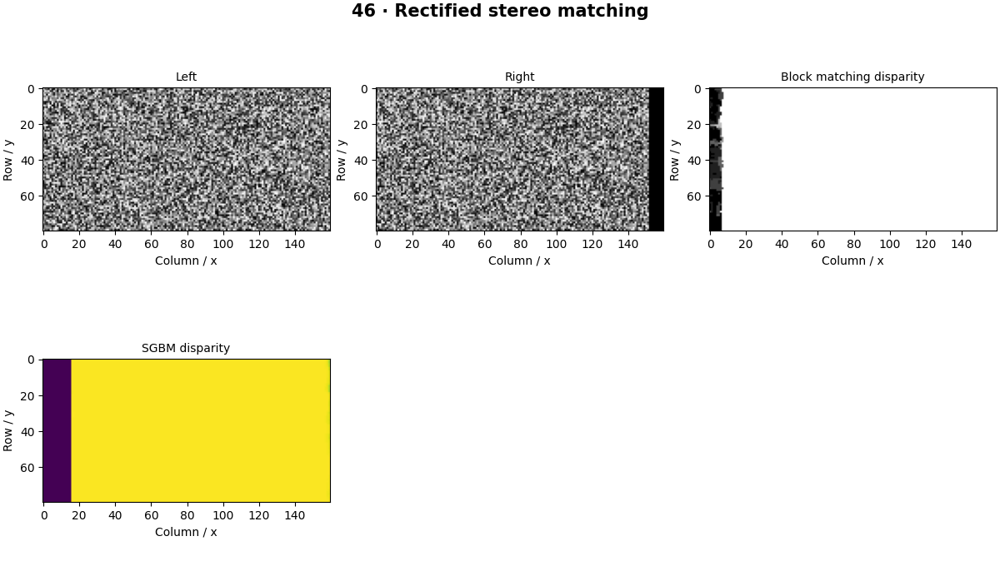

# Stereo Vision — concepts and mechanisms

## What and why

Stereo vision searches for corresponding image points between cameras. Rectification makes ideal matches lie on the same row, reducing a two-dimensional search to a horizontal disparity search. Matching still struggles with occlusion, textureless areas and repeated patterns.

## 1. Rectification and disparity hypotheses

Rectification remaps calibrated views so epipolar lines align horizontally. The lab starts with already rectified synthetic images to isolate matching. A disparity hypothesis shifts one image relative to the other; only overlapping valid pixels should contribute to its comparison cost.

## 2. Block matching from scratch

Block matching aggregates a photometric difference over a neighborhood for each candidate disparity and selects the minimum. Larger windows stabilize noisy texture but blur depth boundaries. Costs may use absolute difference, squared difference or robust descriptors. The reference uses absolute differences and a box-filter aggregation.

## 3. SGBM and consistency checks

Semi-global matching adds smoothness constraints along multiple directions while permitting discontinuities. OpenCV StereoSGBM returns fixed-point disparities scaled by 16. Check invalid values and left-right consistency before converting to depth. The generated plane is deliberately easier than a real stereo scene.

## Mathematical foundation

$$
d^*(p)=\arg\min_d\sum_{q\in W(p)}|L(q)-R(q-(d,0))|
$$

L and R are rectified images, W(p) a neighborhood around pixel p and d a candidate disparity. The selected disparity minimizes local absolute intensity difference. Candidate costs [9,2,7] select the second candidate.

The numerical example makes the units and reduction visible before the larger pipeline:

```python
import numpy as np
import cv2

candidate_disparities = np.array([0, 1, 2])
costs = np.array([9.0, 2.0, 7.0])
best = candidate_disparities[costs.argmin()]
assert best == 1
print(best)
```

## What happens internally

The reference constructs a cost volume over integer shifts and chooses its minimum. SGBM provides an optimized comparison; error is evaluated only in an interior region with valid synthetic correspondences.

Read the chapter entry point, then follow its shared source. The core reference is `geometry.disparity_to_depth`. Separate data construction, algorithm, metric and plotting when changing the experiment.

## Visual reasoning



Predict a change before rerunning. Explain what each axis, color, mask or matrix cell represents. In learned examples, compare a loss curve with held-out predictions; in geometry examples, compare coordinate residuals with known synthetic truth. Visual plausibility is useful evidence, but does not replace a declared metric.

## Controlled experiment

Replace random texture with a flat patch and inspect ambiguity in the full cost curve. Add an occluder visible to only one camera.

Write down the independent variable, what remains fixed, and the metric before changing code. Repeat stochastic experiments with multiple seeds and retain negative results. A timing comparison should include warm-up, repeat count and hardware; never compare unmatched preprocessing or data sizes.

## Applications and limits

Convert calibrated disparity into depth with valid masks. The mini project applies the mechanism in a small runnable baseline. Using raw SGBM integer output as pixels makes depth wrong by a factor of 16. Rectification does not create missing correspondence in occluded regions.

The local generated distribution deliberately removes some real-world complexity. External data, pretrained models and hardware paths are documented separately in [external workflows](../../docs/external-workflows.md). A toy objective or synthetic score must be labeled as such when used in a portfolio.

## Exercises and checkpoint

Explain this chapter to someone using one concrete example. Then implement a tiny case, change a parameter, create a failure and apply the method to new data. Use the [three exercise levels](../exercises/beginner.md) and [challenge](../exercises/challenge.md) to record evidence.

## Research connection

[Read the chapter research note](../../docs/research-reading.md#chapter-46). It distinguishes the original contribution, architecture intuition, limitations and alternatives from the scope of the runnable lab.

## References and next step

[Primary reference](https://docs.opencv.org/4.x/d2/d85/classcv_1_1StereoSGBM.html). Continue through the chapter notebooks and mini project, then follow the next-chapter link in the [chapter README](../README.md).
