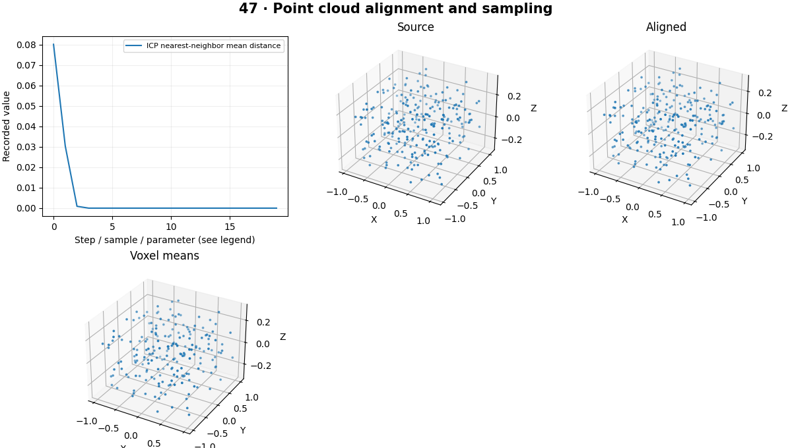

# Point Clouds — concepts and mechanisms

## What and why

A point cloud is a set of 3D samples, often with color, normals or confidence. Unlike an image, it has no guaranteed regular grid. Sampling density, outliers and coordinate conventions affect every downstream geometric operation.

## 1. Backprojection and point-cloud structure

A depth map can be backprojected through inverse intrinsics to produce camera-frame points. Filter invalid depth before geometric processing. PLY and other point formats may carry color and normals. Units and frame names must accompany files because coordinates alone do not reveal whether values are meters or millimeters.

## 2. Voxel sampling and nearest neighbors

Voxel downsampling divides space into cells and replaces points within each cell by a representative such as their mean. It reduces density and memory at the cost of small details. A nearest-neighbor tree accelerates geometric queries but does not guarantee that the nearest point is the correct physical correspondence.

## 3. Rigid alignment and ICP

With known pairs, Kabsch alignment finds the least-squares rigid rotation and translation through SVD and reflection correction. ICP alternates nearest-neighbor assignment and rigid fitting. It needs a reasonable initialization and can converge to a wrong local alignment on symmetric or partially overlapping shapes.

## Mathematical foundation

$$
\min_{R,t}\sum_i\lVert Rp_i+t-q_i\rVert^2
$$

pi and qi are paired 3D points, R a proper rotation and t translation. If every target equals its source plus [1,0,0], identity rotation and that translation give zero residual.

The numerical example makes the units and reduction visible before the larger pipeline:

```python
import numpy as np
import cv2

source = np.array([[0.0, 0.0, 0.0], [0.0, 1.0, 0.0], [0.0, 0.0, 1.0]])
translation = np.array([1.0, 0.0, 0.0])
target = source + translation
residual = np.linalg.norm(source + translation - target, axis=1)
assert np.allclose(residual, 0)
print(residual)
```

## What happens internally

The lab compares exact paired rigid fitting with iterative unpaired ICP and plots voxel-reduced points. The optional Open3D workflow reads and writes real point-cloud files.

Read the chapter entry point, then follow its shared source. The core reference is `geometry.icp`. Separate data construction, algorithm, metric and plotting when changing the experiment.

## Visual reasoning



Predict a change before rerunning. Explain what each axis, color, mask or matrix cell represents. In learned examples, compare a loss curve with held-out predictions; in geometry examples, compare coordinate residuals with known synthetic truth. Visual plausibility is useful evidence, but does not replace a declared metric.

## Controlled experiment

Increase initial rotation and partial overlap to find ICP failures. Compare point count and geometric detail at several voxel sizes.

Write down the independent variable, what remains fixed, and the metric before changing code. Repeat stochastic experiments with multiple seeds and retain negative results. A timing comparison should include warm-up, repeat count and hardware; never compare unmatched preprocessing or data sizes.

## Applications and limits

Construct and inspect point clouds with units and frame labels. The mini project applies the mechanism in a small runnable baseline. ICP residual can be small for an incorrect symmetric alignment. Voxel size has physical units and must match the cloud scale.

The local generated distribution deliberately removes some real-world complexity. External data, pretrained models and hardware paths are documented separately in [external workflows](../../docs/external-workflows.md). A toy objective or synthetic score must be labeled as such when used in a portfolio.

## Exercises and checkpoint

Explain this chapter to someone using one concrete example. Then implement a tiny case, change a parameter, create a failure and apply the method to new data. Use the [three exercise levels](../exercises/beginner.md) and [challenge](../exercises/challenge.md) to record evidence.

## Research connection

[Read the chapter research note](../../docs/research-reading.md#chapter-47). It distinguishes the original contribution, architecture intuition, limitations and alternatives from the scope of the runnable lab.

## References and next step

[Primary reference](https://www.open3d.org/docs/release/tutorial/pipelines/icp_registration.html). Continue through the chapter notebooks and mini project, then follow the next-chapter link in the [chapter README](../README.md).
