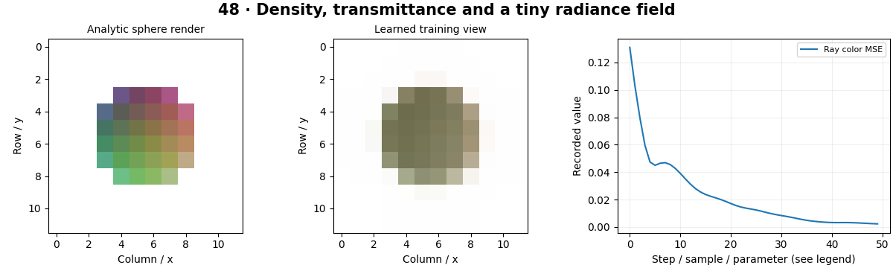

# Neural Radiance Fields — concepts and mechanisms

## What and why

A neural radiance field represents a scene with a function that predicts density and appearance at spatial locations and viewing directions. Rendering integrates samples along camera rays. The representation learns through images, but geometric identifiability depends on the available views.

## 1. Rays, density and positional encoding

A ray starts at a camera origin and advances along a direction. A network can map sampled positions and view directions to density and color. Positional encoding supplies sinusoidal features to represent spatial variation. The local model uses positions only, so it cannot model full view-dependent appearance.

## 2. Volume rendering and transmittance

Density becomes opacity over a finite ray segment. Transmittance describes how much light reaches a sample without previous absorption. Each sample’s contribution is its opacity times prior transmittance, and remaining light reaches the background. Differentiable compositing lets image error update the field.

## 3. Fit a tiny radiance field

The tiny lab learns an orthographic view of an analytic synthetic volume and compares rendered colors with known targets. Fitting one view is underconstrained and does not demonstrate novel-view reconstruction. A real NeRF workflow requires multiple calibrated views, ray sampling, scene bounds and held-out camera evaluation.

## Mathematical foundation

$$
C=\sum_i T_i(1-e^{-\sigma_i\Delta_i})c_i
$$

σi is density, Δi sample interval, ci color and Ti transmittance before sample i. One sample with opacity 0.5, black color and white background yields final intensity 0.5 after adding the background term.

The numerical example makes the units and reduction visible before the larger pipeline:

```python
import numpy as np
import cv2

opacity, color, background = 0.5, 0.0, 1.0
rendered = opacity * color + (1 - opacity) * background
assert np.isclose(rendered, 0.5)
print(rendered)
```

## What happens internally

The field uses sinusoidal position features, an MLP and nonnegative density. The differentiable renderer accumulates opacity and transmittance, then a pixel MSE trains the field.

Read the chapter entry point, then follow its shared source. The core reference is `geometry.volume_render`. Separate data construction, algorithm, metric and plotting when changing the experiment.

## Visual reasoning



Predict a change before rerunning. Explain what each axis, color, mask or matrix cell represents. In learned examples, compare a loss curve with held-out predictions; in geometry examples, compare coordinate residuals with known synthetic truth. Visual plausibility is useful evidence, but does not replace a declared metric.

## Controlled experiment

Hold out a camera view in an extended multiview experiment and compare its error with training-view error. Inspect whether density is plausible or merely explains one view.

Write down the independent variable, what remains fixed, and the metric before changing code. Repeat stochastic experiments with multiple seeds and retain negative results. A timing comparison should include warm-up, repeat count and hardware; never compare unmatched preprocessing or data sizes.

## Applications and limits

Train a tiny synthetic scene and separate camera errors from model errors. The mini project applies the mechanism in a small runnable baseline. Low training-image loss does not prove correct 3D geometry. Ignoring background transmittance darkens empty rays.

The local generated distribution deliberately removes some real-world complexity. External data, pretrained models and hardware paths are documented separately in [external workflows](../../docs/external-workflows.md). A toy objective or synthetic score must be labeled as such when used in a portfolio.

## Exercises and checkpoint

Explain this chapter to someone using one concrete example. Then implement a tiny case, change a parameter, create a failure and apply the method to new data. Use the [three exercise levels](../exercises/beginner.md) and [challenge](../exercises/challenge.md) to record evidence.

## Research connection

[Read the chapter research note](../../docs/research-reading.md#chapter-48). It distinguishes the original contribution, architecture intuition, limitations and alternatives from the scope of the runnable lab.

## References and next step

[Primary reference](https://arxiv.org/abs/2003.08934). Continue through the chapter notebooks and mini project, then follow the next-chapter link in the [chapter README](../README.md).
