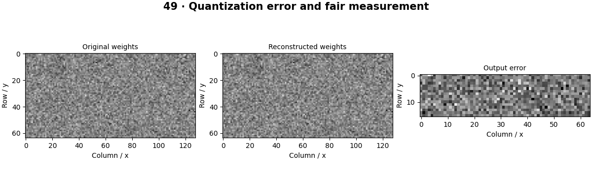

# Model Optimization — concepts and mechanisms

## What and why

Optimization changes runtime, memory or storage while controlling output quality. Faster arithmetic is useful only when it improves the actual bottleneck. Measure a representative workload before choosing quantization, pruning, compilation or a different architecture.

## 1. Profiling and reliable benchmarks

Separate preprocessing, transfer, model execution and postprocessing time. Warm up the runtime, repeat measurements and report a distribution rather than one sample. GPU operations may be asynchronous and need synchronization for accurate timing. Batch size affects throughput and individual request latency differently.

## 2. Quantization and numerical error

Symmetric int8 quantization maps floating weights to signed integers using a scale. Reconstructing them reveals rounding error. Smaller stored weights do not automatically mean faster execution: a runtime needs supported quantized kernels. The lab times floating multiplication before and after dequantization and explicitly avoids calling that an int8 speedup.

## 3. ONNX export and runtime parity

ONNX is an interchange graph format; export success alone does not prove numerical equivalence or performance. The export script trains TinyCNN, checks its ONNX graph and compares CPU runtime logits on a held-out batch. TensorRT concepts include graph optimization, precision selection and engine compilation, which require compatible target hardware for validation.

## Mathematical foundation

$$
q=clip(round(w/s),-127,127),\quad\hat w=sq
$$

w is a weight, s a positive scale, q its signed int8 code and ŵ the reconstruction. With w=0.26 and s=0.1, q=3 and ŵ=0.3, giving error 0.04.

The numerical example makes the units and reduction visible before the larger pipeline:

```python
import numpy as np
import cv2

weight, scale = 0.26, 0.1
quantized = np.clip(np.rint(weight / scale), -127, 127).astype(np.int8)
reconstructed = float(quantized) * scale
assert np.isclose(reconstructed, 0.3)
print(quantized, reconstructed)
```

## What happens internally

The local lab records storage and output error for a quantized weight matrix. scripts/export_model.py adds actual graph validation and ONNX Runtime output agreement.

Read the chapter entry point, then follow its shared source. The core reference is `engineering.quantize_symmetric`. Separate data construction, algorithm, metric and plotting when changing the experiment.

## Visual reasoning



Predict a change before rerunning. Explain what each axis, color, mask or matrix cell represents. In learned examples, compare a loss curve with held-out predictions; in geometry examples, compare coordinate residuals with known synthetic truth. Visual plausibility is useful evidence, but does not replace a declared metric.

## Controlled experiment

Quantize a weight distribution with an outlier and compare per-tensor and per-channel error. Measure the target runtime rather than extrapolating from file size.

Write down the independent variable, what remains fixed, and the metric before changing code. Repeat stochastic experiments with multiple seeds and retain negative results. A timing comparison should include warm-up, repeat count and hardware; never compare unmatched preprocessing or data sizes.

## Applications and limits

Benchmark speed, memory and accuracy on the same workload. The mini project applies the mechanism in a small runnable baseline. Benchmarking a first call includes initialization. Numerically close logits can still cross a decision threshold on borderline examples.

The local generated distribution deliberately removes some real-world complexity. External data, pretrained models and hardware paths are documented separately in [external workflows](../../docs/external-workflows.md). A toy objective or synthetic score must be labeled as such when used in a portfolio.

## Exercises and checkpoint

Explain this chapter to someone using one concrete example. Then implement a tiny case, change a parameter, create a failure and apply the method to new data. Use the [three exercise levels](../exercises/beginner.md) and [challenge](../exercises/challenge.md) to record evidence.

## Research connection

[Read the chapter research note](../../docs/research-reading.md#chapter-49). It distinguishes the original contribution, architecture intuition, limitations and alternatives from the scope of the runnable lab.

## References and next step

[Primary reference](https://docs.pytorch.org/docs/stable/onnx.html). Continue through the chapter notebooks and mini project, then follow the next-chapter link in the [chapter README](../README.md).
