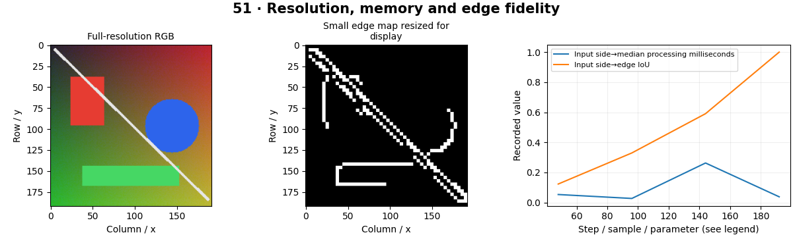

# Edge AI — concepts and mechanisms

## What and why

Edge AI runs perception near the sensor on constrained hardware. Memory, power, thermal behavior and supported operators can matter as much as model size. Target-device measurements are necessary because desktop CPU results do not predict every edge accelerator.

## 1. Compute, memory and resolution budgets

An RGB uint8 frame uses height×width×3 bytes before additional buffers. Intermediate feature maps can use much more memory than the input. Lowering resolution reduces compute but may remove small defects or distant objects. The lab measures memory and edge fidelity across input sizes.

## 2. Model and runtime choices

Mobile architectures use operations designed for limited compute, but the fastest model depends on runtime support and memory access. Quantization, operator fusion and hardware accelerators introduce compatibility constraints. A graph that falls back to CPU for unsupported operations may lose the expected speed advantage.

## 3. Target-device evaluation

Measure sustained latency, throughput, peak memory, power and thermal throttling on the target device. Include capture, resize, transfers and postprocessing. The repository reports only local CPU measurements for its default experiment and provides a device benchmark worksheet for learners to fill with actual hardware results.

## Mathematical foundation

$$
M=HWCb
$$

M is buffer size in bytes, H,W spatial dimensions, C channels and b bytes per element. A 640×480 RGB uint8 image uses 921600 bytes, excluding object overhead and copies.

The numerical example makes the units and reduction visible before the larger pipeline:

```python
import numpy as np
import cv2

height, width, channels, bytes_per_element = 480, 640, 3, 1
size = height * width * channels * bytes_per_element
assert size == 921600
print(size)
```

## What happens internally

The lab resizes one generated image, runs Canny repeatedly, records buffer size and compares resized edge masks to the full-resolution algorithm output.

Read the chapter entry point, then follow its shared source. The core reference is `engineering.quantize_symmetric`. Separate data construction, algorithm, metric and plotting when changing the experiment.

## Visual reasoning



Predict a change before rerunning. Explain what each axis, color, mask or matrix cell represents. In learned examples, compare a loss curve with held-out predictions; in geometry examples, compare coordinate residuals with known synthetic truth. Visual plausibility is useful evidence, but does not replace a declared metric.

## Controlled experiment

Choose a small-object size and reduce resolution until it disappears. Compare the memory saving with the task-specific quality loss.

Write down the independent variable, what remains fixed, and the metric before changing code. Repeat stochastic experiments with multiple seeds and retain negative results. A timing comparison should include warm-up, repeat count and hardware; never compare unmatched preprocessing or data sizes.

## Applications and limits

Measure performance under actual device constraints. The mini project applies the mechanism in a small runnable baseline. A smaller model file may still allocate large activations. Cold-start and thermally throttled timings answer different operational questions.

The local generated distribution deliberately removes some real-world complexity. External data, pretrained models and hardware paths are documented separately in [external workflows](../../docs/external-workflows.md). A toy objective or synthetic score must be labeled as such when used in a portfolio.

## Exercises and checkpoint

Explain this chapter to someone using one concrete example. Then implement a tiny case, change a parameter, create a failure and apply the method to new data. Use the [three exercise levels](../exercises/beginner.md) and [challenge](../exercises/challenge.md) to record evidence.

## Research connection

[Read the chapter research note](../../docs/research-reading.md#chapter-51). It distinguishes the original contribution, architecture intuition, limitations and alternatives from the scope of the runnable lab.

## References and next step

[Primary reference](https://onnxruntime.ai/docs/performance/). Continue through the chapter notebooks and mini project, then follow the next-chapter link in the [chapter README](../README.md).
