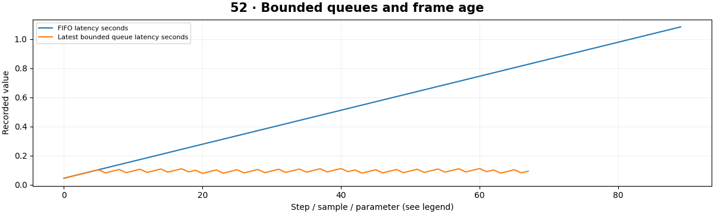

# Real-Time Computer Vision — concepts and mechanisms

## What and why

Real-time vision is about meeting timing needs on current frames. Throughput measures completed work per second; latency measures delay; frame age measures how stale a result is. A fast model can still produce unusable output if queues grow without bounds.

## 1. Latency, throughput and frame age

A source can produce frames faster than the inference stage consumes them. In a FIFO queue, waiting time then grows even if every frame is eventually processed. Batch processing can increase throughput while increasing latency. Decide which timing metric matches the application before optimizing.

## 2. Bounded queues and frame dropping

A bounded latest-frame queue discards old waiting frames to keep results fresh. This reduces completeness and changes time gaps between observations. Tracking must use timestamps to account for skipped frames. The discrete-event lab compares an unbounded FIFO with a bounded queue using declared service time.

## 3. Async pipelines and profiling

Threads can overlap I/O and native-library work; Python-heavy CPU loops may need vectorization or processes. Async code helps coordinate waiting but does not make CPU inference free. The dashboard permits one in-flight request to bound browser-side accumulation. Measure each stage before adding concurrency.

## Mathematical foundation

$$
\rho=\lambda s
$$

λ is arrival rate in frames/second, s mean service seconds/frame and ρ utilization. At 30 FPS and 0.045 seconds of service, ρ=1.35, so one worker cannot keep up indefinitely without dropping or reducing input.

The numerical example makes the units and reduction visible before the larger pipeline:

```python
import numpy as np
import cv2

arrival_fps, service_seconds = 30.0, 0.045
utilization = arrival_fps * service_seconds
assert utilization > 1
print(utilization)
```

## What happens internally

The scheduling simulator advances event times, completes active work and drops the oldest waiting frame when capacity is exceeded. Its output is a simulated latency distribution, not a hardware FPS claim.

Read the chapter entry point, then follow its shared source. The core reference is `engineering.queue_simulation`. Separate data construction, algorithm, metric and plotting when changing the experiment.

## Visual reasoning



Predict a change before rerunning. Explain what each axis, color, mask or matrix cell represents. In learned examples, compare a loss curve with held-out predictions; in geometry examples, compare coordinate residuals with known synthetic truth. Visual plausibility is useful evidence, but does not replace a declared metric.

## Controlled experiment

Compare FIFO and bounded queues under a service-time spike. Report dropped frames alongside p50 and p95 frame latency.

Write down the independent variable, what remains fixed, and the metric before changing code. Repeat stochastic experiments with multiple seeds and retain negative results. A timing comparison should include warm-up, repeat count and hardware; never compare unmatched preprocessing or data sizes.

## Applications and limits

Keep displays responsive while processing bounded work queues. The mini project applies the mechanism in a small runnable baseline. Reporting average FPS hides long stalls. Repeated wait calls and unbounded queues can make live results increasingly stale.

The local generated distribution deliberately removes some real-world complexity. External data, pretrained models and hardware paths are documented separately in [external workflows](../../docs/external-workflows.md). A toy objective or synthetic score must be labeled as such when used in a portfolio.

## Exercises and checkpoint

Explain this chapter to someone using one concrete example. Then implement a tiny case, change a parameter, create a failure and apply the method to new data. Use the [three exercise levels](../exercises/beginner.md) and [challenge](../exercises/challenge.md) to record evidence.

## Research connection

[Read the chapter research note](../../docs/research-reading.md#chapter-52). It distinguishes the original contribution, architecture intuition, limitations and alternatives from the scope of the runnable lab.

## References and next step

[Primary reference](https://docs.python.org/3/library/queue.html). Continue through the chapter notebooks and mini project, then follow the next-chapter link in the [chapter README](../README.md).
